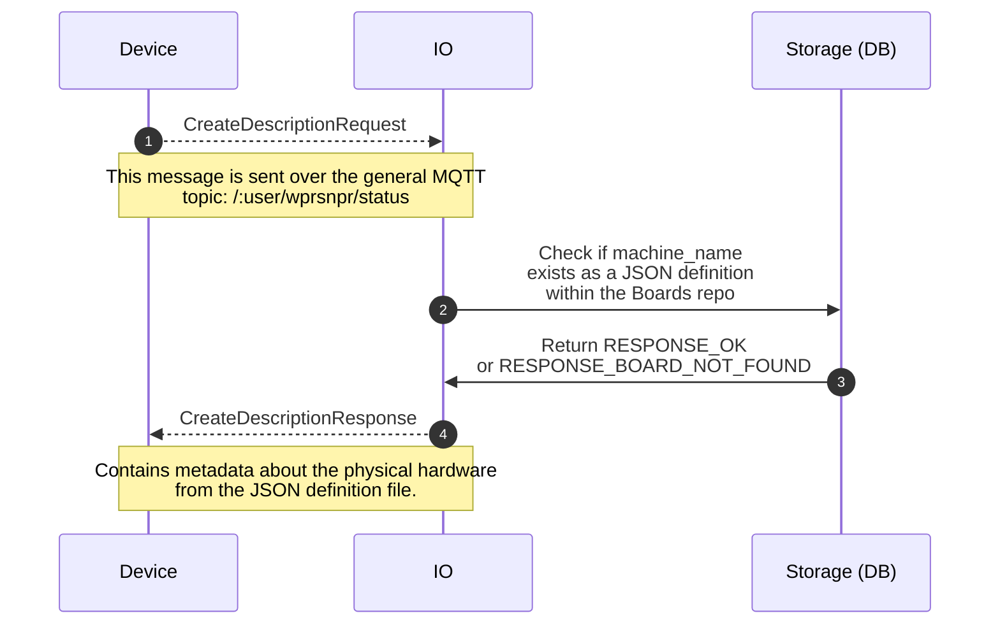
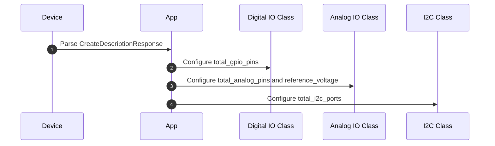
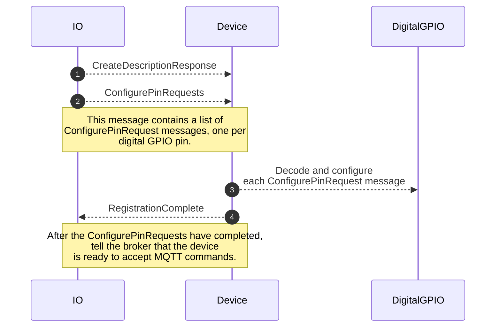

# description.proto

This file details how WipperSnapper firmware. registers a new or checks-in an existing board with the Adafruit IO MQTT broker.

## Sequence Diagrams

 
### Process: Check in

WipperSnapper's check in process involves a board sending its hardware identifier, MAC address and library version to the MQTT Broker. The broker verifies if the hardware's "digital twin" definition exists within the [WipperSnapper_Boards](https://github.com/adafruit/Wippersnapper_Boards) repository. 

Then, the broker sends a message back to the board with `OK` if found within the repo. If the board was not found within the repo,  the `NOT_FOUND` response is sent and the board should disconnect from the broker and halt.

### Process: Hardware Configuration

Where it can, the WipperSnapper firmware avoids dynamic allocation. If the `CreateDescriptionResponse` message contains a valid response( `RESPONSE_OK` ), fields from the `CreateDescriptionResponse` message are parsed and used to configure some hardware-specific classes:
  

### Process: Hardware Sync

The hardware sync process described by this API is outdated and will be depreciated in a future API version. It only exists for use with the Digital IO class.  

After the broker sends the `CreateDescriptionResponse` message, it sends the values and states for any digital IO pins configured on the device. Then, it waits for a `RegistrationComplete` response from the device. The `RegistrationComplete` message confirms that the hardware has completed configuring its state and values.
  

  
