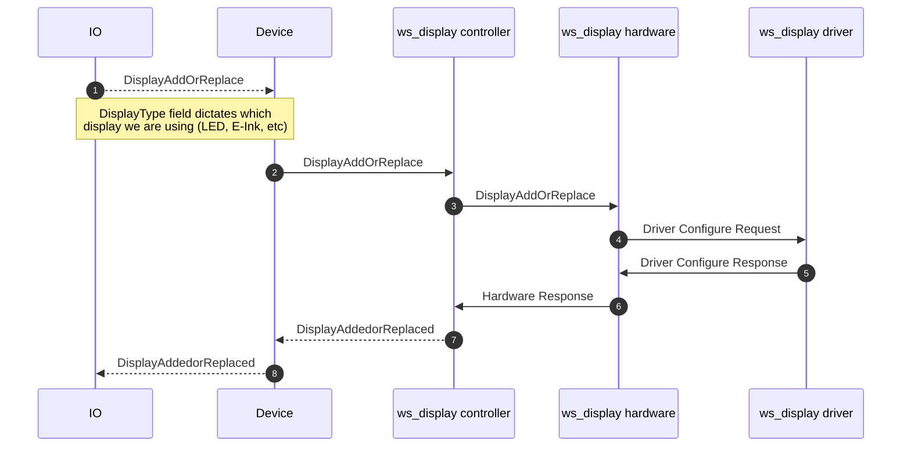
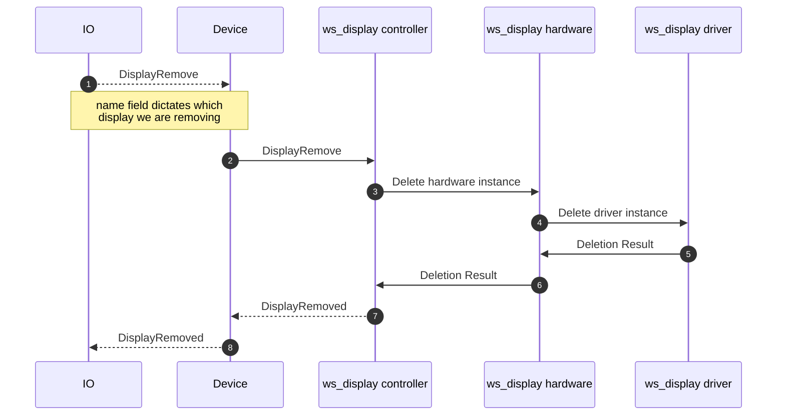
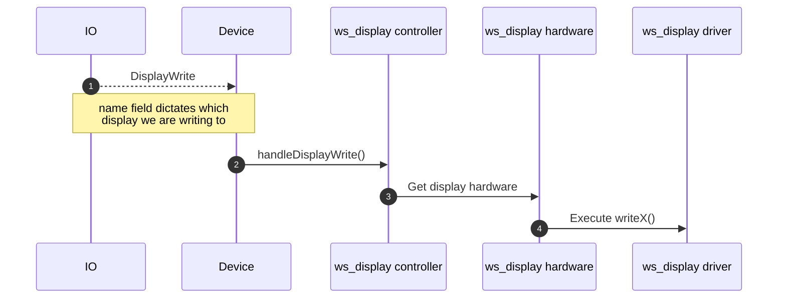

# display.proto

This file details the WipperSnapper messaging API for interfacing with a display.

## WipperSnapper Components

The following WipperSnapper Components may utilize `display.proto`:

* E-Ink/E-Paper Displays (EPD)
* TFT Displays
* OLED Displays
* 7-Segment Displays
* Alphanumeric Displays
* LCD Character Displays

## Supported Display Drivers

### E-Paper/E-Ink Displays (EPD)

| Driver | Description | Adafruit Product |
|--------|-------------|------------------|
| **SSD1680** | EPD controller for monochrome e-paper displays | Various |
| **ILI0373** | EPD controller (also known as SSD167) | Various |
| **UC8253** | 3.7" Monochrome E-Ink Display driver (416x240) | [#6395](https://www.adafruit.com/product/6395) |
| **UC8179** | 5.83" Monochrome E-Ink Display driver (648x480) | [#6397](https://www.adafruit.com/product/6397) |
| **UC8151** | 2.9" Flexible E-Ink Display driver (296x128, also ILI0343) | [#4262](https://www.adafruit.com/product/4262) |
| **SSD1683** | 4.2" Grayscale E-Ink Display driver (300x400) | [#6381](https://www.adafruit.com/product/6381) |

### TFT Displays

| Driver | Description |
|--------|-------------|
| **ST7789** | TFT LCD controller for color displays |

## Display Modes

### EPD Modes

E-Paper displays support different rendering modes:

* **EPD_MODE_GRAYSCALE4** - 4-level grayscale rendering
* **EPD_MODE_MONO** - Monochrome (black and white) rendering

## Configuration

### EPD Displays (SPI)

EPD displays require the following pin configuration:
* **bus** - The SPI bus number
* **pin_dc** - Data/Command pin
* **pin_rst** - Reset pin
* **pin_cs** - Chip Select pin
* **pin_sram_cs** - SRAM Chip Select pin (optional)
* **pin_busy** - Busy signal pin (indicates when display is ready)

EPD configuration parameters:
* **mode** - Display mode (grayscale or mono)
* **width** - Display width in pixels
* **height** - Display height in pixels
* **text_size** - Text scale factor (1 = 6x8px, 2 = 12x16px, etc.)

### TFT Displays (SPI)

TFT displays require the following pin configuration:
* **bus** - The SPI bus number
* **pin_cs** - Chip Select pin
* **pin_dc** - Data/Command pin
* **pin_mosi** - MOSI (Master Out Slave In) pin
* **pin_sck** - SCK (Serial Clock) pin
* **pin_rst** - Reset pin
* **pin_miso** - MISO (Master In Slave Out) pin

TFT configuration parameters:
* **width** - Display width in pixels
* **height** - Display height in pixels
* **rotation** - Display rotation (0-3)
* **text_size** - Text scale factor (1 = 6x8px, 2 = 12x16px, etc.)

## Sequence Diagrams

### Attaching a Display Component to a device running WipperSnapper

### Removing a Display Component from a device running WipperSnapper

### Writing to a Display from IO

The display message is set by the component's feed value, which is a string. The message is sent to the display driver.

