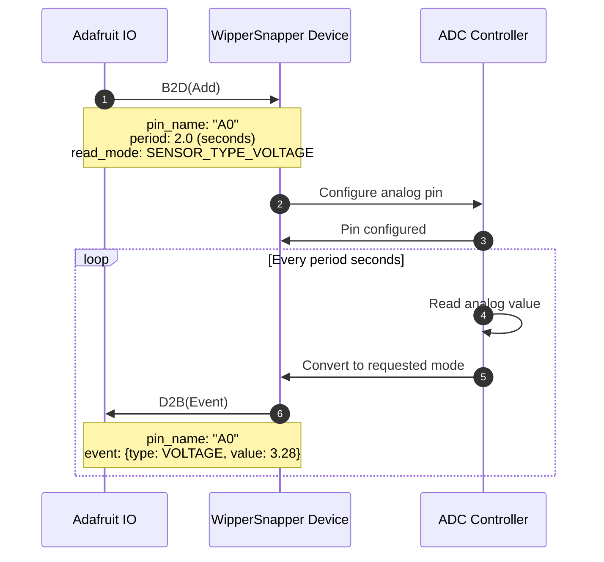
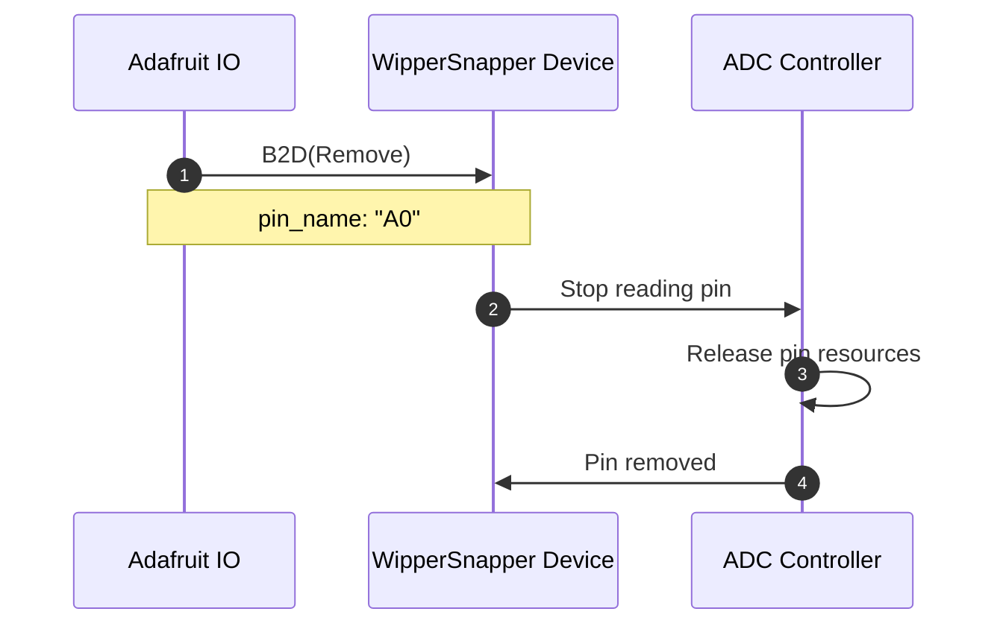

# analogio.proto

This file details the WipperSnapper messaging API for reading analog input pins (ADC - Analog to Digital Converter).

## WipperSnapper Components

The following WipperSnapper components utilize `analogio.proto`:
* [analogio](https://github.com/adafruit/Wippersnapper_Components/tree/main/components/analogio) - Analog input pins

## Architecture Overview

The v2 Analog IO API uses message envelopes for cleaner organization:

- **B2D (BrokerToDevice)** - Commands from Adafruit IO to device
  - `add` - Add/configure an analog input pin
  - `remove` - Remove an analog input pin

- **D2B (DeviceToBroker)** - Responses and data from device to Adafruit IO
  - `event` - Analog reading from pin

**Note:** Analog IO is read-only. There is no `write` command. For analog output (DAC), use PWM instead.

## Read Modes

Analog pins can be read in different modes using the `read_mode` field (of type `ws.sensor.Type`):

| Read Mode | Description | Use Case |
|-----------|-------------|----------|
| `SENSOR_TYPE_VOLTAGE` | Read as voltage (V) | Battery monitoring, voltage dividers |
| `SENSOR_TYPE_RAW` | Read as raw ADC value | Custom sensor calibration |
| `SENSOR_TYPE_UNITLESS_PERCENT` | Read as percentage (0-100%) | Potentiometers, analog sensors |

## Sequence Diagrams

### Add an Analog Pin



### Remove an Analog Pin



## Use Cases & Examples

### Example 1: Battery Voltage Monitoring

Monitor a battery voltage with a voltage divider:

```
B2D(Add) {
  pin_name: "A1",
  period: 10.0,  // Read every 10 seconds
  read_mode: SENSOR_TYPE_VOLTAGE
}
```

The device sends voltage readings:
```
D2B(Event) {
  pin_name: "A1",
  event: {
    type: SENSOR_TYPE_VOLTAGE,
    value: 3.7  // Volts
  }
}
```

**Note:** Voltage reading is based on board's reference voltage (typically 3.3V). Use external voltage dividers for higher voltages.

### Example 2: Potentiometer Position

Read a potentiometer as a percentage:

```
B2D(Add) {
  pin_name: "A2",
  period: 0.5,  // Read twice per second
  read_mode: SENSOR_TYPE_UNITLESS_PERCENT
}
```

Returns:
```
D2B(Event) {
  pin_name: "A2",
  event: {
    type: SENSOR_TYPE_UNITLESS_PERCENT,
    value: 75.3  // 75.3%
  }
}
```

### Example 3: Raw ADC Value

Get raw ADC reading for custom calibration:

```
B2D(Add) {
  pin_name: "A3",
  period: 1.0,
  read_mode: SENSOR_TYPE_RAW
}
```

Returns:
```
D2B(Event) {
  pin_name: "A3",
  event: {
    type: SENSOR_TYPE_RAW,
    value: 2048  // Raw ADC value (0-4095 on 12-bit ADC)
  }
}
```

### Example 4: Light Sensor (Photoresistor)

Monitor light levels with a photoresistor voltage divider:

```
B2D(Add) {
  pin_name: "A4",
  period: 5.0,
  read_mode: SENSOR_TYPE_VOLTAGE
}
```

Higher voltage = more light (depending on circuit configuration).

## Pin Naming Conventions

Analog pin names should match the board's pinout definition in the [WipperSnapper_Boards](https://github.com/adafruit/Wippersnapper_Boards) repository:

- Arduino-style: `"A0"`, `"A1"`, `"A2"`, etc.
- ESP32: `"GPIO32"`, `"GPIO33"` (GPIO with ADC capability)
- RP2040: `"GP26"`, `"GP27"`, `"GP28"` (ADC-capable pins)

**Important:** Not all pins support analog input. Check your board's documentation for ADC-capable pins.

## ADC Resolution

Different boards have different ADC resolutions:

| Platform | Resolution | Range | Voltage Range |
|----------|-----------|-------|---------------|
| Arduino Uno/Nano | 10-bit | 0-1023 | 0-5V |
| ESP32 | 12-bit | 0-4095 | 0-3.3V (with attenuation up to ~3.6V) |
| RP2040 (Pico) | 12-bit | 0-4095 | 0-3.3V |
| SAMD21/SAMD51 | 12-bit | 0-4095 | 0-3.3V |

When using `SENSOR_TYPE_RAW`, the value will be in the range supported by your board's ADC.

## Voltage Reference

The voltage reading depends on the board's reference voltage:

- **3.3V boards** (ESP32, RP2040, SAMD): ADC max = 3.3V
- **5V boards** (Arduino Uno): ADC max = 5V

Some boards allow configuring the voltage reference (AREF). Check your board's documentation.

## Sampling Period Guidelines

Choose an appropriate `period` based on your use case:

| Use Case | Recommended Period | Reasoning |
|----------|-------------------|-----------|
| Battery monitoring | 30-60 seconds | Slow-changing, conserve bandwidth |
| Temperature sensing | 5-10 seconds | Moderately slow |
| Light sensing | 1-5 seconds | Moderate responsiveness |
| Potentiometer | 0.1-0.5 seconds | Fast user interaction |
| Fast sensors | 0.05-0.1 seconds | Quick response needed |

**Note:** Faster sampling = more MQTT messages = more bandwidth/power consumption.

## Voltage Dividers for High Voltages

To measure voltages higher than the board's ADC range, use a voltage divider:

```
Vin ---[R1]---+---[R2]--- GND
              |
           ADC Pin
```

Formula: `Vout = Vin * (R2 / (R1 + R2))`

**Example:** Measure 12V battery with 3.3V ADC
- Use R1 = 10kΩ, R2 = 3.3kΩ
- 12V → 2.98V at ADC pin
- In code: `actualVoltage = readVoltage * ((R1 + R2) / R2)`

## Best Practices

### Hardware
1. **Input protection:** Add series resistor (1-10kΩ) to protect ADC from overvoltage
2. **Filtering:** Add 0.1µF capacitor near ADC pin to reduce noise
3. **Voltage dividers:** Use 1% tolerance resistors for accurate voltage measurement
4. **Reference voltage:** Keep reference stable - avoid noisy power supplies

### Software
1. **Sampling rate:** Don't sample faster than necessary (wastes bandwidth and power)
2. **Averaging:** For noisy signals, increase period and rely on device-side filtering
3. **Calibration:** Use `SENSOR_TYPE_RAW` and calibrate in your application if needed
4. **Units:** Choose appropriate `read_mode` for your application (voltage vs. raw vs. percent)

### Power Management
1. **Low-power devices:** Use longer periods (≥10 seconds) to conserve battery
2. **Always-on sensors:** Shorter periods acceptable for mains-powered devices
3. **Deep sleep:** Consider if analog reading frequency allows device to sleep between readings

## Troubleshooting

### Reading is always 0 or maximum
- **Check wiring:** Verify sensor is connected correctly
- **Check voltage range:** Ensure input is within ADC range (0-3.3V or 0-5V)
- **Input protection:** Series resistor might be too high
- **Pin capability:** Verify pin supports analog input

### Noisy/unstable readings
- **Add capacitor:** 0.1µF between ADC pin and GND
- **Increase period:** Longer period allows more internal averaging
- **Check power supply:** Noisy power can affect ADC reference
- **Shielded cables:** For long cable runs, use shielded cables

### Reading doesn't match expected voltage
- **Check reference voltage:** Verify board's ADC reference voltage
- **Voltage divider:** Recalculate divider ratio
- **Pin damage:** Overvoltage may have damaged ADC input
- **Calibration:** Use multimeter to verify actual voltage

### Values changing without input change
- **Floating input:** Ensure sensor has stable connection
- **EMI:** Keep analog wires away from power lines and motors
- **Pull-up/pull-down:** Some sensors need external resistors

## Analog vs. Digital

| Feature | Analog Input | Digital Input |
|---------|--------------|---------------|
| Values | Continuous (0-Vref) | Binary (HIGH/LOW) |
| Resolution | 10-12 bits typical | 1 bit |
| Use Cases | Voltage, potentiometers, analog sensors | Buttons, switches, digital sensors |
| Noise Sensitivity | Higher | Lower |
| Speed | Slower (ADC conversion time) | Faster |

## Relationship with Other Components

Analog input is useful for:

- **Voltage monitoring:** Battery level, solar panel output
- **Sensor reading:** Temperature (thermistor), light (LDR), sound (microphone)
- **User input:** Potentiometers, joysticks, faders
- **Signal monitoring:** Audio level, RF signal strength

For digital control outputs, see:
- [digitalio.proto](digitalio.md) - Digital GPIO
- [pwm.proto](pwm.md) - PWM for analog-like output

## Related Documentation

- [sensor.proto](sensor.md) - Sensor types and event structure
- [WipperSnapper Components](https://github.com/adafruit/Wippersnapper_Components) - Analog input component definitions
- [WipperSnapper Boards](https://github.com/adafruit/Wippersnapper_Boards) - Board-specific ADC capabilities