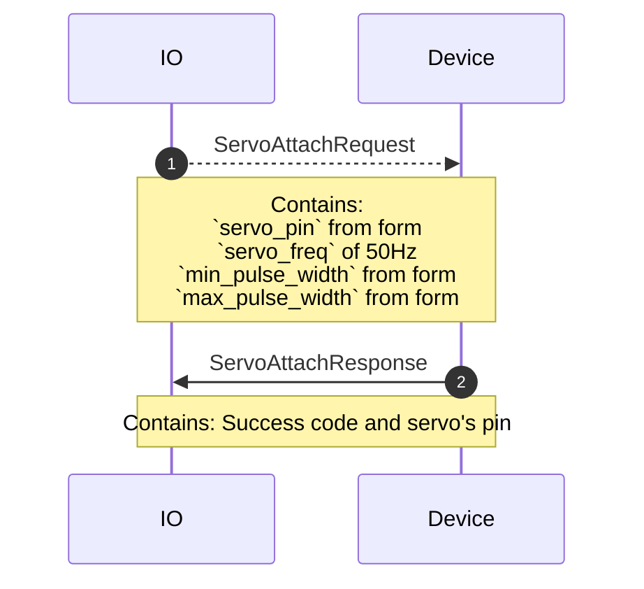
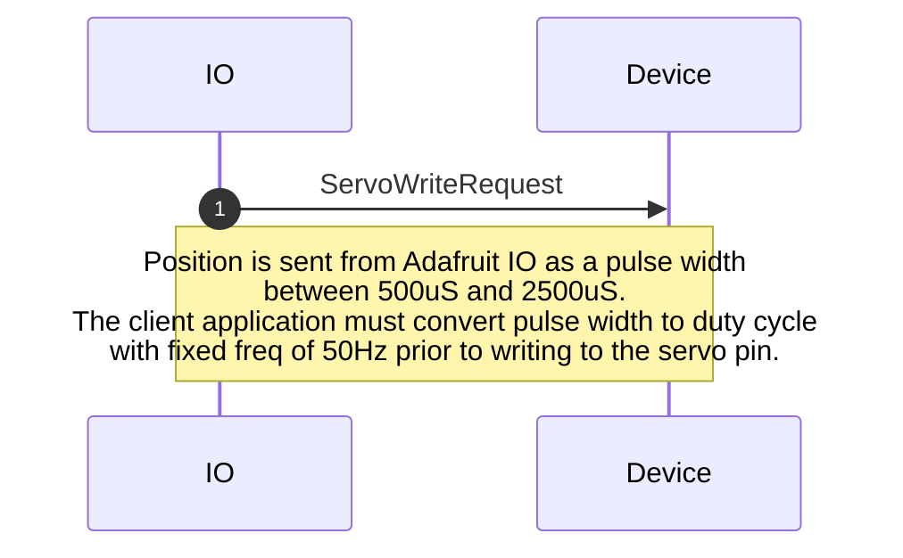
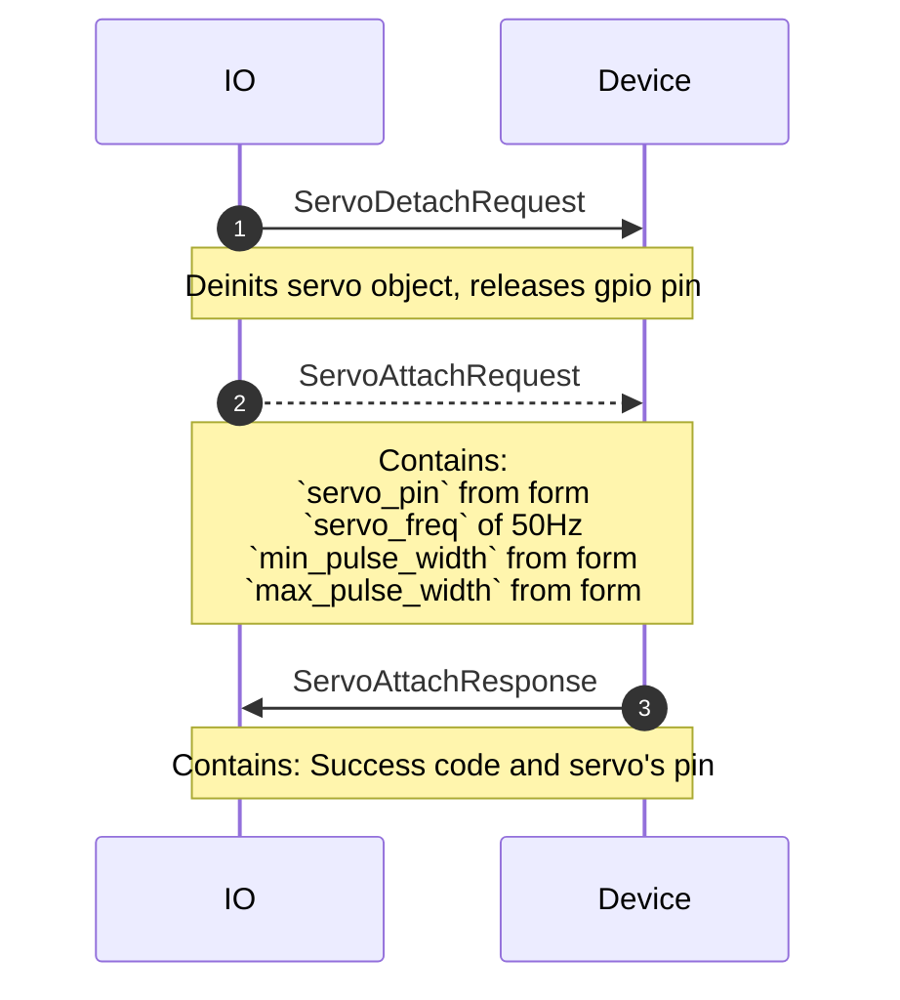
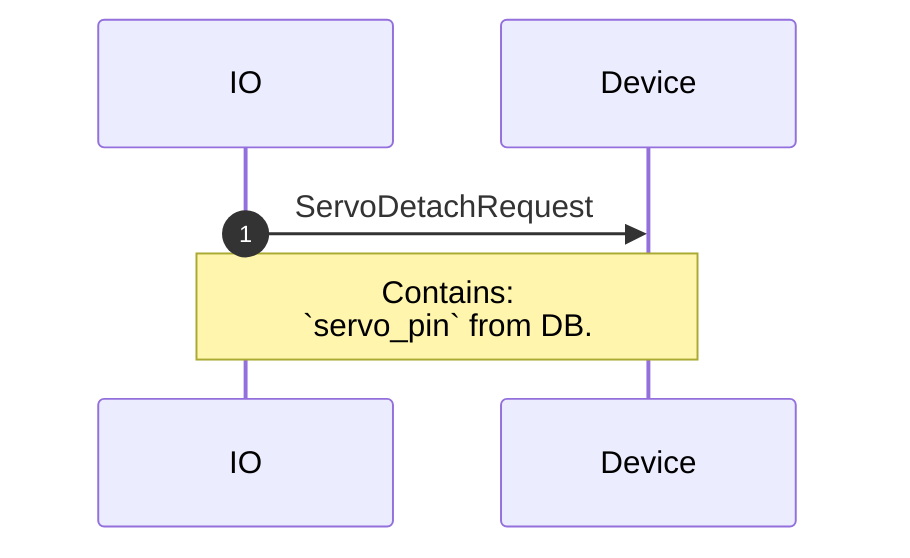

# checkin.proto

This file details connecting a new or existing hardware to the Adafruit IO MQTT broker.

## WipperSnapper Components

  

The following WipperSnapper components utilize `servo.proto`:
* [Generic Servo](https://github.com/adafruit/Wippersnapper_Components/tree/main/components/servo/servo)
  

## Sequence Diagrams

  

### Create: Servo

### Write: Servo

  

### Update: Servo

  

### Delete: Servo

  

### Sync: Servo

