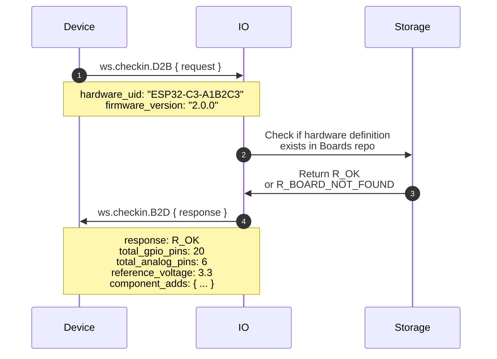
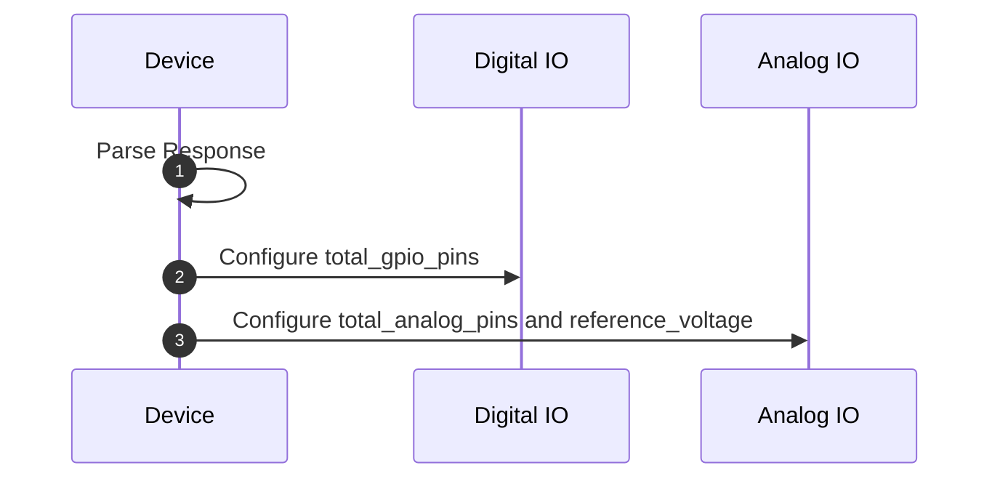
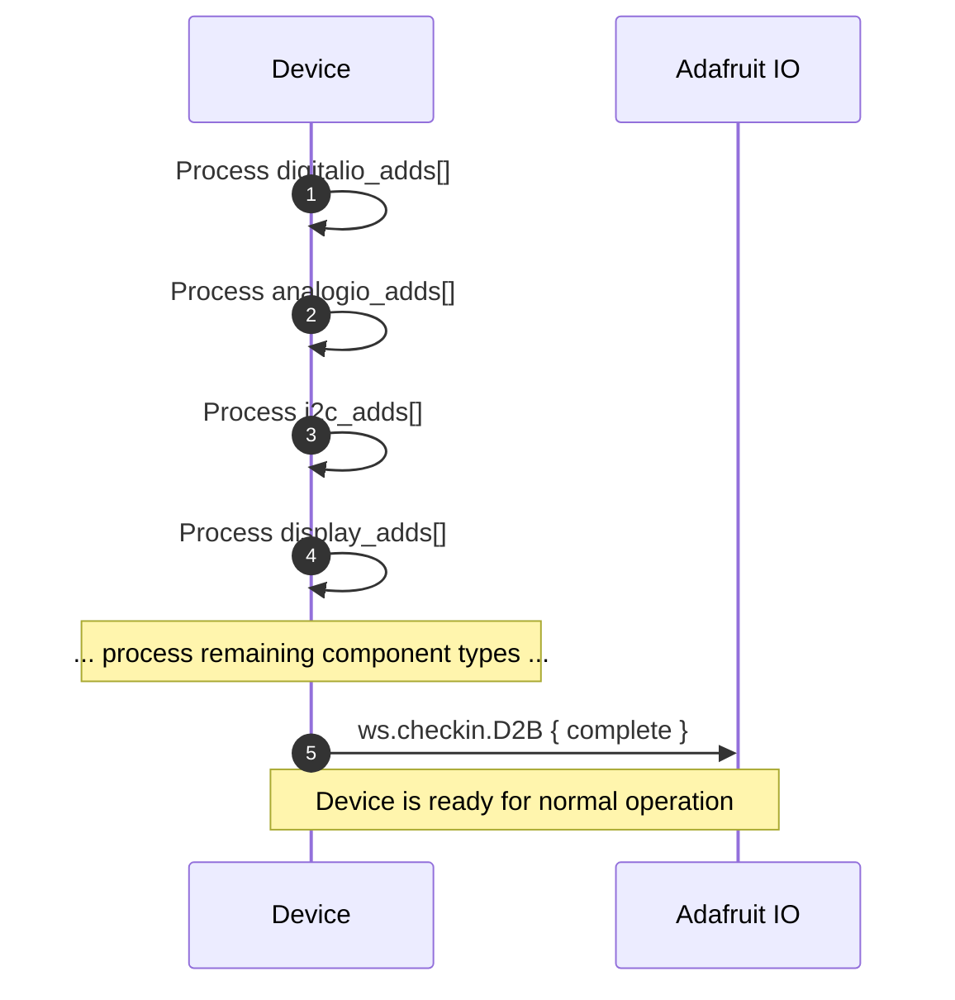

# checkin.proto

This file details how WipperSnapper firmware registers a new or checks-in an existing board with the Adafruit IO MQTT broker.

## Architecture Overview

The v2 Check-In API uses message envelopes:

- **B2D (BrokerToDevice)** - Response from Adafruit IO
  - `response` - Board verification result with hardware capabilities and component configuration

- **D2B (DeviceToBroker)** - Requests from device
  - `request` - Device identification (hardware UID and firmware version)
  - `complete` - Signal that device has finished initializing all components

## Message Details

### Request (D2B)

- **hardware_uid** - Board name + last 3 of NIC's MAC address
- **firmware_version** - Client firmware version string

### Response (B2D)

- **response** - Status enum: `R_OK` (found) or `R_BOARD_NOT_FOUND`
- **total_gpio_pins** - Number of GPIO pins on the device
- **total_analog_pins** - Number of analog pins on the device
- **reference_voltage** - Hardware's default ADC reference voltage
- **component_adds** - `ComponentAdds` message containing all pre-configured components
- **sleep_enabled** - Whether sleep mode is enabled
- **sleep_config** - Sleep configuration (if enabled)

### ComponentAdds

Contains separate repeated fields for each component type to initialize during check-in:

```protobuf
message ComponentAdds {
  repeated ws.digitalio.Add digitalio_adds    = 1;
  repeated ws.analogin.Add analogio_adds      = 2;
  repeated ws.servo.Add servo_adds            = 3;
  repeated ws.pwm.Add pwm_adds                = 4;
  repeated ws.pixels.Add pixels_adds          = 5;
  repeated ws.ds18x20.Add ds18x20_adds        = 6;
  repeated ws.uart.Add uart_adds              = 7;
  repeated ws.i2c.DeviceAddOrReplace i2c_adds = 8;
  repeated ws.display.Add display_adds        = 9;
}
```

Each component's `Add` message may include an optional initial `write` field for setting the component's initial state.

### Complete (D2B)

Empty message signalling the device has finished processing all components and is ready for normal operation.

## Sequence Diagrams

### Process: Check-In

WipperSnapper's check-in process involves a board sending its hardware identifier and firmware version to the MQTT Broker. The broker verifies if the hardware's "digital twin" definition exists within the [WipperSnapper_Boards](https://github.com/adafruit/Wippersnapper_Boards) repository.


```mermaid
sequenceDiagram
autonumber

Device->>IO: ws.checkin.D2B { request }
Note over Device,IO: hardware_uid: "ESP32-C3-A1B2C3"<br/>firmware_version: "2.0.0"

IO->>Storage: Check if hardware definition<br/>exists in Boards repo
Storage->>IO: Return R_OK<br/>or R_BOARD_NOT_FOUND

IO->>Device: ws.checkin.B2D { response }
Note over IO,Device: response: R_OK<br/>total_gpio_pins: 20<br/>total_analog_pins: 6<br/>reference_voltage: 3.3<br/>component_adds: { ... }
```

### Process: Hardware Configuration

If the response is `R_OK`, the device configures hardware classes from the response:


```mermaid
sequenceDiagram
autonumber
Device->>Device: Parse Response
Device->>Digital IO: Configure total_gpio_pins
Device->>Analog IO: Configure total_analog_pins and reference_voltage
```

### Process: Component Initialization

The device processes each component list in `ComponentAdds`:


```mermaid
sequenceDiagram
autonumber
participant Device
participant IO as Adafruit IO

Device->>Device: Process digitalio_adds[]
Device->>Device: Process analogio_adds[]
Device->>Device: Process i2c_adds[]
Device->>Device: Process display_adds[]
Note over Device: ... process remaining component types ...

Device->>IO: ws.checkin.D2B { complete }
Note over Device,IO: Device is ready for normal operation
```

## Example: Full Check-In with Components

```
// Device sends request
ws.checkin.D2B {
  request: {
    hardware_uid: "ESP32S3-A1B2C3",
    firmware_version: "2.0.0"
  }
}

// Broker responds with board info and components
ws.checkin.B2D {
  response: {
    response: R_OK,
    total_gpio_pins: 40,
    total_analog_pins: 10,
    reference_voltage: 3.3,
    component_adds: {
      digitalio_adds: [
        { pin_name: "D13", gpio_direction: D_OUTPUT, write: { pin_name: "D13", value: ... } }
      ],
      i2c_adds: [
        { device_description: { device_address: 0x77 }, device_name: "bme280", device_period: 60.0 }
      ],
      display_adds: [
        { type: DISPLAY_CLASS_TFT, driver: "ST7789", spi_tft: { ... }, config_display: { ... } }
      ]
    }
  }
}

// Device finishes initialization
ws.checkin.D2B {
  complete: {}
}
```

## Related Documentation

- [wippersnapper_device_overview.md](wippersnapper_device_overview.md) - Complete device flow with check-in
- Individual component docs for `Add` message details
