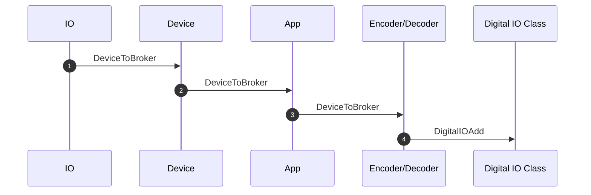
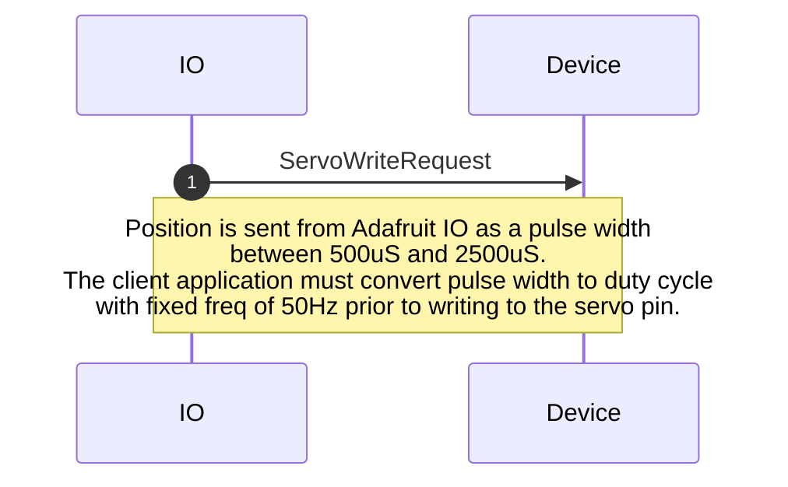
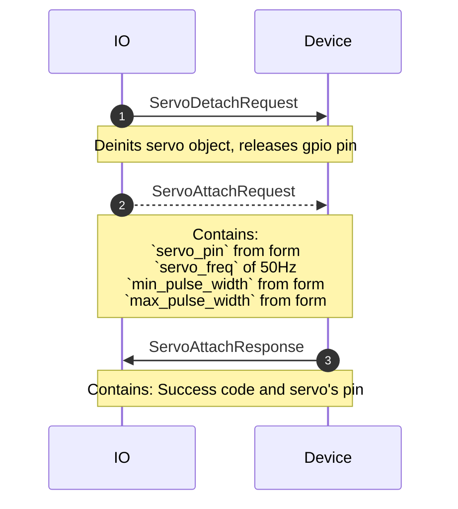
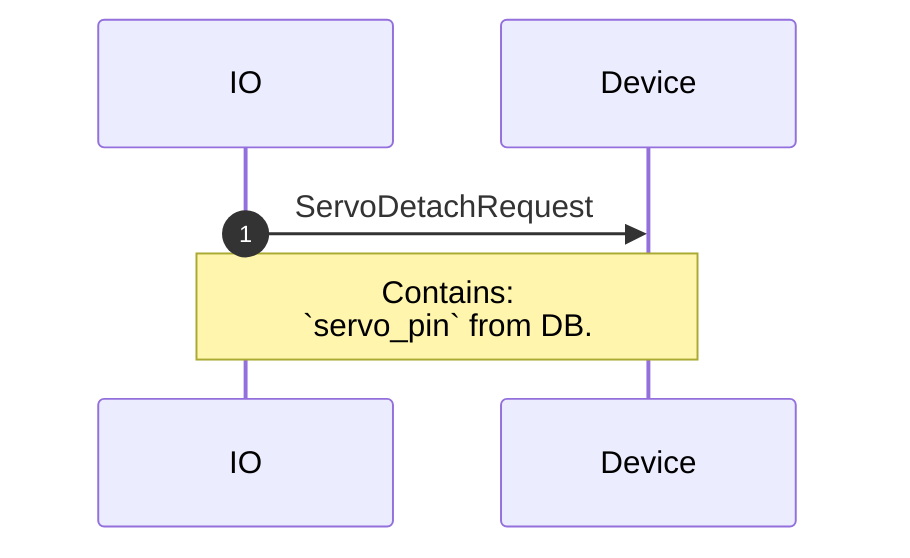
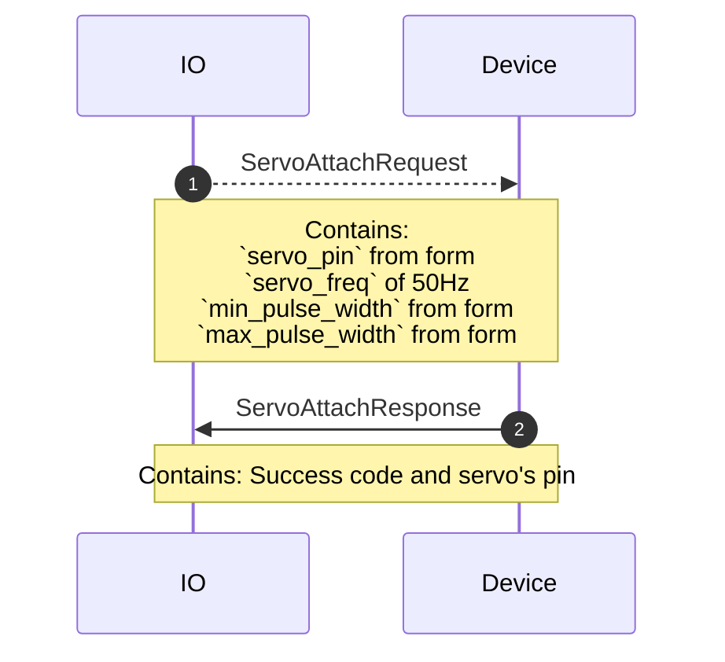

# digitalio.proto

  This file details the WipperSnapper messaging API for interfacing with digital I/O pins.

## WipperSnapper Components

The following WipperSnapper components utilize `servo.proto`:
* [pin](https://github.com/adafruit/Wippersnapper_Components/tree/main/components/pin)

## Sequence Diagrams

### Add a Digital Pin

### Remove a Digital Pin

  

### Update: Servo

  

### Delete: Servo

  

### Sync: Servo

