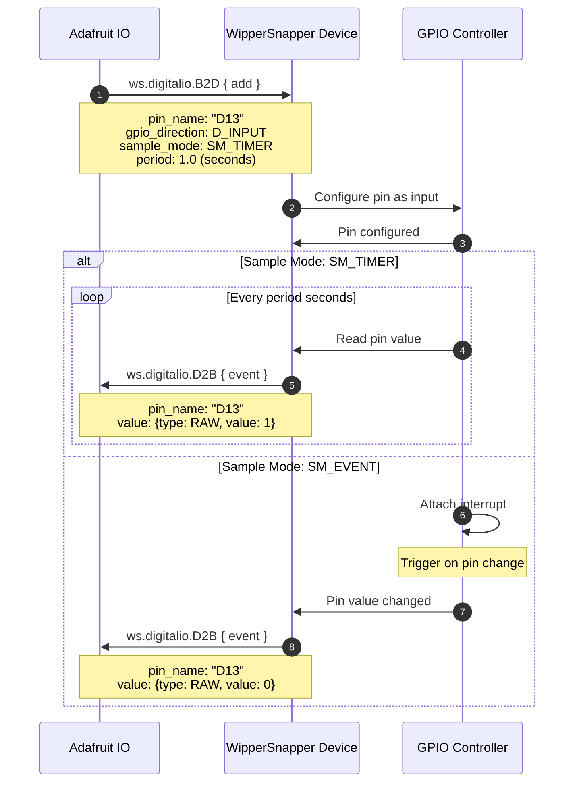
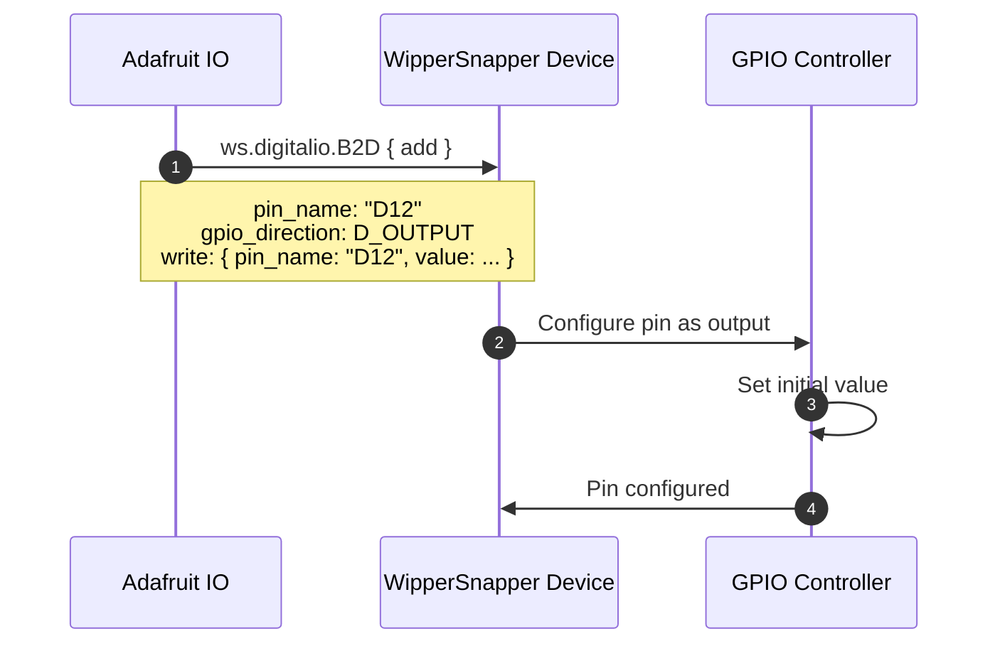
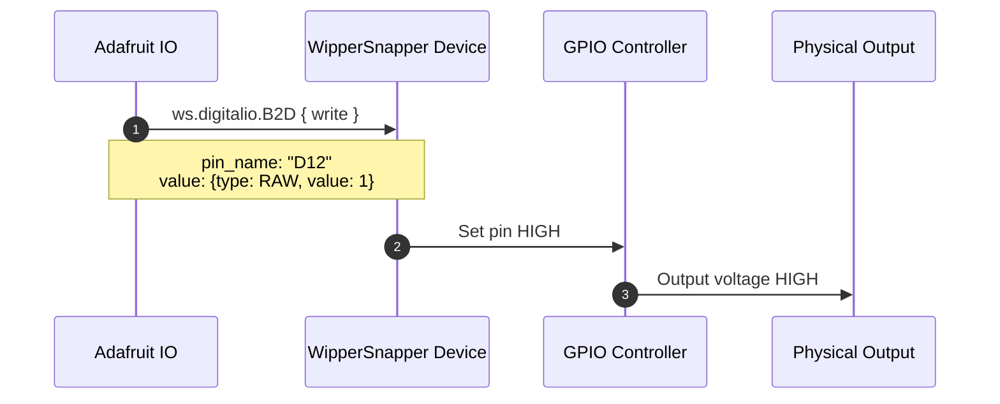
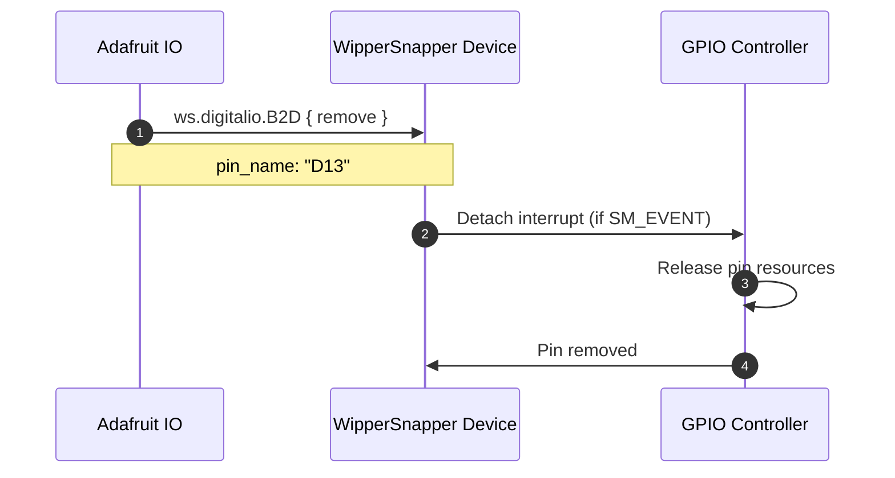

# digitalio.proto

This file details the WipperSnapper messaging API for interfacing with digital I/O pins (GPIO).

## WipperSnapper Components

The following WipperSnapper components utilize `digitalio.proto`:
* [pin](https://github.com/adafruit/Wippersnapper_Components/tree/main/components/pin)

## Architecture Overview

The v2 Digital IO API uses message envelopes for cleaner organization:

- **B2D (BrokerToDevice)** - Commands from Adafruit IO to device
  - `add` - Add/configure a digital pin
  - `remove` - Remove a digital pin
  - `write` - Write a value to an output pin

- **D2B (DeviceToBroker)** - Responses and data from device to Adafruit IO
  - `event` - Pin value changed (from input pins)

## Pin Configuration

### Direction

Pins can be configured in three directions:

| Direction | Description | Use Case |
|-----------|-------------|----------|
| `D_INPUT` | Standard input mode | Reading button states, sensor signals |
| `D_INPUT_PULL_UP` | Input with internal pull-up resistor | Reading switches/buttons without external resistor |
| `D_OUTPUT` | Output mode | Controlling LEDs, relays, logic signals |

### Sample Mode

For input pins, the sample mode determines how often values are read:

| Mode | Description | Best For |
|------|-------------|----------|
| `SM_TIMER` | Periodically sample at fixed interval | Monitoring stable inputs, polling sensors |
| `SM_EVENT` | Sample when pin state changes (interrupt-driven) | Buttons, switches, motion sensors |

### Additional Add Fields

- **write** - Optional initial `Write` message for setting pin state at check-in
- **is_inverted** - If true, inverts the pin's value (active low)

### Value Type

Both `Event` and `Write` messages use `ws.sensor.Event` for the value field, which carries the pin's boolean state along with sensor metadata.

## Sequence Diagrams

### Add a Digital Pin (Input)


```mermaid
sequenceDiagram
autonumber
participant IO as Adafruit IO
participant Device as WipperSnapper Device
participant GPIO as GPIO Controller

IO->>Device: ws.digitalio.B2D { add }
Note over IO,Device: pin_name: "D13"<br/>gpio_direction: D_INPUT<br/>sample_mode: SM_TIMER<br/>period: 1.0 (seconds)

Device->>GPIO: Configure pin as input
GPIO->>Device: Pin configured

alt Sample Mode: SM_TIMER
    loop Every period seconds
        GPIO->>Device: Read pin value
        Device->>IO: ws.digitalio.D2B { event }
        Note over Device,IO: pin_name: "D13"<br/>value: {type: RAW, value: 1}
    end
else Sample Mode: SM_EVENT
    GPIO->>GPIO: Attach interrupt
    Note over GPIO: Trigger on pin change
    GPIO->>Device: Pin value changed
    Device->>IO: ws.digitalio.D2B { event }
    Note over Device,IO: pin_name: "D13"<br/>value: {type: RAW, value: 0}
end
```

### Add a Digital Pin (Output)


```mermaid
sequenceDiagram
autonumber
participant IO as Adafruit IO
participant Device as WipperSnapper Device
participant GPIO as GPIO Controller

IO->>Device: ws.digitalio.B2D { add }
Note over IO,Device: pin_name: "D12"<br/>gpio_direction: D_OUTPUT<br/>write: { pin_name: "D12", value: ... }

Device->>GPIO: Configure pin as output
GPIO->>GPIO: Set initial value
GPIO->>Device: Pin configured
```

### Write to an Output Pin


```mermaid
sequenceDiagram
autonumber
participant IO as Adafruit IO
participant Device as WipperSnapper Device
participant GPIO as GPIO Controller
participant LED as Physical Output

IO->>Device: ws.digitalio.B2D { write }
Note over IO,Device: pin_name: "D12"<br/>value: {type: RAW, value: 1}

Device->>GPIO: Set pin HIGH
GPIO->>LED: Output voltage HIGH
```

### Remove a Digital Pin


```mermaid
sequenceDiagram
autonumber
participant IO as Adafruit IO
participant Device as WipperSnapper Device
participant GPIO as GPIO Controller

IO->>Device: ws.digitalio.B2D { remove }
Note over IO,Device: pin_name: "D13"

Device->>GPIO: Detach interrupt (if SM_EVENT)
GPIO->>GPIO: Release pin resources
GPIO->>Device: Pin removed
```

## Use Cases & Examples

### Example 1: Button Input (Event-Driven)

Monitor a button that triggers on press/release:

```
ws.digitalio.B2D { add: {
  pin_name: "D2",
  gpio_direction: D_INPUT_PULL_UP,
  sample_mode: SM_EVENT
}}
```

When the button is pressed or released, the device sends:
```
ws.digitalio.D2B { event: {
  pin_name: "D2",
  value: {type: RAW, value: 0}
}}
```

**Best Practices:**
- Use `D_INPUT_PULL_UP` for buttons without external pull-up resistors
- `SM_EVENT` mode is most efficient - only sends updates on state change
- Button logic is typically inverted (LOW = pressed, HIGH = released)

### Example 2: LED Control

Control an LED from Adafruit IO:

```
ws.digitalio.B2D { add: {
  pin_name: "D13",
  gpio_direction: D_OUTPUT,
  write: { pin_name: "D13", value: {type: RAW, value: 0} }
}}
```

To turn the LED on:
```
ws.digitalio.B2D { write: {
  pin_name: "D13",
  value: {type: RAW, value: 1}
}}
```

### Example 3: Sensor Polling

Poll a digital sensor every 2 seconds:

```
ws.digitalio.B2D { add: {
  pin_name: "D7",
  gpio_direction: D_INPUT,
  sample_mode: SM_TIMER,
  period: 2.0
}}
```

The device will send readings every 2 seconds:
```
ws.digitalio.D2B { event: {
  pin_name: "D7",
  value: {type: RAW, value: 1}
}}
```

### Example 4: Motion Sensor (PIR)

Detect motion with a PIR sensor:

```
ws.digitalio.B2D { add: {
  pin_name: "D5",
  gpio_direction: D_INPUT,
  sample_mode: SM_EVENT
}}
```

Motion detected:
```
ws.digitalio.D2B { event: {
  pin_name: "D5",
  value: {type: RAW, value: 1}
}}
```

## Pin Naming Conventions

Pin names should match the board's pinout definition in the [WipperSnapper_Boards](https://github.com/adafruit/Wippersnapper_Boards) repository:

- Arduino-style: `"D0"`, `"D1"`, `"D13"`, etc.
- ESP32: `"GPIO2"`, `"GPIO15"`, etc.
- RP2040: `"GP0"`, `"GP1"`, etc.

## Sample Mode Guidelines

### When to use SM_TIMER
- ✓ Monitoring stable signals that don't change frequently
- ✓ Polling sensors that provide digital output
- ✓ Cases where you need regular updates regardless of state
- ✓ When pin changes are too frequent for event mode

### When to use SM_EVENT
- ✓ Buttons and switches
- ✓ Motion sensors (PIR)
- ✓ Door/window sensors
- ✓ Any input that changes infrequently
- ✓ Battery-powered applications (more efficient)

**Note:** Not all pins support interrupt (SM_EVENT) mode. Check your board's documentation.

## Best Practices

### Input Pins
1. **Pull-up resistors:** Use `D_INPUT_PULL_UP` for buttons/switches without external resistors
2. **Debouncing:** Consider signal stability - some boards have hardware debouncing
3. **Sample period:** For `SM_TIMER`, choose appropriate period based on expected change frequency
4. **Power consumption:** `SM_EVENT` uses less power than `SM_TIMER` for infrequent events

### Output Pins
1. **Initial state:** Always set initial `value` when adding output pins
2. **Current limits:** Don't drive high-current loads directly - use transistors/MOSFETs
3. **Logic levels:** Ensure 3.3V/5V compatibility with connected devices
4. **Pin capabilities:** Not all pins can be used as outputs - check board documentation

### General
1. **Pin conflicts:** Don't configure the same pin multiple times simultaneously
2. **Reserved pins:** Avoid pins used for built-in functions (LED, I2C, SPI, etc.)
3. **Cleanup:** Always remove pins when no longer needed to free resources

## Relationship with Other Components

Digital IO pins are fundamental and can interact with:

- **PWM** - Some digital pins support PWM output for dimming LEDs or motor control
- **Servo** - Servos use digital pins with PWM
- **I2C/SPI** - Specific pins are reserved for these buses
- **UART** - TX/RX pins for serial communication

Always check pin availability before configuring digital IO on pins that might be needed for other protocols.

## Troubleshooting

### Input pin always reads the same value
- Check wiring and connections
- Verify pull-up/pull-down resistor configuration
- Test with multimeter to confirm expected voltage levels

### Event mode not triggering
- Verify pin supports interrupt mode
- Check if pin is configured correctly in board definition
- Consider switching to SM_TIMER for testing

### Output pin not controlling device
- Verify pin is configured as D_OUTPUT
- Check current requirements of connected device
- Use transistor/MOSFET for high-current loads
- Verify voltage levels match (3.3V vs 5V)
