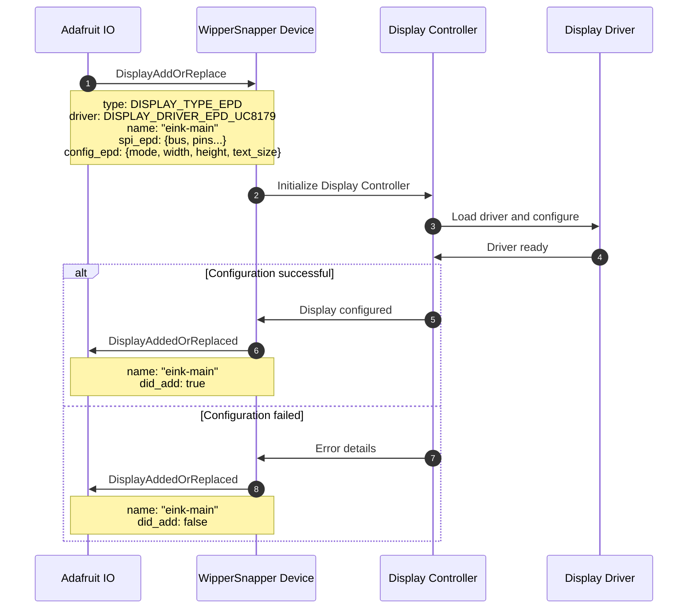
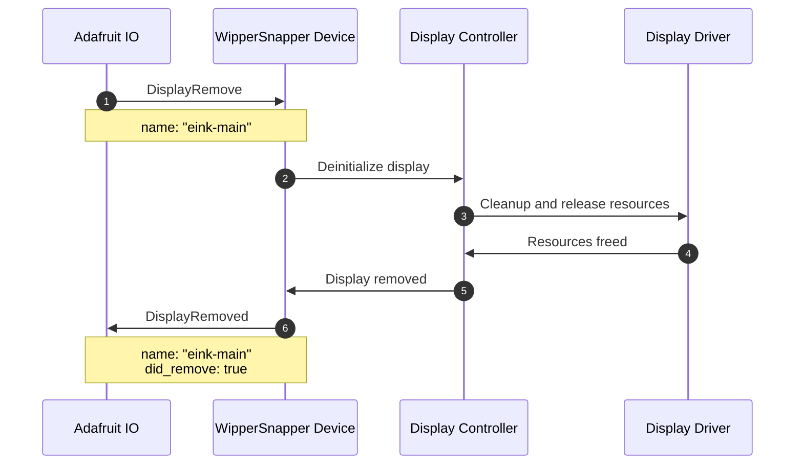

# display.proto

This file details the WipperSnapper messaging API for interfacing with displays connected via SPI, I2C, parallel buses, or DSI.

## Architecture Overview

The v2 Display API supports a wide variety of display technologies and connection types:

### Display Types
- **EPD (E-Paper/E-Ink)** - Low-power bistable displays
- **TFT** - Color LCD displays

### Interface Types
- **SPI** - Serial Peripheral Interface (most common)
- **I2C** - Inter-Integrated Circuit (for smaller OLED displays)
- **TTL RGB666** - 18-bit parallel RGB for Qualia boards
- **i8080** - 8-bit parallel Intel bus for T-DisplayS3/Memento
- **DSI** - Display Serial Interface for high-resolution displays

## Supported Display Drivers

### E-Paper/E-Ink Displays (EPD)

| Driver | Description | Resolution | Adafruit Product |
|--------|-------------|------------|------------------|
| **SSD1680** | EPD controller for monochrome e-paper | Various | Various |
| **ILI0373** | EPD controller (also known as SSD167) | Various | Various |
| **UC8253** | 3.7" Monochrome E-Ink Display | 416x240 | [#6395](https://www.adafruit.com/product/6395) |
| **UC8179** | 5.83" Monochrome E-Ink Display | 648x480 | [#6397](https://www.adafruit.com/product/6397) |
| **UC8151** | 2.9" Flexible E-Ink Display (also ILI0343) | 296x128 | [#4262](https://www.adafruit.com/product/4262) |
| **SSD1683** | 4.2" Grayscale E-Ink Display | 300x400 | [#6381](https://www.adafruit.com/product/6381) |

### TFT Displays

| Driver | Description |
|--------|-------------|
| **ST7789** | TFT LCD controller for color displays |

## Display Modes

### EPD Modes

E-Paper displays support different rendering modes that affect image quality and update speed:

* **EPD_MODE_GRAYSCALE4** - 4-level grayscale rendering (slower but higher quality)
* **EPD_MODE_MONO** - Monochrome black and white (faster updates)

## Interface Configurations

### EPD SPI Configuration

For SPI-connected E-Paper displays:

**Pin Configuration (`EpdSpiConfig`):**
* **bus** - SPI bus number
* **pin_dc** - Data/Command pin
* **pin_rst** - Reset pin
* **pin_cs** - Chip Select pin
* **pin_sram_cs** - SRAM Chip Select pin (optional, for buffering)
* **pin_busy** - Busy signal pin (indicates when display is ready)

**Display Configuration (`EPDConfig`):**
* **mode** - `EPD_MODE_GRAYSCALE4` or `EPD_MODE_MONO`
* **width** - Display width in pixels
* **height** - Display height in pixels
* **text_size** - Text scale factor (1 = 6x8px, 2 = 12x16px, etc.)

### TFT SPI Configuration

For SPI-connected TFT displays:

**Pin Configuration (`TftSpiConfig`):**
* **bus** - SPI bus number
* **pin_cs** - Chip Select pin
* **pin_dc** - Data/Command pin
* **pin_mosi** - MOSI (Master Out Slave In) pin
* **pin_sck** - SCK (Serial Clock) pin
* **pin_rst** - Reset pin
* **pin_miso** - MISO (Master In Slave Out) pin (optional)

**Display Configuration (`TftConfig`):**
* **width** - Display width in pixels
* **height** - Display height in pixels
* **rotation** - Display rotation (0-3)
* **text_size** - Text scale factor (1 = 6x8px, 2 = 12x16px, etc.)

### I2C Configuration

For I2C-connected displays (typically small OLEDs):

**Bus Configuration (`I2cBusConfig`):**
* I2C address and bus pins (see i2c.proto for details)

### TTL RGB666 Configuration (Qualia Boards)

For 18-bit parallel RGB displays:

**Pin Configuration (`TtlRgb666PinConfig`):**
* **pin_r0, pin_r1, pin_r2** - Red channel pins
* **pin_g0, pin_g1, pin_g2** - Green channel pins
* **pin_b0, pin_b1, pin_b2** - Blue channel pins

**Display Configuration (`TtlRgb666Config`):**
* **width, height** - Display dimensions in pixels
* **rotation** - Display rotation (0-3)
* **text_size** - Text scale factor

### i8080 Configuration (T-DisplayS3, Memento)

For 8-bit parallel Intel 8080 bus displays:

**Pin Configuration (`I8080PinConfig`):**
* **pin_d0 through pin_d7** - 8-bit data bus pins
* **pin_cs** - Chip Select pin
* **pin_dc** - Data/Command pin
* **pin_rst** - Reset pin

**Display Configuration (`I8080Config`):**
* **width, height** - Display dimensions in pixels
* **rotation** - Display rotation (0-3)
* **text_size** - Text scale factor

### DSI Configuration

For Display Serial Interface (high-res displays):

**Pin Configuration (`DsiPinConfig`):**
* **pin_clk** - DSI clock lane
* **pin_data0 through pin_data3** - DSI data lanes (up to 4)

**Display Configuration (`DsiConfig`):**
* **width, height** - Display dimensions in pixels
* **rotation** - Display rotation (0-3)
* **text_size** - Text scale factor

## Sequence Diagrams

### Add or Replace a Display

The same message is used for both adding new displays and updating existing configurations.



### Write Content to Display

Displays can receive different types of content: text, URLs, base64 images, or binary images.

```mermaid
sequenceDiagram
autonumber
participant IO as Adafruit IO
participant Device as WipperSnapper Device
participant Display as Display Controller
participant Driver as Display Driver

IO->>Device: DisplayWrite
Note over IO,Device: name: "eink-main"<br/>Content type (one of):<br/>- message: "Hello World"<br/>- url: "https://example.com/image.png"<br/>- base64image: "data:image/png;base64,..."<br/>- binary_image: {content_type, data}

Device->>Display: Forward content

alt Text Message
    Display->>Driver: Render text with text_size
    Driver->>Display: Text rendered
else Image (URL, Base64, or Binary)
    Display->>Device: Fetch/decode image if needed
    Device->>Display: Image data
    Display->>Driver: Render bitmap image
    Driver->>Display: Image rendered
end

Driver->>Display: Update complete
Note over Display: For EPD: Wait for busy pin<br/>For TFT: Immediate
```

### Remove a Display



## Content Types for DisplayWrite

The `DisplayWrite` message supports multiple content types for maximum flexibility:

### 1. Text Message

Simple monospace text rendered directly on the display:
```
message: "Temperature: 23.5°C\nHumidity: 45%"
```
- Maximum 1024 characters
- Uses display's default monospace font
- Sized according to `text_size` configuration
- Line breaks with `\n`

### 2. URL

Fetch an image from a URL and display it:
```
url: "https://io.adafruit.com/api/v2/feeds/weather/image"
```
- Maximum 10240 characters for URL
- Device fetches image over network
- Supports common image formats (PNG, JPEG, BMP)

### 3. Base64 Image

Base64-encoded image with content type prefix:
```
base64image: "data:image/png;base64,iVBORw0KGgoAAAANSUhEUgAAAAUA..."
```
- Maximum 102400 characters (~75KB image data)
- Include MIME type prefix
- Useful for small images sent directly in message

### 4. Binary Image

Raw binary image data with separate content type:
```
binary_image: {
  content_type: "image/png",
  data: <binary bytes>
}
```
- Maximum 102400 bytes (~100KB)
- More efficient than base64 for larger images
- Content type specified separately

## E-Paper Display Considerations

### Update Speed

E-Paper displays have slower refresh rates than TFT displays:
- **Monochrome mode** - ~1-2 seconds per full refresh
- **Grayscale mode** - ~5-10 seconds per full refresh

### Busy Pin

The **pin_busy** signal indicates when the display is ready:
- HIGH - Display is busy updating
- LOW - Display is ready for next command

Always check busy pin before sending new content to EPD displays.

### Image Persistence

E-Paper displays retain their image without power, making them ideal for:
- Low-power applications
- Status displays that update infrequently
- Outdoor readability in direct sunlight

## Example Configurations

### Example 1: 5.83" E-Ink Display (UC8179)

```
DisplayAddOrReplace {
  type: DISPLAY_TYPE_EPD,
  driver: DISPLAY_DRIVER_EPD_UC8179,
  name: "weather-display",
  spi_epd: {
    bus: 0,
    pin_dc: "D10",
    pin_rst: "D9",
    pin_cs: "D8",
    pin_busy: "D11"
  },
  config_epd: {
    mode: EPD_MODE_MONO,
    width: 648,
    height: 480,
    text_size: 3
  }
}
```

### Example 2: TFT Display (ST7789)

```
DisplayAddOrReplace {
  type: DISPLAY_TYPE_TFT,
  driver: DISPLAY_DRIVER_TFT_ST7789,
  name: "status-screen",
  spi_tft: {
    bus: 0,
    pin_cs: "D5",
    pin_dc: "D6",
    pin_mosi: "D11",
    pin_sck: "D13",
    pin_rst: "D9"
  },
  config_tft: {
    width: 240,
    height: 320,
    rotation: 1,
    text_size: 2
  }
}
```

### Example 3: Qualia RGB666 Display

```
DisplayAddOrReplace {
  type: DISPLAY_TYPE_TFT,
  driver: DISPLAY_DRIVER_TFT_ST7789,  // or appropriate driver
  name: "qualia-main",
  ttl_rgb666: {
    pin_r0: "GPIO1", pin_r1: "GPIO2", pin_r2: "GPIO3",
    pin_g0: "GPIO4", pin_g1: "GPIO5", pin_g2: "GPIO6",
    pin_b0: "GPIO7", pin_b1: "GPIO8", pin_b2: "GPIO9"
  },
  config_ttl_rgb666: {
    width: 480,
    height: 480,
    rotation: 0,
    text_size: 2
  }
}
```

## Best Practices

### Display Naming

Use descriptive names that indicate the display's purpose:
- ✓ `"weather-display"`, `"status-screen"`, `"sensor-dashboard"`
- ✗ `"display1"`, `"disp"`, `"d"`

### Image Optimization

- **E-Paper**: Use 1-bit (monochrome) or 4-bit (grayscale) images
- **TFT**: Use RGB565 format for best performance
- Resize images to display resolution before sending
- For EPD, dither images for better appearance

### Update Frequency

- **E-Paper**: Limit updates to once per minute or less
- **TFT**: Can update as frequently as needed
- Consider partial updates for E-Paper when possible

### Text Sizing

Choose text_size based on display resolution:
- **Small displays (<128px)**: text_size = 1
- **Medium displays (128-320px)**: text_size = 2
- **Large displays (>320px)**: text_size = 3+

## Related Documentation

- [i2c.proto](i2c.md) - For I2C-connected OLED displays
- [WipperSnapper Components](https://github.com/adafruit/Wippersnapper_Components) - Display component definitions

## Future Considerations

From the proto file comments, future improvements may include:
- Merging config message types for consistency
- Brightness pin control in pin configurations
- Refactoring SPI bus pin info to be a sub-message
- Support for multiple displays with the same name
