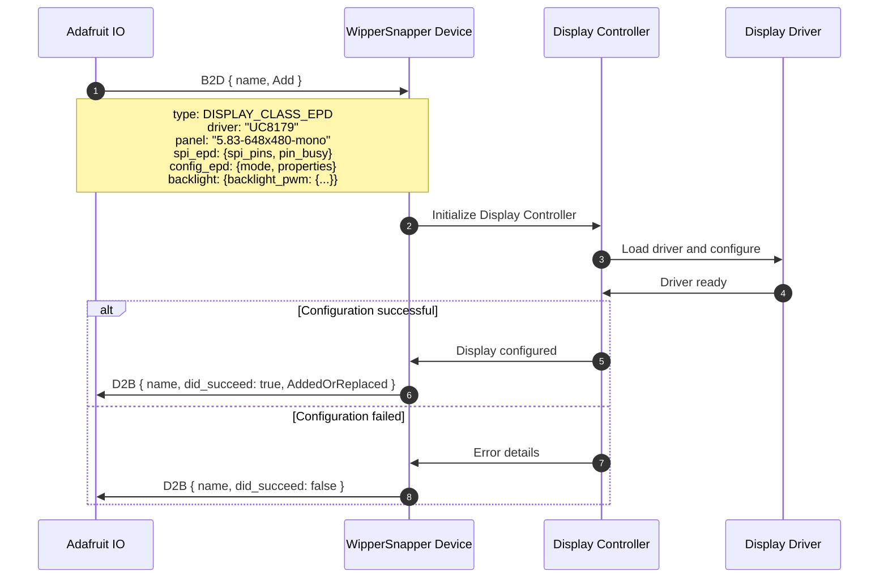
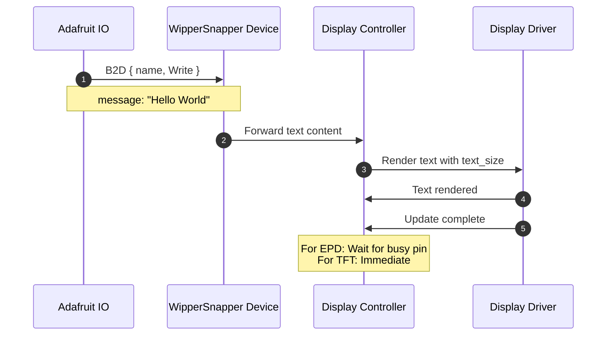
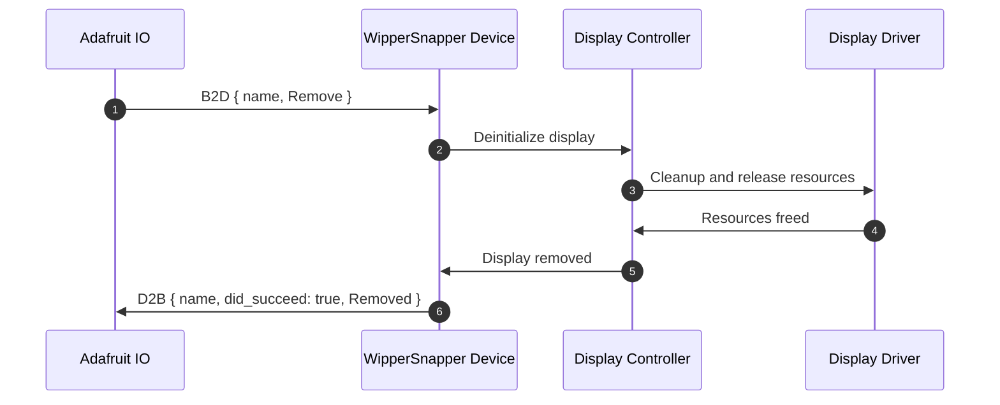

# display.proto

This file details the WipperSnapper messaging API for interfacing with displays connected via SPI, I2C, parallel buses, or DSI.

## Architecture Overview

The v2 Display API supports a wide variety of display technologies and connection types through a unified message structure.

### Display Classes
- **EPD (E-Paper/E-Ink)** - Low-power bistable displays
- **TFT** - Color LCD displays
- **OLED** - Organic LED displays (monochrome or color)
- **LED Backpack** - HT16K33-based 7-segment/14-segment LED displays
- **Character LCD** - Text-based LCD displays

### Interface Types
- **SPI** - Serial Peripheral Interface (EPD and TFT)
- **I2C** - Inter-Integrated Circuit (OLED, LED backpack, character LCD)
- **TTL RGB666** - 18-bit parallel RGB for Qualia boards
- **i8080** - 8-bit parallel Intel bus for T-DisplayS3/Memento
- **DSI** - MIPI Display Serial Interface for high-resolution displays (e.g., ESP32-P4)

## Supported Display Drivers

Drivers are specified as strings (no proto recompilation needed to add new ones).

### E-Paper/E-Ink Displays (EPD)

| Driver | Description |
|--------|-------------|
| **SSD1680** | EPD controller for monochrome e-paper |
| **ILI0373** | EPD controller (also known as SSD167) |
| **UC8253** | EPD controller for 3.7" displays |
| **UC8179** | EPD controller for 5.83" displays |
| **UC8151** | EPD controller for flexible e-ink (also ILI0343) |
| **SSD1683** | EPD controller for 4.2" grayscale displays |

### TFT Displays

| Driver | Description |
|--------|-------------|
| **ST7789** | TFT LCD controller |

### OLED Displays

| Driver | Description |
|--------|-------------|
| **SSD1306** | Monochrome OLED (128x64, 128x32) |
| **SSD1305** | Monochrome OLED |
| **SH1106** | Monochrome OLED (128x64) |
| **SH1107** | Monochrome OLED |

### LED Backpack Displays

| Driver | Description |
|--------|-------------|
| **HT16K33** | Adafruit LED backpacks (7-segment, alphanumeric) |

### Character LCD Displays

| Driver | Description |
|--------|-------------|
| **MCP23008** | I2C GPIO expander for LCD |
| **PCF8574** | I2C to parallel expander for LCD |

## Message Envelopes (B2D / D2B)

All display messages are wrapped in envelope messages that include the display instance name.

### BrokerToDevice (B2D)

```protobuf
message B2D {
  string name = 1;       // Unique instance identifier
  oneof payload {
    Add add       = 2;   // Add or replace a display
    Remove remove = 3;   // Remove a display
    Write write   = 4;   // Write content to a display
  }
}
```

### DeviceToBroker (D2B)

```protobuf
message D2B {
  string name        = 1;  // Unique instance identifier
  bool did_succeed   = 2;  // Whether the operation succeeded
  oneof payload {
    AddedOrReplaced added_or_replaced = 3;
    Removed removed                   = 4;
  }
}
```

## Display Properties

Common display properties shared across graphical display types:

```protobuf
message DisplayProperties {
  int32 width     = 1;  // Display width in pixels
  int32 height    = 2;  // Display height in pixels
  int32 rotation  = 3;  // Clockwise 90° increments (0-3)
  int32 text_size = 4;  // Text scale factor (1 = 6x8px, 2 = 12x16px, ...)
}
```

## Interface Configurations

### Shared SPI Pin Config

All SPI displays share a common pin configuration:

```protobuf
message SpiPinConfig {
  int32 bus       = 1;  // SPI bus number
  string pin_mosi = 2;  // MOSI pin
  string pin_sck  = 3;  // SCK pin
  string pin_miso = 4;  // MISO pin (optional)
  string pin_cs   = 5;  // Chip Select pin
  string pin_dc   = 6;  // Data/Command pin
  string pin_rst  = 7;  // Reset pin
}
```

### EPD SPI Configuration

Wraps the shared SPI config with EPD-specific pins:

* **spi_pins** - SPI bus and pin configuration
* **pin_sram_cs** - SRAM Chip Select pin (optional, for buffering)
* **pin_busy** - Busy signal pin (indicates when display is ready)

### TFT SPI Configuration

Wraps the shared SPI config directly:

* **spi_pins** - SPI bus and pin configuration

### I2C Configuration

I2C displays use `ws.i2c.DeviceDescriptor` for bus configuration (address, SDA/SCL pins, etc.). See [i2c.md](i2c.md) for details.

### TTL RGB666 Configuration (Qualia Boards)

18-bit parallel RGB pin configuration:

* **pin_r0, pin_r1, pin_r2** - Red channel pins
* **pin_g0, pin_g1, pin_g2** - Green channel pins
* **pin_b0, pin_b1, pin_b2** - Blue channel pins

### i8080 Configuration (T-DisplayS3, Memento)

8-bit parallel Intel 8080 bus pin configuration:

* **pin_d0 through pin_d7** - 8-bit data bus pins
* **pin_cs** - Chip Select pin
* **pin_dc** - Data/Command pin
* **pin_rst** - Reset pin

### DSI Configuration

MIPI DSI displays use dedicated differential pads (not GPIOs) for clock and data lanes:

* **bus** - DSI bus index (0 if only one DSI peripheral)
* **pin_rst** - GPIO pin for display panel reset

## Display-Specific Configs

### EPDConfig

* **mode** - `EPD_MODE_GRAYSCALE4` or `EPD_MODE_MONO`
* **properties** - `DisplayProperties` (width, height, rotation, text_size)

### LedBackpackConfig

* **brightness** - 0 (off) to 15 (full brightness)
* **alignment** - `LBA_LEFT` or `LBA_RIGHT`

### CharLcdConfig

* **rows** - Number of rows (2, 4, etc.)
* **columns** - Number of columns (16, 20, etc.)

### DisplayProperties (generic)

Used for TFT, OLED, TTL RGB666, i8080, and DSI displays:

* **width, height** - Display dimensions in pixels
* **rotation** - Display rotation (0-3)
* **text_size** - Text scale factor

## Backlight Configuration

Backlight control is configured in the `Add` message via a `BacklightConfig` field. It supports two modes:

```protobuf
message BacklightConfig {
  oneof backlight_add {
    ws.digitalio.Add backlight_digital = 1;  // On/off backlight via digital pin
    ws.pwm.Add backlight_pwm           = 2;  // Dimmable backlight via PWM pin
  }
}
```

- **Digital backlight**: Simple on/off control using a DigitalIO pin. Control is sent via standard `DigitalIO.Write` messages.
- **PWM backlight**: Variable brightness control using a PWM pin. Control is sent via standard `PWM.Write` messages.

The backlight pin is configured at display add time (check-in) and then controlled independently through the respective DigitalIO or PWM write paths.

## Sequence Diagrams

### Add or Replace a Display

The same message is used for both adding new displays and updating existing configurations.



### Write Content to Display

Displays receive text content via the `Write` message.



### Remove a Display



## Content Types for Write

The `Write` message supports a single content type:

### Text Message

Monospace text rendered directly on the display:
```
message: "Temperature: 23.5C\nHumidity: 45%"
```
- Uses the display's default monospace font
- Sized according to `text_size` in `DisplayProperties`
- Line breaks with `\n`

For LED backpacks and character LCDs, the text is rendered according to the display type (e.g., numeric segments, character cells).

## E-Paper Display Considerations

### Update Speed

E-Paper displays have slower refresh rates than TFT displays:
- **Monochrome mode** - ~1-2 seconds per full refresh
- **Grayscale mode** - ~5-10 seconds per full refresh

### Busy Pin

The **pin_busy** signal indicates when the display is ready:
- HIGH - Display is busy updating
- LOW - Display is ready for next command

Always check busy pin before sending new content to EPD displays.

### Image Persistence

E-Paper displays retain their image without power, making them ideal for:
- Low-power applications
- Status displays that update infrequently
- Outdoor readability in direct sunlight

## Example Configurations

### Example 1: 5.83" E-Ink Display (UC8179)

```
B2D {
  name: "weather-display",
  add: {
    type: DISPLAY_CLASS_EPD,
    driver: "UC8179",
    panel: "5.83-648x480-mono",
    spi_epd: {
      spi_pins: {
        bus: 0,
        pin_dc: "D10",
        pin_rst: "D9",
        pin_cs: "D8"
      },
      pin_busy: 11
    },
    config_epd: {
      mode: EPD_MODE_MONO,
      properties: {
        width: 648,
        height: 480,
        text_size: 3
      }
    }
  }
}
```

### Example 2: TFT Display (ST7789) with PWM Backlight

```
B2D {
  name: "status-screen",
  add: {
    type: DISPLAY_CLASS_TFT,
    driver: "ST7789",
    spi_tft: {
      spi_pins: {
        bus: 0,
        pin_cs: "D5",
        pin_dc: "D6",
        pin_mosi: "D11",
        pin_sck: "D13",
        pin_rst: "D9"
      }
    },
    config_display: {
      width: 240,
      height: 135,
      rotation: 1,
      text_size: 2
    },
    backlight: {
      backlight_pwm: {
        pin: "D45",
        frequency: 1000,
        duty_cycle: 65535
      }
    }
  }
}
```

### Example 3: SSD1306 OLED over I2C

```
B2D {
  name: "status-display",
  add: {
    type: DISPLAY_CLASS_OLED,
    driver: "SSD1306",
    panel: "128x64",
    i2c: {
      device_address: 0x3C
    },
    config_display: {
      width: 128,
      height: 64,
      text_size: 1
    }
  }
}
```

### Example 4: 7-Segment LED Backpack over I2C

```
B2D {
  name: "clock-display",
  add: {
    type: DISPLAY_CLASS_LED_BACKPACK,
    driver: "HT16K33",
    panel: "4digit-7seg",
    i2c: {
      device_address: 0x70
    },
    config_led: {
      brightness: 8,
      alignment: LBA_RIGHT
    }
  }
}
```

### Example 5: Character LCD over I2C

```
B2D {
  name: "info-display",
  add: {
    type: DISPLAY_CLASS_CHAR_LCD,
    driver: "PCF8574",
    panel: "16x2",
    i2c: {
      device_address: 0x27
    },
    config_char_lcd: {
      rows: 2,
      columns: 16
    }
  }
}
```

### Example 6: Writing to a Display

```
B2D {
  name: "clock-display",
  write: {
    message: "12:34"
  }
}
```

### Example 7: Add with Initial Content

The `Add` message supports an optional `write` field for initial display content at check-in:

```
B2D {
  name: "status-screen",
  add: {
    type: DISPLAY_CLASS_TFT,
    driver: "ST7789",
    spi_tft: { ... },
    config_display: { width: 240, height: 135 },
    write: {
      message: "Initializing..."
    }
  }
}
```

## Best Practices

### Display Naming

Use descriptive names that indicate the display's purpose:
- Good: `"weather-display"`, `"status-screen"`, `"sensor-dashboard"`
- Bad: `"display1"`, `"disp"`, `"d"`

### Panel Identifiers

For E-Paper displays especially, the same driver can support multiple panels:
- Format: `"{size}-{resolution}-{color_mode}"` or `"adafruit-{product_id}"`
- Examples: `"5.83-648x480-mono"`, `"4.2-300x400-gray"`, `"adafruit-6397"`

### Text Sizing

Choose text_size based on display resolution:
- **Small displays (<128px)**: text_size = 1
- **Medium displays (128-320px)**: text_size = 2
- **Large displays (>320px)**: text_size = 3+

### Update Frequency

- **E-Paper**: Limit updates to once per minute or less
- **TFT**: Can update as frequently as needed

## Related Documentation

- [i2c.proto](i2c.md) - For I2C-connected display device descriptors
- [pwm.proto](pwm.md) - For PWM backlight control
- [digitalio.proto](digitalio.md) - For digital backlight control
