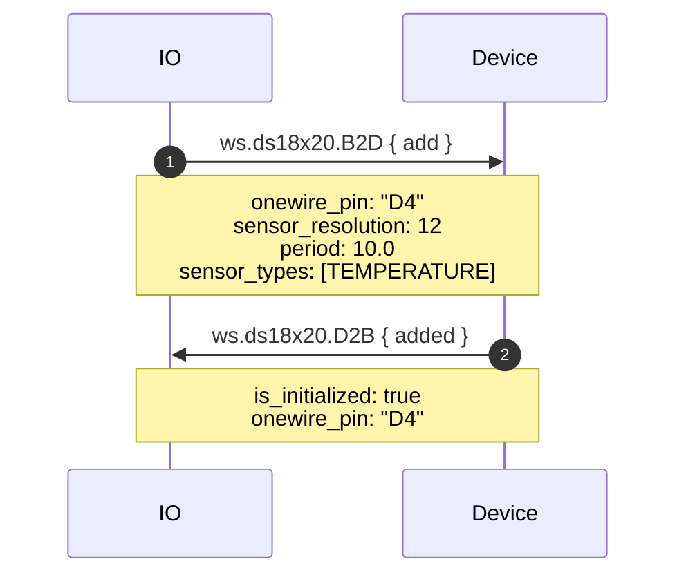
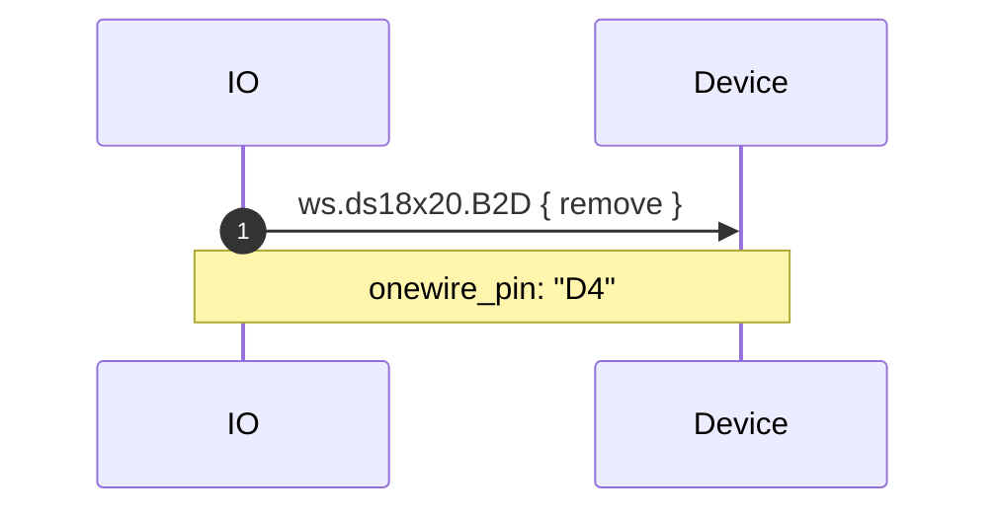
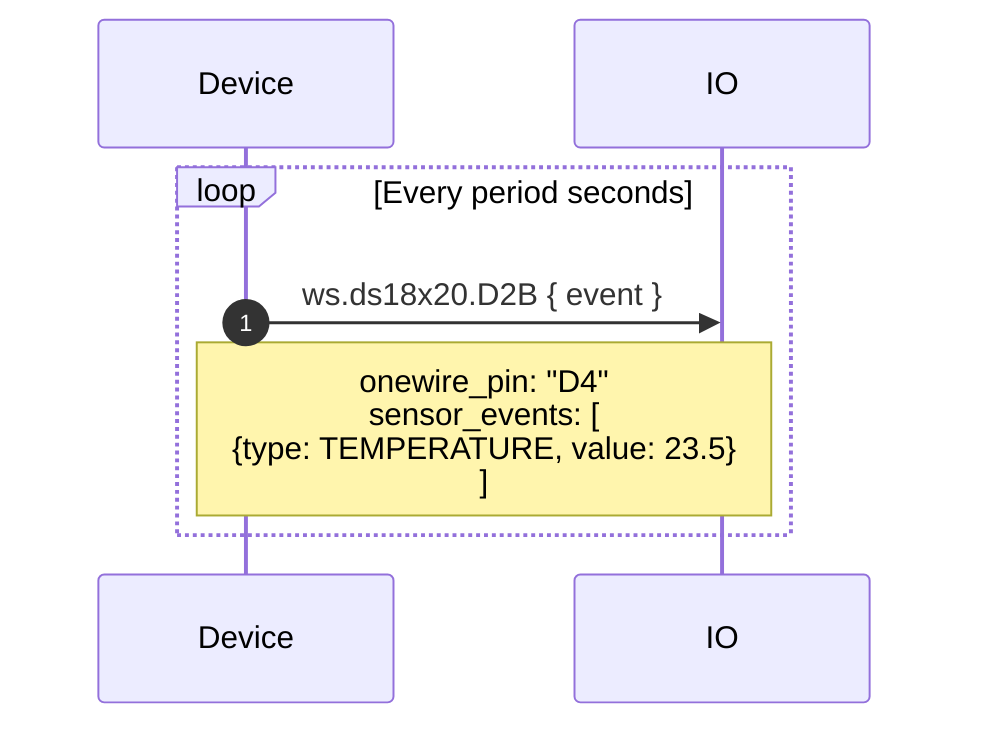

# ds18x20.proto

This file details the API used by hardware running Adafruit WipperSnapper firmware for interfacing with a DS18B20 temperature sensor.

**Note about design and implementation**: WipperSnapper defines a pin as a OneWire bus. Only one DS18x20 sensor is allowed per pin. To use multiple DS18x20 sensors, use multiple pins.

## WipperSnapper Component Definitions

The following JSON component definition type(s) reference `ds18x20.proto`:
* [ds18x20](https://github.com/adafruit/Wippersnapper_Components/tree/main/components/ds18x20)

## Architecture Overview

The v2 DS18x20 API uses message envelopes:

- **B2D (BrokerToDevice)** - Commands from Adafruit IO to device
  - `add` - Initialize a OneWire bus and DS18x20 sensor
  - `remove` - Deinitialize the sensor and release the pin

- **D2B (DeviceToBroker)** - Responses and data from device to Adafruit IO
  - `added` - Confirmation of sensor initialization
  - `event` - Temperature sensor reading

## Message Details

### Add

- **onewire_pin** - Pin to use as a OneWire bus
- **sensor_resolution** - Sensor resolution (9, 10, 11, or 12 bits)
- **period** - Read period in seconds
- **sensor_types** - SI types used by the sensor (`repeated ws.sensor.Type`)

### Added (response)

- **is_initialized** - True if the OneWire bus initialized successfully
- **onewire_pin** - The pin being used

### Event

- **onewire_pin** - Pin identifying the sensor
- **sensor_events** - Sensor readings (`repeated ws.sensor.Event`)

## Sequence Diagrams

### Create: DS18x20

Request from a broker to:
1) Initialize a OneWire bus on a desired pin
2) Initialize and configure a DS18x20 Maxim temperature sensor on the OneWire bus

### Delete: DS18x20

Request from a broker to deinitialize the sensor and release the OneWire pin:

### Sensor Event: DS18x20

Periodic temperature reading sent from device to broker:

