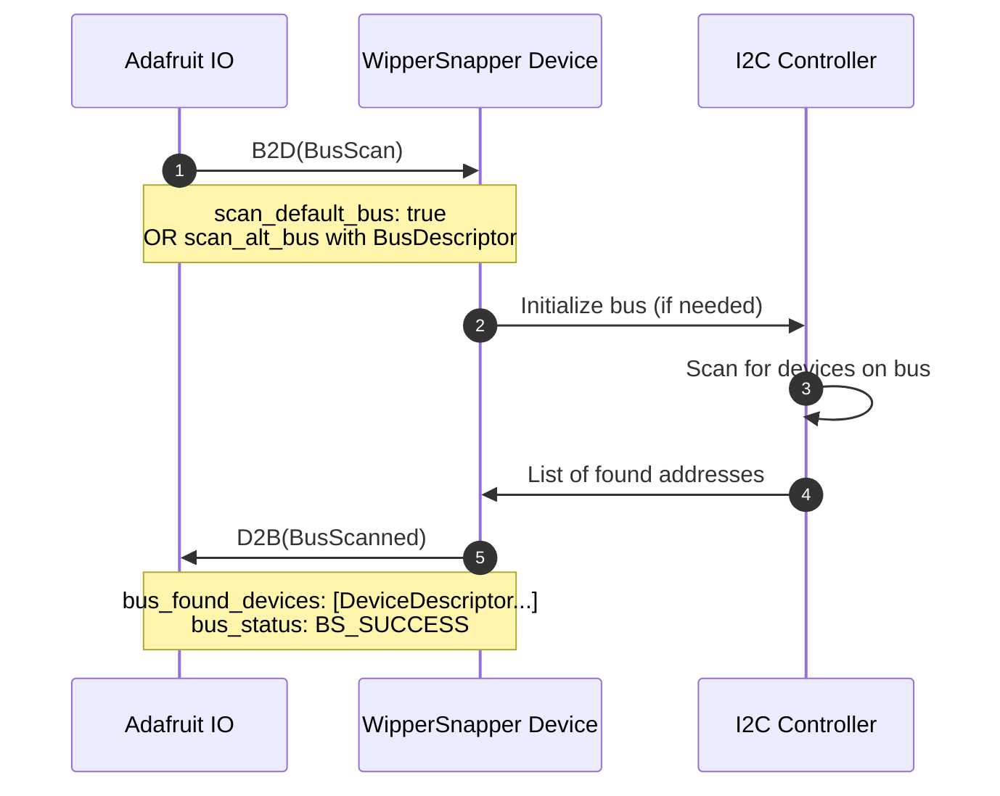
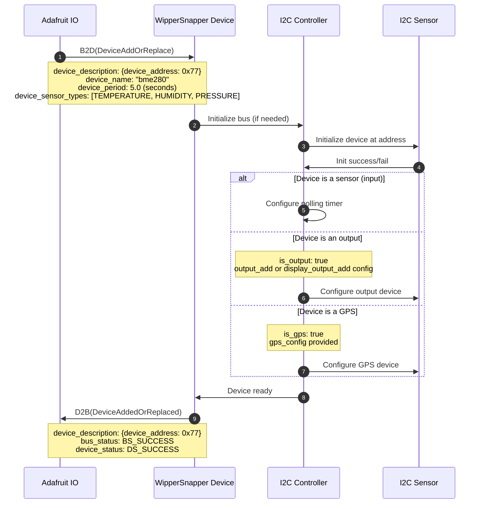
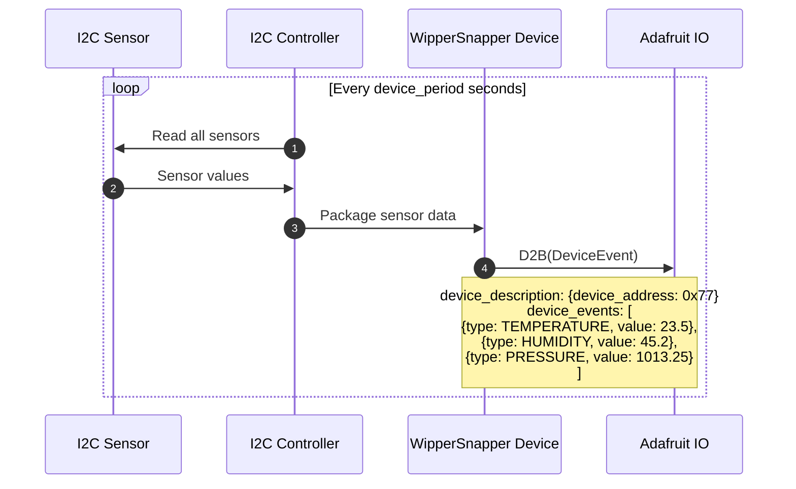
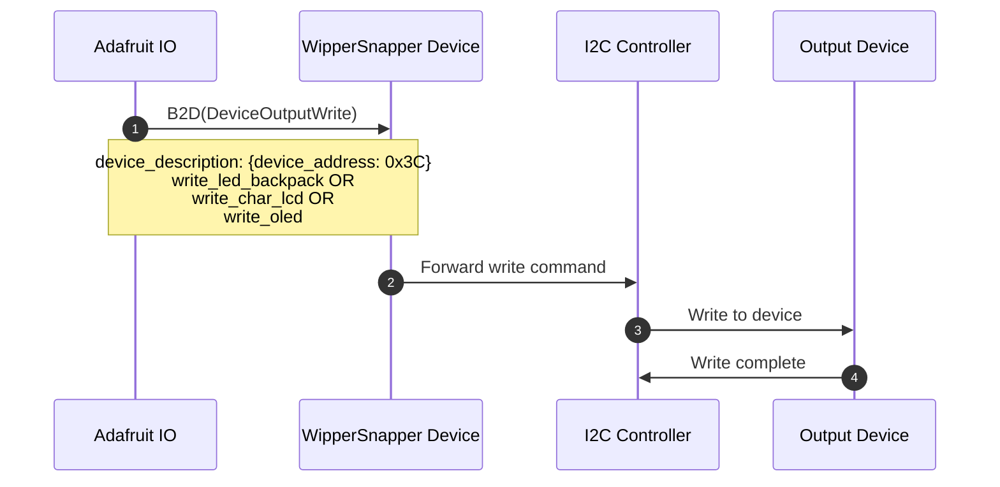
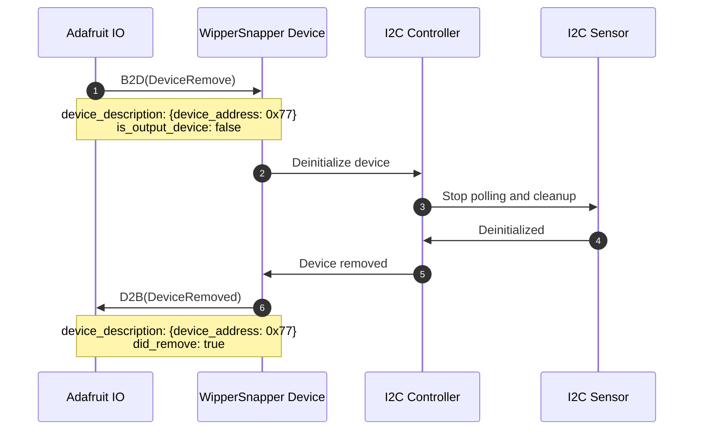

# i2c.proto

This file details the API used by hardware running Adafruit WipperSnapper firmware for interfacing with the I2C bus and I2C sensors.

## WipperSnapper Component Definitions

The following JSON component definition type(s) reference `i2c.proto`:
* [i2c](https://github.com/adafruit/Wippersnapper_Components/tree/main/components/i2c)

## Architecture Overview

The v2 I2C API uses message envelopes for cleaner organization:

- **B2D (BrokerToDevice)** - Commands from Adafruit IO to device
  - `bus_scan` - Scan the I2C bus for devices
  - `device_add_replace` - Add or update an I2C device
  - `device_remove` - Remove an I2C device
  - `device_output_write` - Write to an I2C output device

- **D2B (DeviceToBroker)** - Responses and data from device to Adafruit IO
  - `bus_scanned` - Results of I2C bus scan
  - `device_added_replaced` - Confirmation of device add/update
  - `device_removed` - Confirmation of device removal
  - `device_event` - Sensor data from I2C device

## Status Codes

### Bus Status

| Status Code | Description |
|------------|-------------|
| `BS_SUCCESS` | I2C bus successfully initialized |
| `BS_ERROR_HANG` | I2C Bus hang detected - user should reset board |
| `BS_ERROR_PULLUPS` | I2C bus failed - SDA or SCL needs a pull-up resistor |
| `BS_ERROR_WIRING` | I2C bus communication failed - check wiring |
| `BS_ERROR_INVALID_CHANNEL` | I2C MUX channel must be 0-7 |

### Device Status

| Status Code | Description |
|------------|-------------|
| `DS_SUCCESS` | I2C device successfully initialized |
| `DS_FAIL_INIT` | I2C device failed to initialize |
| `DS_FAIL_DEINIT` | I2C device failed to deinitialize |
| `DS_FAIL_UNSUPPORTED_SENSOR` | WipperSnapper firmware outdated - update required |
| `DS_NOT_FOUND` | I2C device not found at specified address |

## Device Descriptor

All I2C operations use a `DeviceDescriptor` to identify devices:

- **device_address** - 7-bit I2C address
- **bus_sda** / **bus_scl** - Optional alternate bus pins
- **mux_address** / **mux_channel** - Optional I2C multiplexer configuration

## Sequence Diagrams

### I2C Scan

On Adafruit.io, an I2C scan can be initialized one of two ways:
1) User clicks "I2C Scan" button
2) User clicks an I2C component from the Component Picker

The scan can target the default I2C bus, an alternate bus, or a bus with a multiplexer.



### Add or Replace an I2C Device

**Note:** I2C devices may contain _multiple_ sensors (e.g., a BME280 has temperature, humidity, and pressure sensors). The `device_sensor_types` array specifies all sensor types, and `device_period` sets the polling interval.

The same `DeviceAddOrReplace` message is used for both creating new devices and updating existing ones.



### Sending Sensor Data from an I2C Device

Sensor devices periodically send data to Adafruit IO based on their configured `device_period`. Since an I2C device may have multiple sensors (e.g., BME280 has temperature, humidity, and pressure), the `device_events` array contains all sensor readings.



### Writing to an I2C Output Device

Output devices (LED backpacks, character LCDs, OLED displays) receive write commands from Adafruit IO.



### Remove an I2C Device

Removing an I2C device deinitializes it and frees resources.



## Special Device Types

### I2C Output Devices

Output devices include LED backpacks, character LCDs, and OLED displays. When adding these devices:
- Set `is_output: true`
- Include the `output_add` configuration with device-specific settings

### I2C Display Devices

Displays connected via I2C (distinct from SPI displays) use:
- Set `is_output: true`
- Include the `display_output_add` configuration

### GPS Devices

GPS modules connected via I2C use:
- Set `is_gps: true`
- Include the `gps_config` with GPS-specific settings

## I2C Multiplexer Support

For boards with multiple I2C devices sharing the same address, use an I2C multiplexer (TCA9548A):

- **mux_address** - Address of the multiplexer (typically 0x70-0x77)
- **mux_channel** - Channel number (0-7) where the device is connected

Example DeviceDescriptor with multiplexer:
```
device_description: {
  device_address: 0x29,
  mux_address: 0x70,
  mux_channel: 2
}
```


