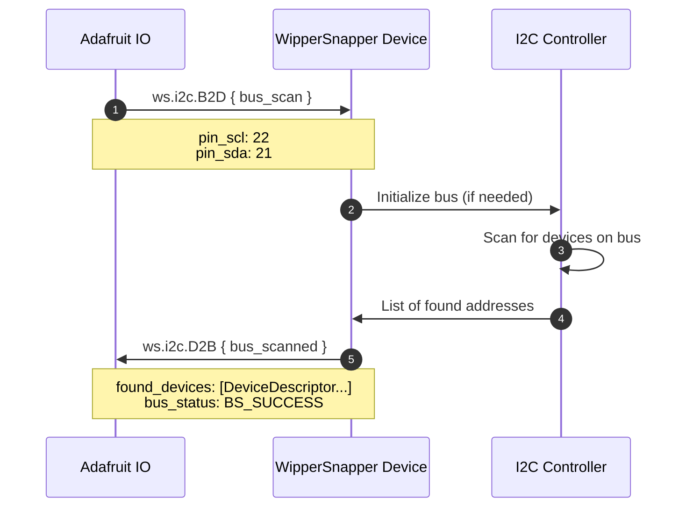
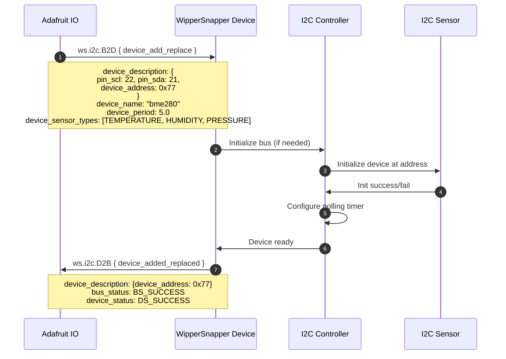
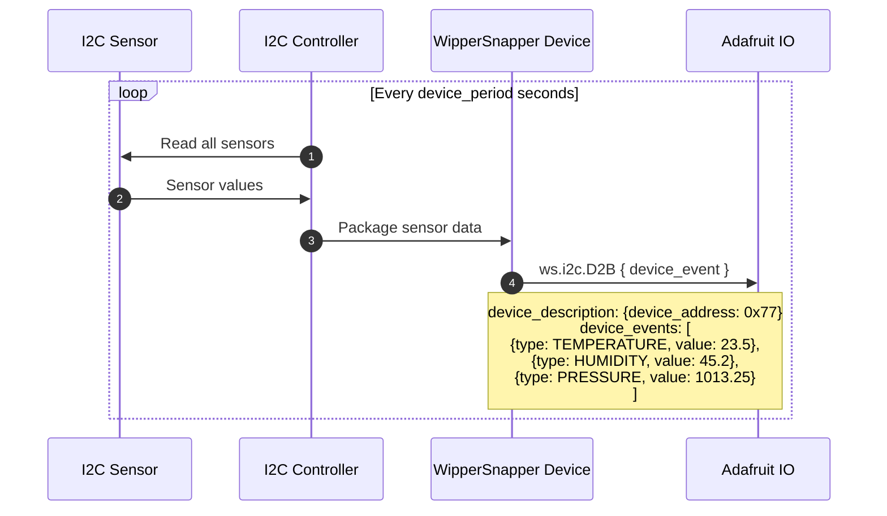
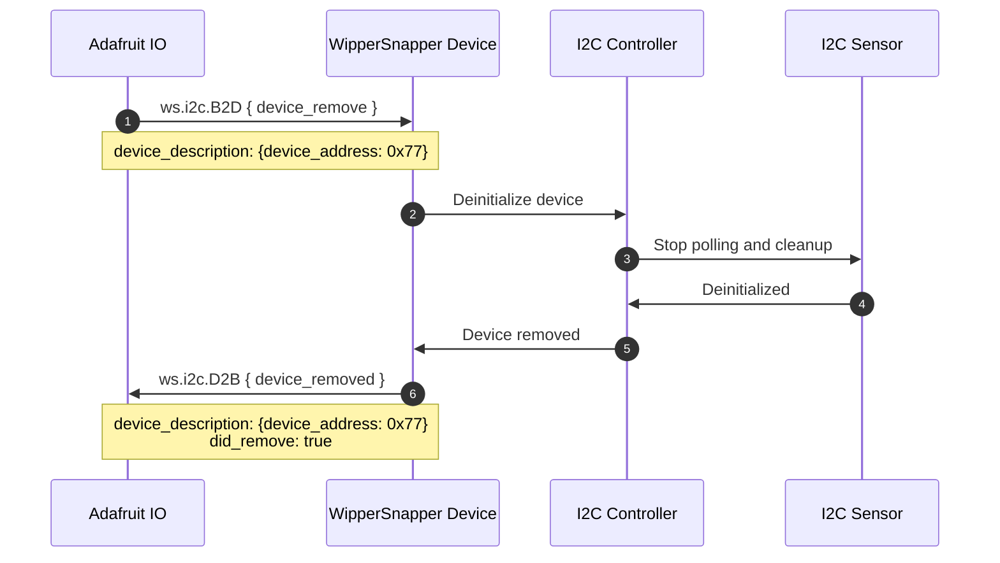

# i2c.proto

This file details the API used by hardware running Adafruit WipperSnapper firmware for interfacing with the I2C bus and I2C sensors.

## WipperSnapper Component Definitions

The following JSON component definition type(s) reference `i2c.proto`:
* [i2c](https://github.com/adafruit/Wippersnapper_Components/tree/main/components/i2c)

## Architecture Overview

The v2 I2C API uses message envelopes for cleaner organization:

- **B2D (BrokerToDevice)** - Commands from Adafruit IO to device
  - `bus_scan` - Scan the I2C bus for devices
  - `device_add_replace` - Add or update an I2C device
  - `device_remove` - Remove an I2C device

- **D2B (DeviceToBroker)** - Responses and data from device to Adafruit IO
  - `bus_scanned` - Results of I2C bus scan
  - `device_added_replaced` - Confirmation of device add/update
  - `device_removed` - Confirmation of device removal
  - `device_event` - Sensor data from I2C device

## Status Codes

### Bus Status

| Status Code | Description |
|------------|-------------|
| `BS_SUCCESS` | I2C bus successfully initialized |
| `BS_ERROR_HANG` | I2C Bus hang detected - user should reset board |
| `BS_ERROR_PULLUPS` | I2C bus failed - SDA or SCL needs a pull-up resistor |
| `BS_ERROR_WIRING` | I2C bus communication failed - check wiring |
| `BS_ERROR_INVALID_CHANNEL` | I2C MUX channel must be 0-7 |

### Device Status

| Status Code | Description |
|------------|-------------|
| `DS_SUCCESS` | I2C device successfully initialized |
| `DS_FAIL_INIT` | I2C device failed to initialize |
| `DS_FAIL_DEINIT` | I2C device failed to deinitialize |
| `DS_FAIL_UNSUPPORTED_SENSOR` | WipperSnapper firmware outdated - update required |
| `DS_NOT_FOUND` | I2C device not found at specified address |

## Device Descriptor

All I2C operations use a `DeviceDescriptor` to identify devices:

- **pin_scl** (`string`) - Pin name for the I2C SCL line, e.g. "D22", "SCL"
- **pin_sda** (`string`) - Pin name for the I2C SDA line, e.g. "D21", "SDA"
- **device_address** (`uint32`) - 7-bit I2C address
- **mux_address** (`uint32`) - Optional I2C multiplexer address
- **mux_channel** (`uint32`) - Optional I2C multiplexer channel

## Scan

The `Scan` message requests a bus scan:

- **pin_scl** (`string`) - SCL pin name
- **pin_sda** (`string`) - SDA pin name
- **mux_address** (`uint32`) - Optional multiplexer address to scan through

## Sequence Diagrams

### I2C Scan

On Adafruit.io, an I2C scan can be initialized one of two ways:
1) User clicks "I2C Scan" button
2) User clicks an I2C component from the Component Picker



### Add or Replace an I2C Device

**Note:** I2C devices may contain _multiple_ sensors (e.g., a BME280 has temperature, humidity, and pressure sensors). The `device_sensor_types` array specifies all sensor types, and `device_period` sets the polling interval.

The same `DeviceAddOrReplace` message is used for both creating new devices and updating existing ones.



### Sending Sensor Data from an I2C Device

Sensor devices periodically send data to Adafruit IO based on their configured `device_period`. Since an I2C device may have multiple sensors (e.g., BME280 has temperature, humidity, and pressure), the `device_events` array contains all sensor readings.



### Remove an I2C Device

Removing an I2C device deinitializes it and frees resources.



## I2C Display Devices

I2C-connected displays (OLEDs, LED backpacks, character LCDs) are configured through the unified display API in `display.proto`. The display `Add` message uses `ws.i2c.DeviceDescriptor` as its I2C interface configuration. See [display.md](display.md) for details.

## I2C Multiplexer Support

For boards with multiple I2C devices sharing the same address, use an I2C multiplexer (TCA9548A):

- **mux_address** - Address of the multiplexer (typically 0x70-0x77)
- **mux_channel** - Channel number (0-7) where the device is connected

Example DeviceDescriptor with multiplexer:
```
device_description: {
  pin_scl: 22,
  pin_sda: 21,
  device_address: 0x29,
  mux_address: 0x70,
  mux_channel: 2
}
```
