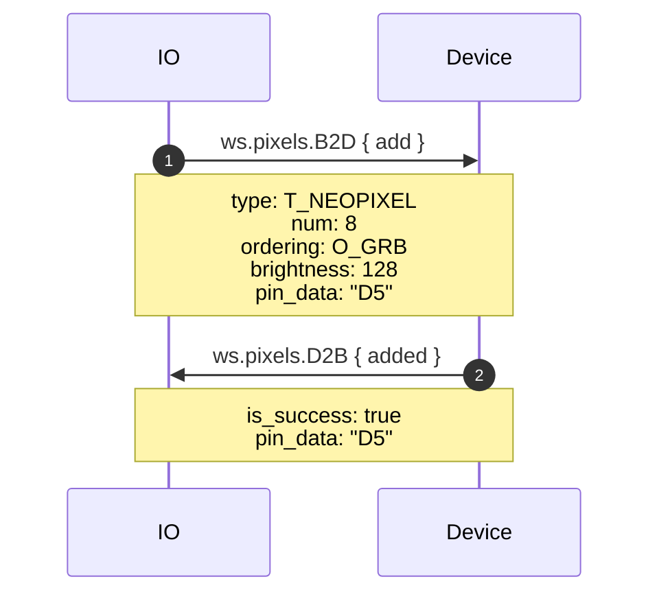
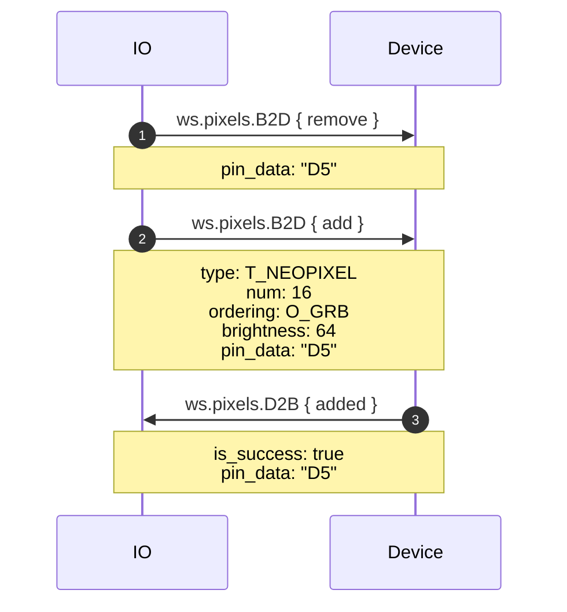
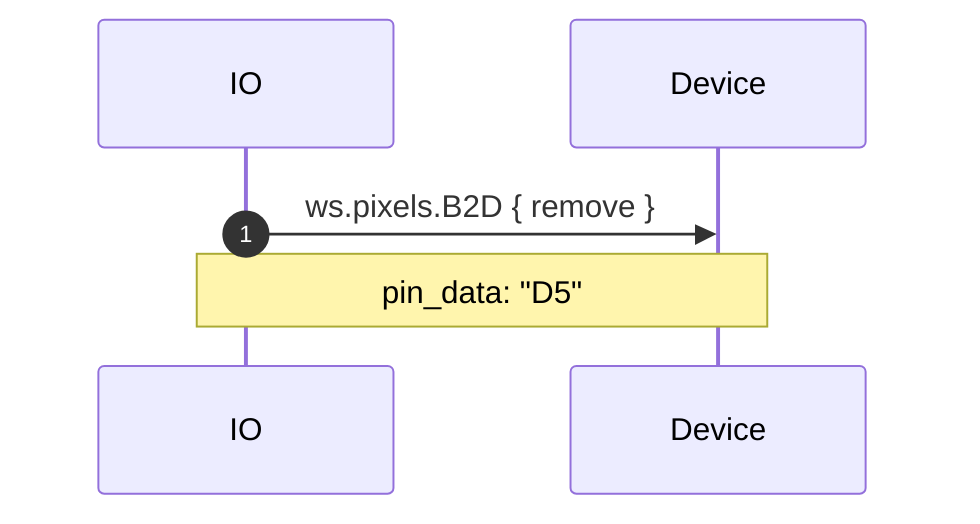
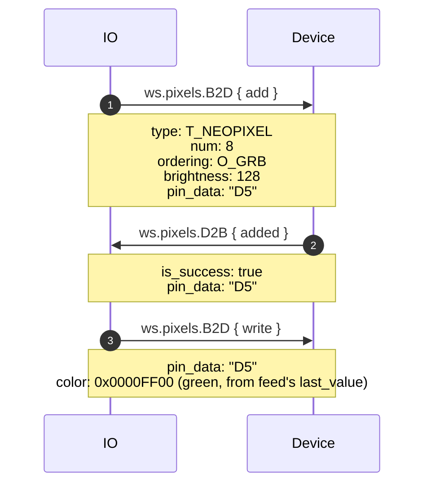
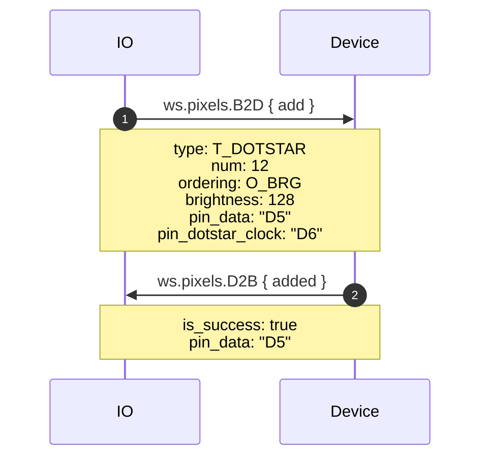
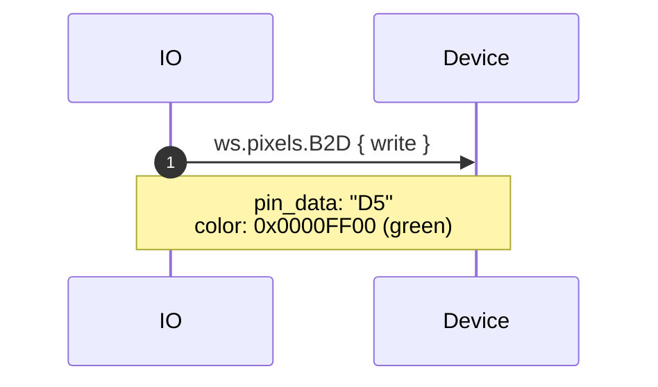
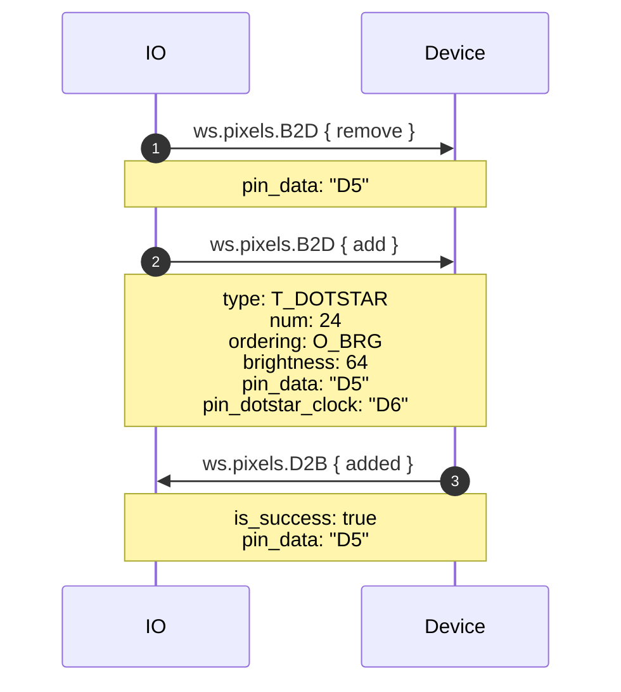
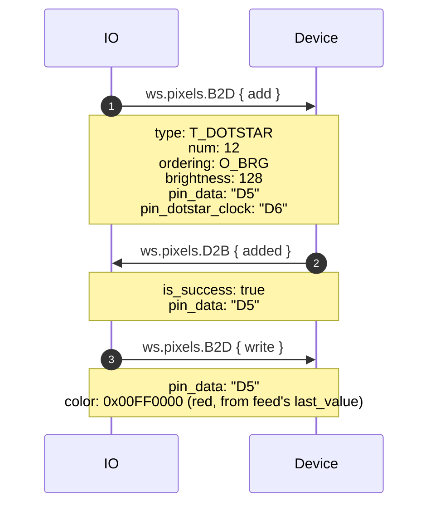

# pixels.proto

This file details the WipperSnapper messaging API for interfacing with a strand of addressable RGB(W) pixels (Adafruit NeoPixel/WS2812b, DotStar/APA102).

## WipperSnapper Components

The following component definitions reference `pixels.proto`:
* [Adafruit_DotStar](https://github.com/adafruit/Wippersnapper_Components/pull/44)
* [Adafruit_NeoPixels](https://github.com/adafruit/Wippersnapper_Components/pull/44)

## Architecture Overview

The v2 Pixels API uses message envelopes:

- **B2D (BrokerToDevice)** - Commands from Adafruit IO to device
  - `add` - Add a strand of addressable pixels
  - `remove` - Remove a strand and release resources
  - `write` - Write a color to a strand

- **D2B (DeviceToBroker)** - Responses from device to Adafruit IO
  - `added` - Confirmation of strand initialization

## Enums

### Type
| Value | Description |
|-------|-------------|
| `T_UNSPECIFIED` | Unspecified (error) |
| `T_NEOPIXEL` | NeoPixel strand |
| `T_DOTSTAR` | DotStar strand |

### Order (Color Ordering)
| Value | Description |
|-------|-------------|
| `O_GRB` | Green, Red, Blue (NeoPixel default) |
| `O_GRBW` | Green, Red, Blue, White |
| `O_RGB` | Red, Green, Blue |
| `O_RGBW` | Red, Green, Blue, White |
| `O_BRG` | Blue, Red, Green (DotStar default) |
| `O_RBG` | Red, Blue, Green |
| `O_GBR` | Green, Blue, Red |
| `O_BGR` | Blue, Green, Red |

## Message Details

### Add

- **type** - Pixel type (`T_NEOPIXEL` or `T_DOTSTAR`)
- **num** - Number of pixels in the strand
- **ordering** - Color ordering (e.g., `O_GRB`)
- **brightness** - Strand brightness (0-255)
- **pin_data** - Data pin for NeoPixel or DotStar
- **pin_dotstar_clock** - Clock pin (DotStar only)
- **write** - Optional initial write (used during check-in)

### Write

- **pin_data** - Data pin of the strand
- **color** - 32-bit color value (MSB: white for RGBW or ignored for RGB, then red, green, blue LSB)

### Added (response)

- **is_success** - True if strand initialized successfully
- **pin_data** - Data pin of the responding strand

## Sequence Diagrams

### Create: NeoPixel

### Write: NeoPixel

### Update: NeoPixel

### Delete: NeoPixel

### Sync: NeoPixel

### Create: DotStar

### Write: DotStar

### Update: DotStar

### Delete: DotStar

### Sync: DotStar

