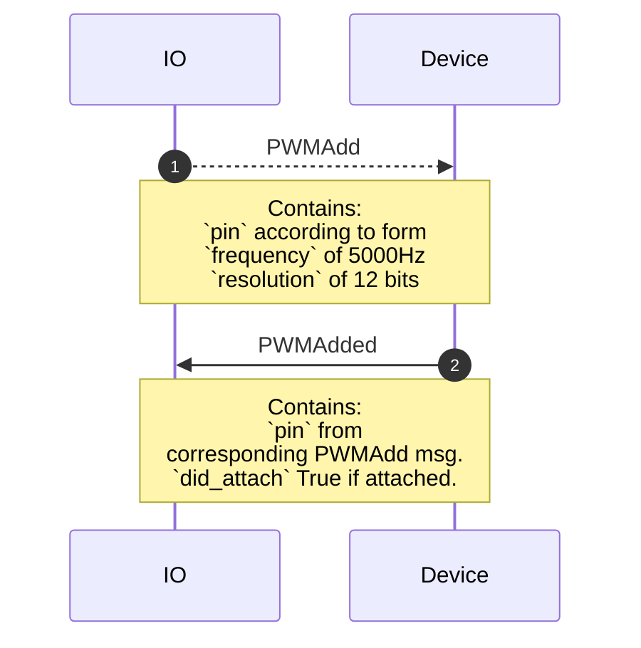
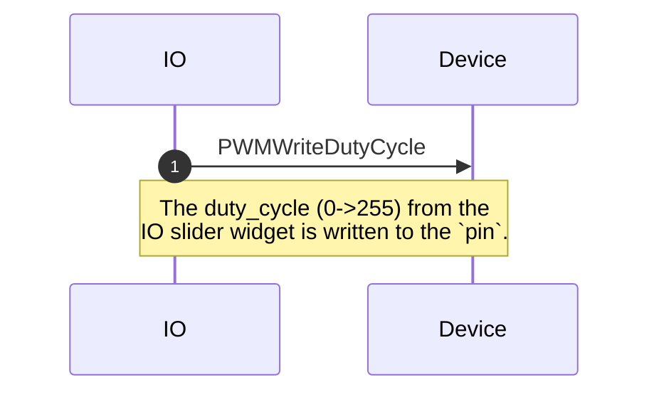
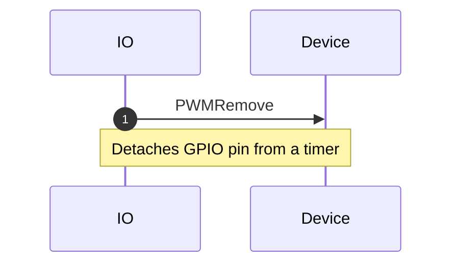
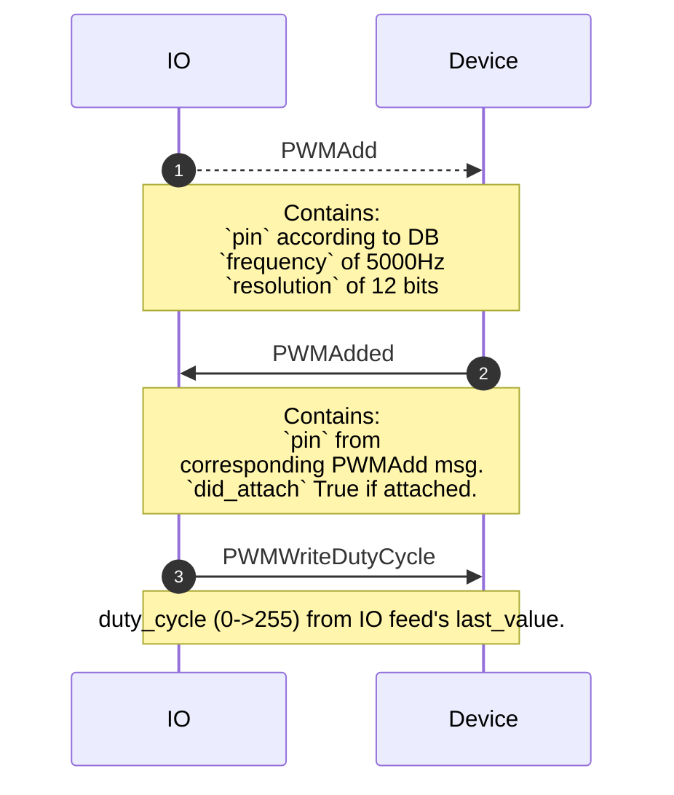
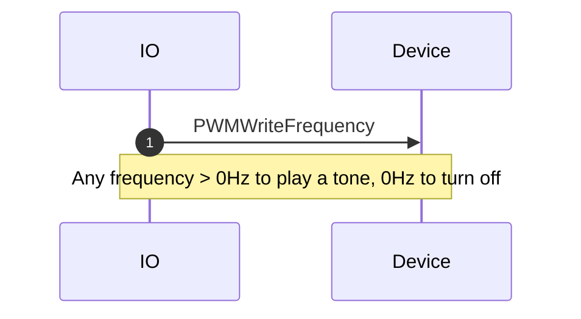
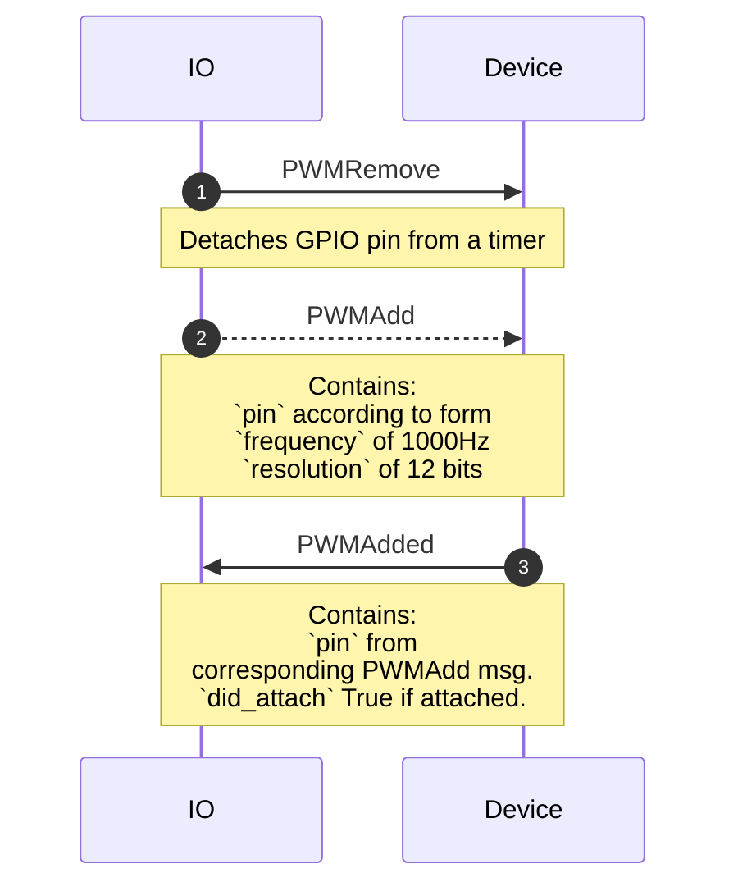
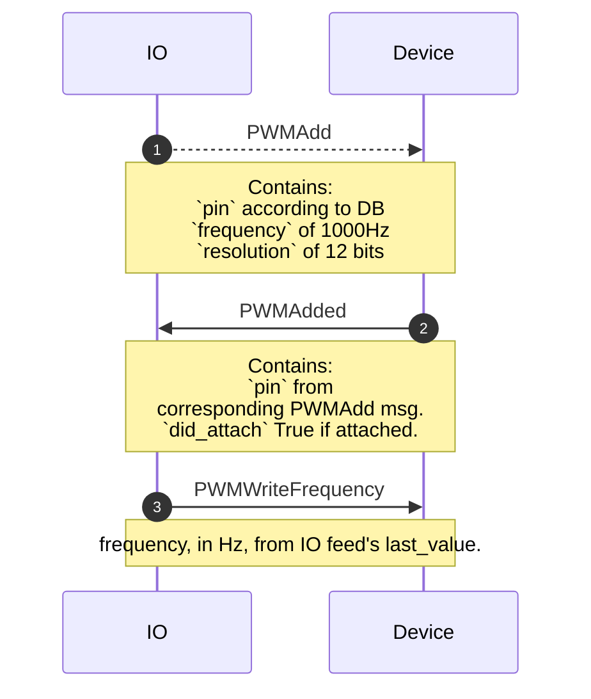

# pwm.proto

This file details the WipperSnapper messaging API for interfacing with PWM output components.

PWM components either have a fixed frequency with a variable duty cycle _or_ a variable frequency with a fixed duty cycle.

## WipperSnapper Components

The following WipperSnapper components utilize `pwm.proto`:

* Dimmable LED (Fixed Frequency, variable Duty Cycle)

* Piezo Buzzer (Variable Frequency, fixed Duty Cycle)

## Sequence Diagrams

### Create: Dimmable LED

### Write: Dimmable LED

### Update: Dimmable LED

### Delete: Dimmable LED

### Sync: Dimmable LED

### Create: Piezo Buzzer

### Write: Piezo Buzzer

### Update: Piezo Buzzer

### Delete: Piezo Buzzer

### Sync: Piezo Buzzer

