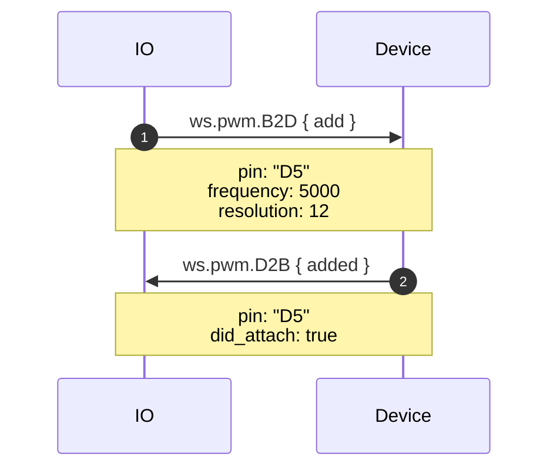
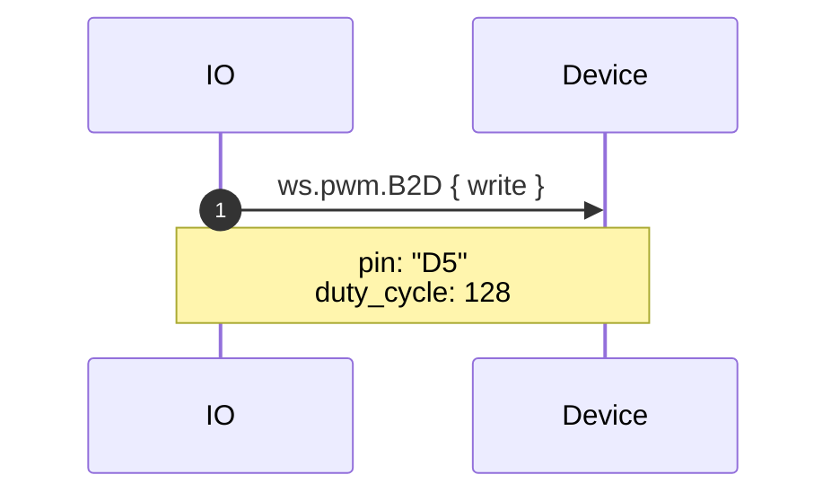
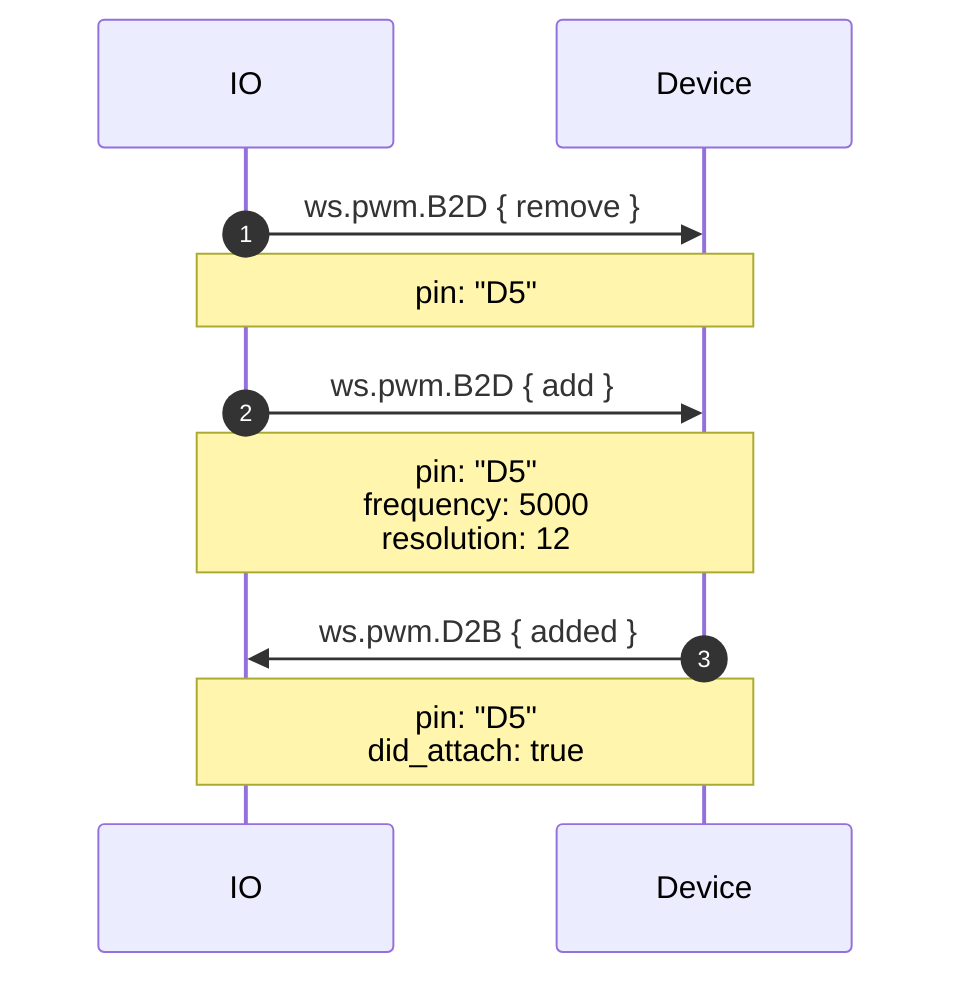
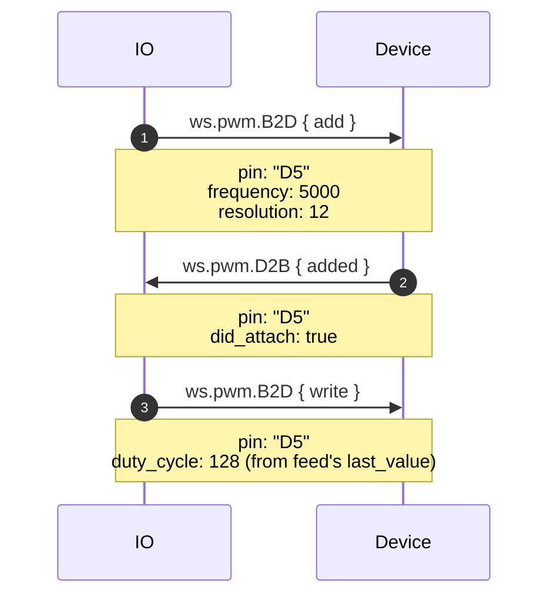
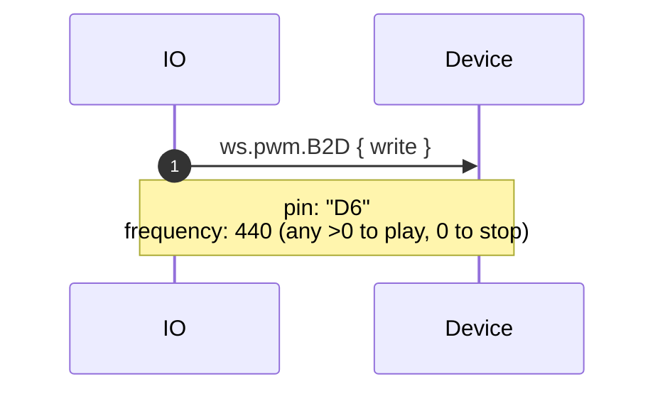
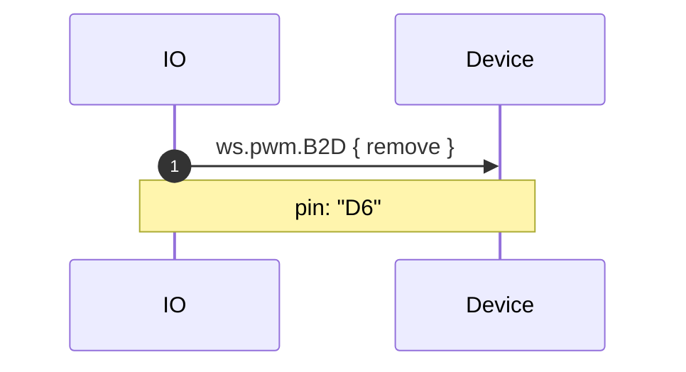
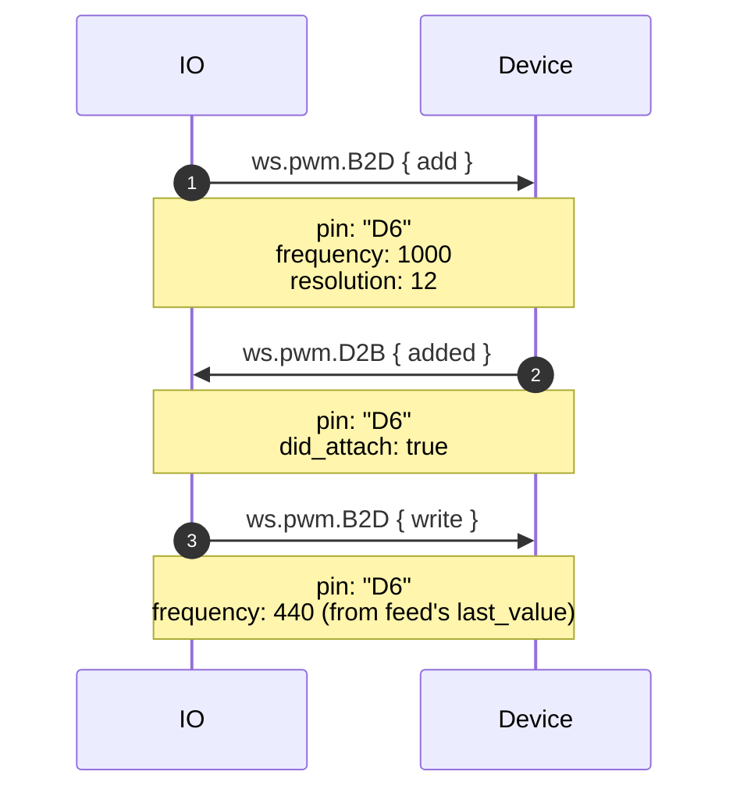

# pwm.proto

This file details the WipperSnapper messaging API for interfacing with PWM output components.

PWM components either have a fixed frequency with a variable duty cycle _or_ a variable frequency with a fixed duty cycle.

## WipperSnapper Components

The following WipperSnapper components utilize `pwm.proto`:

* Dimmable LED (Fixed Frequency, variable Duty Cycle)
* Piezo Buzzer (Variable Frequency, fixed Duty Cycle)

## Architecture Overview

The v2 PWM API uses message envelopes:

- **B2D (BrokerToDevice)** - Commands from Adafruit IO to device
  - `add` - Attach/allocate a PWM pin
  - `remove` - Detach a PWM pin
  - `write` - Write duty cycle or frequency to a pin

- **D2B (DeviceToBroker)** - Responses from device to Adafruit IO
  - `added` - Confirmation of pin attachment

## Message Details

### Add

Attaches a PWM pin. On ESP32, this attaches a pin to a LEDC channel/timer group.

- **pin** - The pin to attach
- **frequency** - PWM frequency in Hz
- **resolution** - Resolution in bits
- **is_inverted** - If true, inverts the output (active low)
- **write** - Optional initial write (used during check-in)

### Write

Writes either a duty cycle or frequency (mutually exclusive via oneof):

- **pin** - The pin to write to
- **duty_cycle** - Duty cycle value (range 0 to 2^resolution)
- **frequency** - Frequency in Hz (duty cycle fixed at 50%)

### Added (response)

- **pin** - The pin that was configured
- **did_attach** - True if attachment was successful

## Sequence Diagrams

### Create: Dimmable LED

```mermaid
sequenceDiagram
autonumber

IO->>Device: ws.pwm.B2D { add }
Note over IO, Device: pin: "D5"<br/>frequency: 5000<br/>resolution: 12

Device->>IO: ws.pwm.D2B { added }
Note over IO, Device: pin: "D5"<br/>did_attach: true
```

### Write: Dimmable LED

```mermaid
sequenceDiagram
autonumber
IO->>Device: ws.pwm.B2D { write }
Note over IO, Device: pin: "D5"<br/>duty_cycle: 128
```

### Update: Dimmable LED

```mermaid
sequenceDiagram
autonumber
IO->>Device: ws.pwm.B2D { remove }
Note over IO, Device: pin: "D5"

IO->>Device: ws.pwm.B2D { add }
Note over IO, Device: pin: "D5"<br/>frequency: 5000<br/>resolution: 12

Device->>IO: ws.pwm.D2B { added }
Note over IO, Device: pin: "D5"<br/>did_attach: true
```

### Delete: Dimmable LED

```mermaid
sequenceDiagram
autonumber
IO->>Device: ws.pwm.B2D { remove }
Note over IO, Device: pin: "D5"
```

### Sync: Dimmable LED

```mermaid
sequenceDiagram
autonumber

IO->>Device: ws.pwm.B2D { add }
Note over IO, Device: pin: "D5"<br/>frequency: 5000<br/>resolution: 12

Device->>IO: ws.pwm.D2B { added }
Note over IO, Device: pin: "D5"<br/>did_attach: true

IO->>Device: ws.pwm.B2D { write }
Note over IO, Device: pin: "D5"<br/>duty_cycle: 128 (from feed's last_value)
```

### Create: Piezo Buzzer

```mermaid
sequenceDiagram
autonumber

IO->>Device: ws.pwm.B2D { add }
Note over IO, Device: pin: "D6"<br/>frequency: 1000<br/>resolution: 12

Device->>IO: ws.pwm.D2B { added }
Note over IO, Device: pin: "D6"<br/>did_attach: true
```

### Write: Piezo Buzzer

```mermaid
sequenceDiagram
autonumber
IO->>Device: ws.pwm.B2D { write }
Note over IO, Device: pin: "D6"<br/>frequency: 440 (any >0 to play, 0 to stop)
```

### Update: Piezo Buzzer

```mermaid
sequenceDiagram
autonumber
IO->>Device: ws.pwm.B2D { remove }
Note over IO, Device: pin: "D6"

IO->>Device: ws.pwm.B2D { add }
Note over IO, Device: pin: "D6"<br/>frequency: 1000<br/>resolution: 12

Device->>IO: ws.pwm.D2B { added }
Note over IO, Device: pin: "D6"<br/>did_attach: true
```

### Delete: Piezo Buzzer

```mermaid
sequenceDiagram
autonumber
IO->>Device: ws.pwm.B2D { remove }
Note over IO, Device: pin: "D6"
```

### Sync: Piezo Buzzer

```mermaid
sequenceDiagram
autonumber

IO->>Device: ws.pwm.B2D { add }
Note over IO, Device: pin: "D6"<br/>frequency: 1000<br/>resolution: 12

Device->>IO: ws.pwm.D2B { added }
Note over IO, Device: pin: "D6"<br/>did_attach: true

IO->>Device: ws.pwm.B2D { write }
Note over IO, Device: pin: "D6"<br/>frequency: 440 (from feed's last_value)
```
