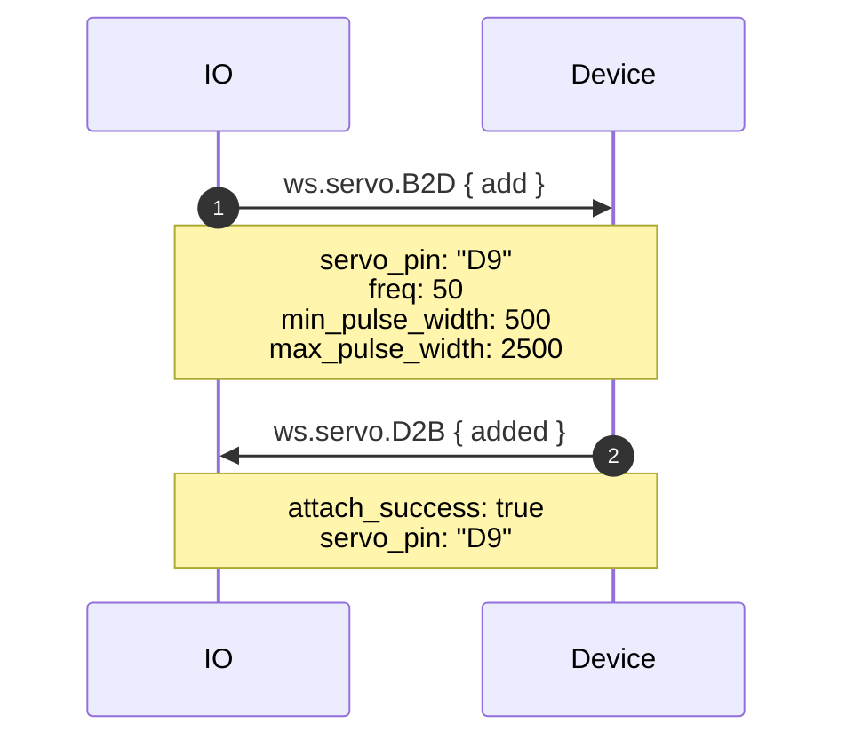
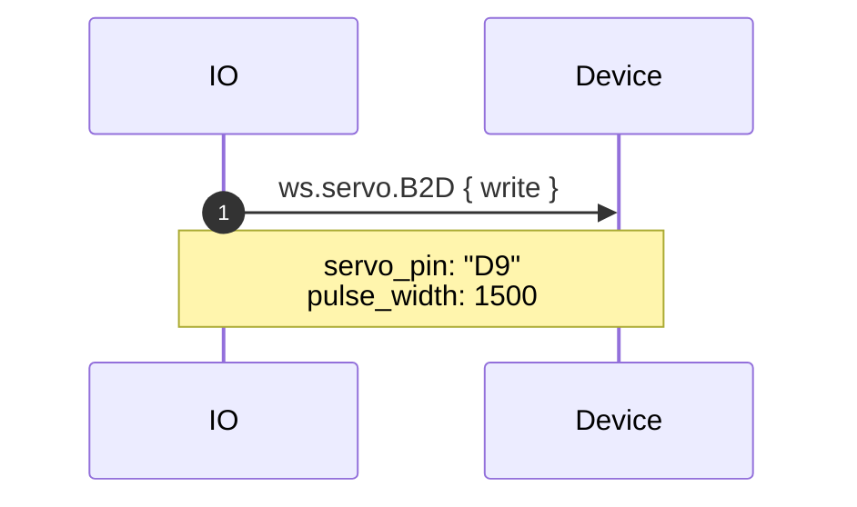
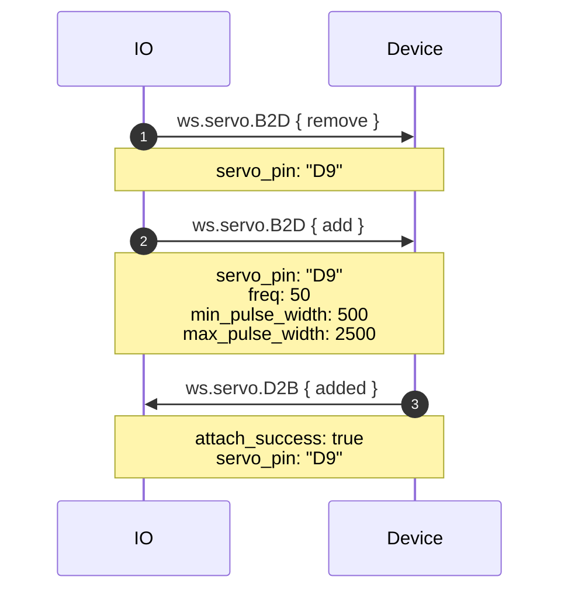
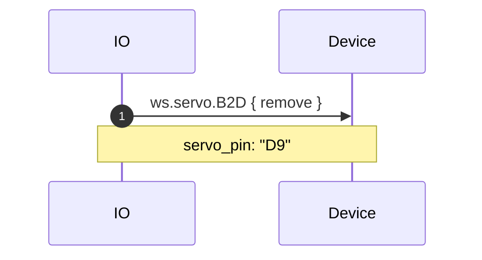

# servo.proto

This file details the WipperSnapper messaging API for interfacing with servo output components.

## WipperSnapper Components

The following WipperSnapper components utilize `servo.proto`:
* [Generic Servo](https://github.com/adafruit/Wippersnapper_Components/tree/main/components/servo/servo)

## Architecture Overview

The v2 Servo API uses message envelopes:

- **B2D (BrokerToDevice)** - Commands from Adafruit IO to device
  - `add` - Attach a servo to a pin
  - `remove` - Detach a servo from a pin
  - `write` - Write a pulse width to a servo

- **D2B (DeviceToBroker)** - Responses from device to Adafruit IO
  - `added` - Confirmation of servo attachment

## Message Details

### Add

- **servo_pin** - Pin to attach the servo to
- **freq** - PWM frequency (default 50Hz)
- **min_pulse_width** - Minimum pulse length in uS (default 500uS)
- **max_pulse_width** - Maximum pulse length in uS (default 2500uS)
- **write** - Optional initial write (used during check-in)

### Write

- **servo_pin** - Pin to address
- **pulse_width** - Pulse width in uS (device converts to duty cycle at 50Hz)

### Added (response)

- **attach_success** - True if servo was attached successfully
- **servo_pin** - Pin that was configured

## Sequence Diagrams

### Create: Servo

### Write: Servo

### Update: Servo

### Delete: Servo

### Sync: Servo

