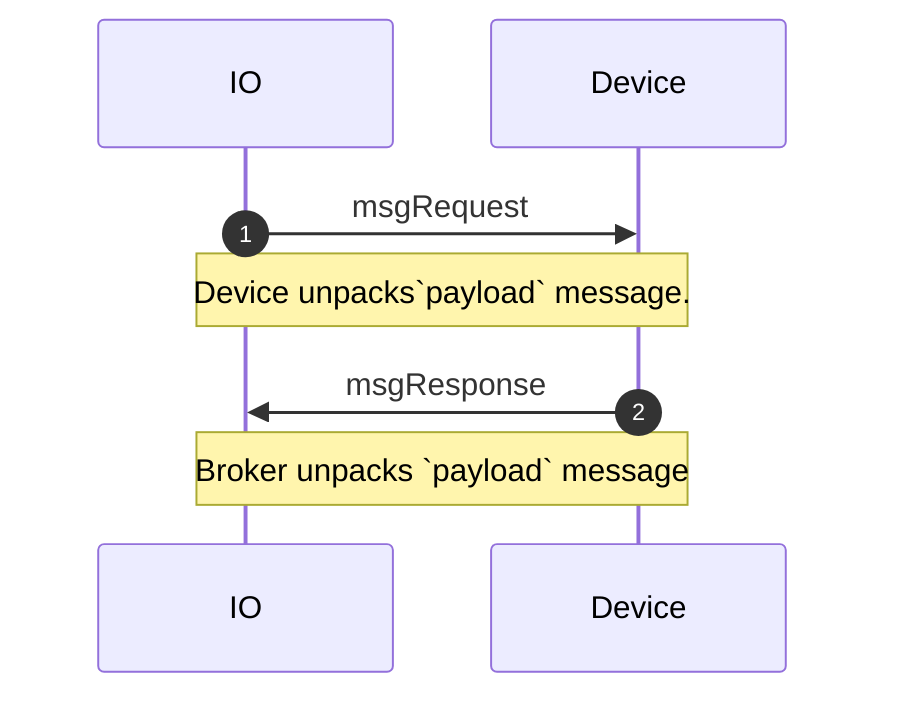

# signal.proto

This file details the `signal.proto` message used to communicate between WipperSnapper clients. The signal file contains high-level `oneof` messages that "wrap" the following protocol buffer APIs: `pin.proto`, `i2c.proto`, `servo.proto`, `pwm.proto`, `ds18x20.proto`, `pixels .proto`, `uart.proto`.

## Sequence Diagrams

### Generalized `msgRequest` and `msgResponse`

Within `signal.proto`, each `.proto` API contains both a `request` and `response` message. The `request` message is a command sent from the broker to a device. The `response` message is a command sent from the device to the broker.

