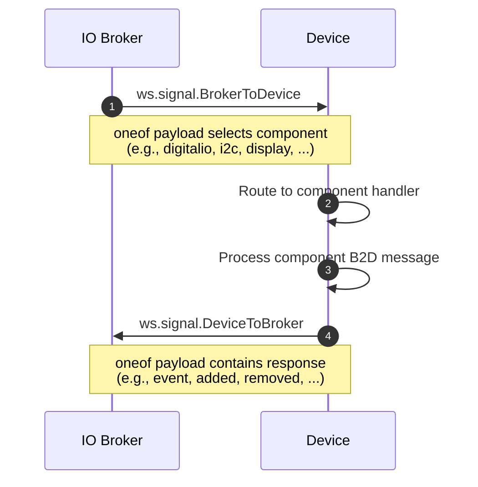
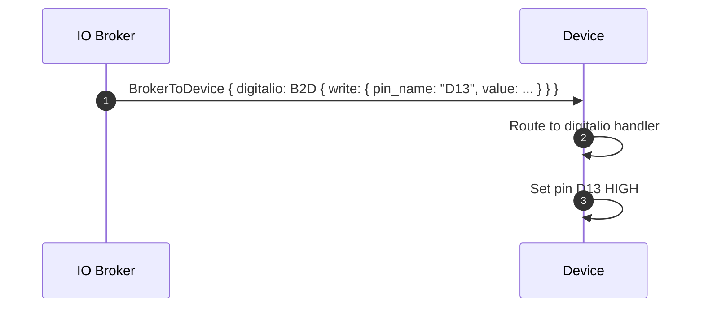

# signal.proto

This file defines the top-level message routing for all WipperSnapper v2 communication between the MQTT broker and devices.

## Message Format

The signal file contains two root messages: `BrokerToDevice` and `DeviceToBroker`. Each uses a `oneof` payload that routes to the appropriate component's B2D or D2B envelope message.

### BrokerToDevice

Sent from the broker to a device. Contains a `oneof payload` selecting one component:

```protobuf
message BrokerToDevice {
  oneof payload {
    // System Events
    ws.error.B2D error    = 10;

    // Device Interactions
    ws.checkin.B2D checkin     = 20;
    ws.sleep.B2D sleep         = 21;

    // Component Interactions
    ws.digitalio.B2D digitalio = 30;
    ws.analogio.B2D analogio   = 31;
    ws.servo.B2D servo         = 32;
    ws.pwm.B2D pwm             = 33;
    ws.pixels.B2D pixels       = 34;
    ws.ds18x20.B2D ds18x20     = 35;
    ws.display.B2D display     = 36;
    ws.uart.B2D uart           = 37;
    ws.i2c.B2D i2c             = 38;
    ws.gps.B2D gps             = 39;
  }
}
```

### DeviceToBroker

Sent from a device to the broker. Contains a `oneof payload` selecting one component:

```protobuf
message DeviceToBroker {
  oneof payload {
    // System Events
    ws.error.D2B error    = 10;

    // Device Interactions
    ws.checkin.D2B checkin     = 20;
    ws.sleep.D2B sleep         = 21;

    // Component Interactions
    ws.digitalio.D2B digitalio = 30;
    ws.analogio.D2B analogio   = 31;
    ws.servo.D2B servo         = 32;
    ws.pwm.D2B pwm             = 33;
    ws.pixels.D2B pixels       = 34;
    ws.ds18x20.D2B ds18x20     = 35;
    ws.display.D2B display     = 36;
    ws.uart.D2B uart           = 37;
    ws.i2c.D2B i2c             = 38;
    ws.gps.D2B gps             = 39;
  }
}
```

## Payload Message Naming Conventions

Each component defines its own B2D and D2B envelope messages. Within those envelopes, payload fields generally follow these conventions:

* `add` - Configure and add a component to a device
* `remove` - Release a component's resources and remove it
* `write` - Write data or commands to an output component
* `event` - Sensor data or pin state from the device

Some components have specialized operations:
* `bus_scan` / `bus_scanned` - I2C bus scanning
* `added` / `added_or_replaced` - Confirmation responses
* `removed` - Removal confirmation

## Sequence Diagram

### High-Level Operation


```mermaid
sequenceDiagram
autonumber

IO Broker->>Device: ws.signal.BrokerToDevice
Note over IO Broker,Device: oneof payload selects component<br/>(e.g., digitalio, i2c, display, ...)

Device->>Device: Route to component handler
Device->>Device: Process component B2D message

Device->>IO Broker: ws.signal.DeviceToBroker
Note over IO Broker,Device: oneof payload contains response<br/>(e.g., event, added, removed, ...)
```

### Example: Digital IO Write


```mermaid
sequenceDiagram
autonumber

IO Broker->>Device: BrokerToDevice { digitalio: B2D { write: { pin_name: "D13", value: ... } } }
Device->>Device: Route to digitalio handler
Device->>Device: Set pin D13 HIGH
```

## Component Summary

| Field # | Component | Package | B2D Operations | D2B Operations |
|---------|-----------|---------|----------------|----------------|
| 10 | error | ws.error | B2D | D2B |
| 20 | checkin | ws.checkin | Response | Request, Complete |
| 21 | sleep | ws.sleep | - | - |
| 30 | digitalio | ws.digitalio | Add, Remove, Write | Event |
| 31 | analogio | ws.analogio | Add, Remove | Event |
| 32 | servo | ws.servo | Add, Remove, Write | Added |
| 33 | pwm | ws.pwm | Add, Remove, Write | Added |
| 34 | pixels | ws.pixels | Add, Remove, Write | Added |
| 35 | ds18x20 | ws.ds18x20 | Add, Remove | Added, Event |
| 36 | display | ws.display | Add, Remove, Write | AddedOrReplaced, Removed |
| 37 | uart | ws.uart | Add, Remove, Write | Added, Written, InputEvent |
| 38 | i2c | ws.i2c | Scan, DeviceAddOrReplace, DeviceRemove | Scanned, DeviceAddedOrReplaced, DeviceRemoved, DeviceEvent |
| 39 | gps | ws.gps | - | - |

## Related Documentation

- [checkin.md](checkin.md) - Device registration and component initialization
- [wippersnapper_device_overview.md](wippersnapper_device_overview.md) - Complete device flow
- Individual component docs: [digitalio](digitalio.md), [analogio](analogio.md), [i2c](i2c.md), [display](display.md), [pwm](pwm.md), [servo](servo.md), [pixels](pixels.md), [ds18x20](ds18x20.md), [uart](uart.md)
