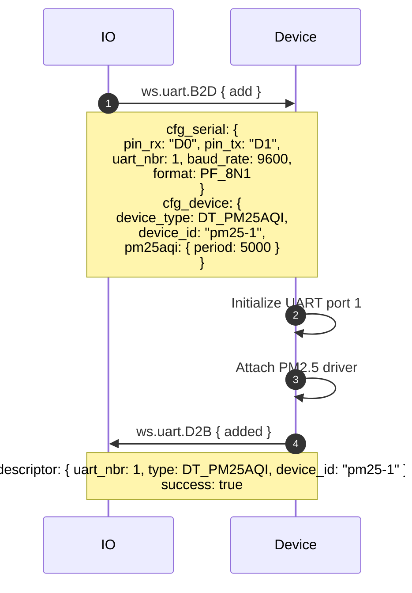
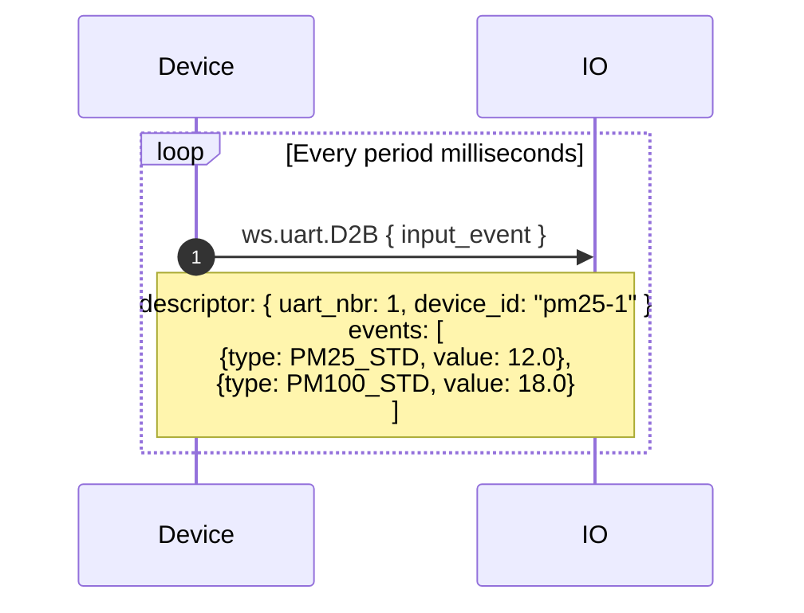
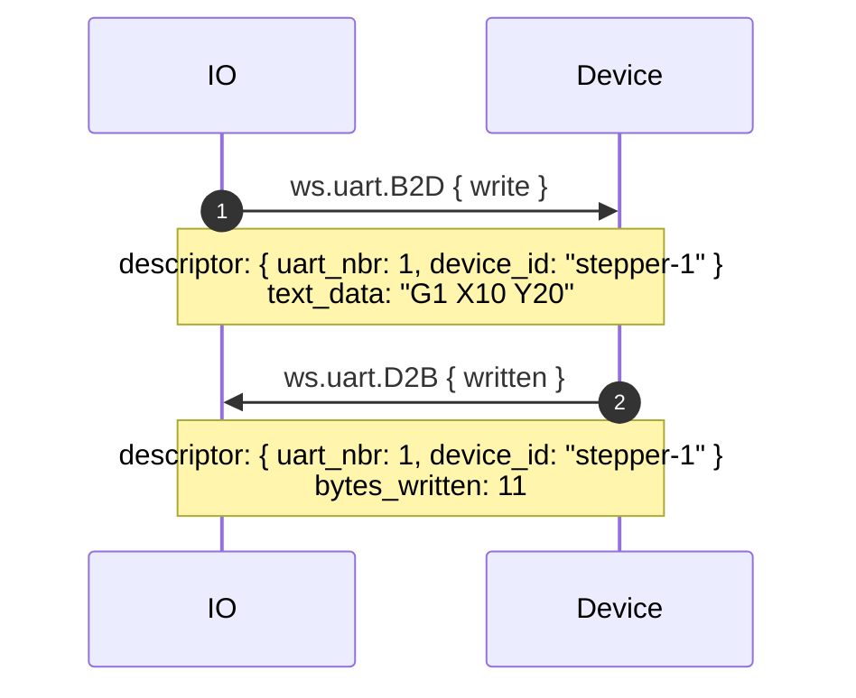
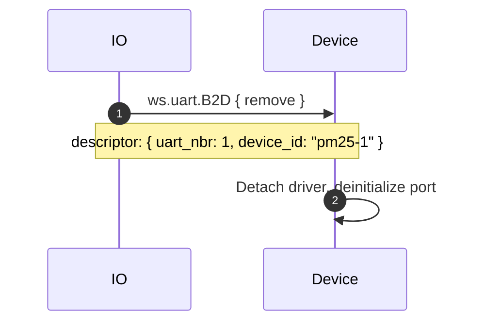

# uart.proto

This file details the WipperSnapper messaging API for interfacing with a UART bus.

## WipperSnapper Components

The following WipperSnapper components utilize `uart.proto`:

* PMS* Air Quality Sensors
* Adafruit Universal GPS module using the MTK33x9 chipset
* Generic UART input/output devices
* Trinamic stepper motors / DYNAMIXEL servos

## Architecture Overview

The v2 UART API uses message envelopes:

- **B2D (BrokerToDevice)** - Commands from Adafruit IO to device
  - `add` - Configure a UART port and attach a device
  - `remove` - Detach a device and deinitialize the port
  - `write` - Write data (bytes or text) to a device

- **D2B (DeviceToBroker)** - Responses and data from device to Adafruit IO
  - `added` - Confirmation of device attachment
  - `written` - Confirmation of bytes written
  - `input_event` - Sensor data from a UART input device

## Enums

### DeviceType

| Value | Description |
|-------|-------------|
| `DT_UNSPECIFIED` | Unspecified device type |
| `DT_GENERIC_INPUT` | Generic UART input device |
| `DT_GENERIC_OUTPUT` | Generic UART output device |
| `DT_GPS` | GPS module |
| `DT_PM25AQI` | PM2.5 air quality sensor |
| `DT_TM22XX` | Trinamic stepper driver |

### PacketFormat

Serial data format (data bits, parity, stop bits). Common values:

| Value | Description |
|-------|-------------|
| `PF_8N1` | 8 data bits, no parity, 1 stop bit (most common) |
| `PF_8N2` | 8 data bits, no parity, 2 stop bits |
| `PF_8E1` | 8 data bits, even parity, 1 stop bit |
| `PF_8O1` | 8 data bits, odd parity, 1 stop bit |

(Also supports 5/6/7-bit variants with N/E/O parity and 1/2 stop bits.)

### GenericDeviceLineEnding

| Value | Description |
|-------|-------------|
| `GDLE_LF` | Newline (LF) |
| `GDLE_CRLF` | Carriage return + newline (CRLF) |
| `GDLE_TIMEOUT_100MS` | 100ms timeout between reads |
| `GDLE_TIMEOUT_1000MS` | 1s timeout between reads |

## Message Details

### Add

Contains two sub-messages:

**SerialConfig** (port configuration):
- **pin_rx** / **pin_tx** - RX and TX pins
- **device_name** - Device path (CPython only, e.g., `/dev/ttyUSB0`)
- **uart_nbr** - UART port number (0, 1, 2, etc.)
- **baud_rate** - Baud rate in bits per second
- **format** - Packet format (e.g., `PF_8N1`)
- **timeout** - Max milliseconds to wait for serial data (default 1000)
- **use_sw_serial** - Use software serial instead of hardware
- **sw_serial_invert** - Invert UART signal on RX/TX pins

**DeviceConfig** (device-specific):
- **device_type** - Type of device (`DT_GPS`, `DT_PM25AQI`, etc.)
- **device_id** - Unique identifier string
- **oneof config**: `GenericInputConfig`, `TrinamicDynamixelConfig`, or `PM25AQIConfig`

**Optional**: `write` field for initial write during check-in.

### Descriptor

Used in Remove, Write, Written, and InputEvent to identify the UART device:
- **uart_nbr** - UART port number
- **type** - Device type
- **device_id** - Device identifier

### Write

- **descriptor** - Identifies the target device
- **oneof payload**: `bytes_data` (raw bytes) or `text_data` (string)

### Written (response)

- **descriptor** - Identifies the device
- **bytes_written** - Number of bytes written

### InputEvent

- **descriptor** - Identifies the source device
- **events** - Sensor readings (`repeated ws.sensor.Event`)

## Sequence Diagrams

### Attaching a UART Component

### Sensor Data from a UART Input Device

### Writing to a UART Output Device

### Detaching a UART Component

