# WipperSnapper v2 Happy Path: Complete Device Flow

This document demonstrates the complete "happy path" flow for a WipperSnapper v2 device, showcasing the new B2D/D2B envelope architecture. This serves as a comprehensive overview of how all the WipperSnapper protocol buffers work together in the v2 API.

## Key Changes in v2

### Message Envelope Architecture

**v2 introduces a cleaner message organization using envelopes:**

- **B2D (BrokerToDevice)** - All commands from Adafruit IO to device
- **D2B (DeviceToBroker)** - All responses and data from device to Adafruit IO

Each component (digitalio, analogio, i2c, etc.) has its own B2D and D2B envelope messages with specific payloads.

### Benefits of v2 Architecture

1. **Cleaner code organization** - Envelope pattern groups related messages
2. **Easier routing** - Top-level message type identifies component
3. **Better extensibility** - Adding new message types doesn't break existing code
4. **Type safety** - Stronger typing with oneof payloads

---

## Overview

The complete flow consists of:

1. **Device Registration** - Device checks in with Adafruit IO
2. **Component Addition** - Adding various hardware components
3. **Data Flow** - Sensors send data, outputs receive commands
4. **Component Management** - Updating and removing components

---

## 1. Complete Boot-to-Operation Example

### The Complete Flow: Device Boot → Component Registration → Operation

This example shows a device booting up, checking in with Adafruit IO, receiving its component configuration, and then operating normally. We'll follow an LED on D13 through its complete lifecycle.

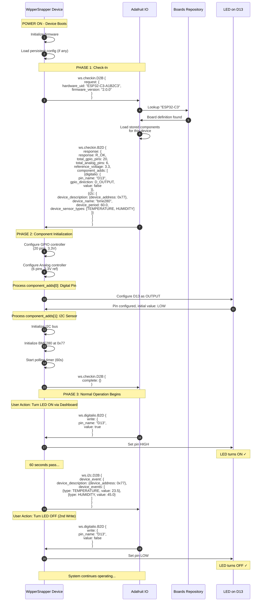

### Key Points in This Flow:

1. **Boot Phase**: Device initializes and loads any local persistent config
2. **Check-In Request**: Device identifies itself to IO with hardware_uid and firmware version
3. **Check-In Response**: IO returns board capabilities AND all configured components
4. **Component Initialization**: Device processes each component in `component_adds` array
5. **Complete Signal**: Device signals it's ready for normal operation
6. **First Write**: User triggers the first write operation (LED ON)
7. **Sensor Data**: I2C sensor sends periodic data
8. **Second Write**: User triggers second write operation (LED OFF)

---

## 2. Device Check-In Structure

### Check-In Request (D2B)

```protobuf
ws.checkin.D2B {
  request: {
    hardware_uid: "boardname-MACADDR",
    firmware_version: "2.0.0"
  }
}
```

### Check-In Response (B2D) with Components

```protobuf
ws.checkin.B2D {
  response: {
    response: R_OK,
    total_gpio_pins: 20,
    total_analog_pins: 6,
    reference_voltage: 3.3,

    // All pre-configured components sent here!
    component_adds: [
      {digitalio: {...}},
      {analogio: {...}},
      {i2c: {...}},
      // ... more components
    ]
  }
}
```

### Complete Signal (D2B)

```protobuf
ws.checkin.D2B {
  complete: {}
}
```

This signals the device has finished initialization and is ready for normal operation.

---

## 3. Component Registration Details

### ComponentAdd Message Structure

The `ComponentAdd` message is a union (oneof) that can contain any component type:

```protobuf
message ComponentAdd {
  oneof payload {
    ws.digitalio.Add digitalio    = 1;
    ws.analogio.Add analogio      = 2;
    ws.servo.Add servo            = 3;
    ws.pwm.Add pwm                = 4;
    ws.pixels.Add pixels          = 5;
    ws.ds18x20.Add ds18x20        = 6;
    ws.uart.Add uart              = 7;
    ws.i2c.DeviceAddOrReplace i2c = 8;
  }
}
```

### Example: Multiple Components at Check-In

```protobuf
component_adds: [
  // Digital Output: Status LED
  {
    digitalio: {
      pin_name: "D13",
      gpio_direction: D_OUTPUT,
      value: false
    }
  },

  // Digital Input: Button
  {
    digitalio: {
      pin_name: "D2",
      gpio_direction: D_INPUT_PULL_UP,
      sample_mode: SM_EVENT
    }
  },

  // Analog Input: Battery Monitor
  {
    analogio: {
      pin_name: "A1",
      period: 30.0,
      read_mode: SENSOR_TYPE_VOLTAGE
    }
  },

  // I2C Sensor: Temperature/Humidity
  {
    i2c: {
      device_description: {device_address: 0x77},
      device_name: "bme280",
      device_period: 60.0,
      device_sensor_types: [TEMPERATURE, HUMIDITY, PRESSURE],
      is_persistent: true
    }
  }
]
```

### Processing ComponentAdd Array

The device processes each `ComponentAdd` in sequence:

1. **Extract component type** from oneof
2. **Initialize hardware** for that component
3. **Configure parameters** from the Add message
4. **Store state** for persistent operation
5. **Continue to next** component

If any component fails to initialize, the device should log the error but continue processing remaining components.

---

## 4. Component Lifecycle with B2D/D2B Envelopes

All component interactions in v2 use the envelope pattern. Here's how it works:

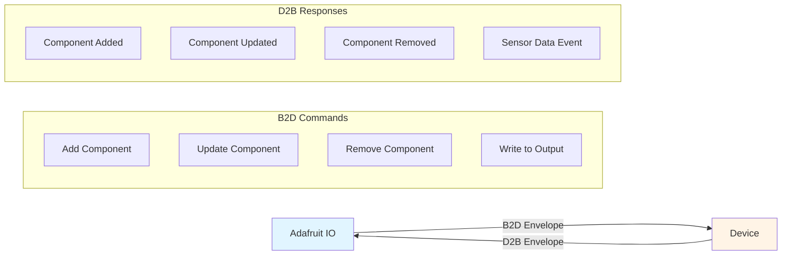

---

## 5. Adding Components During Runtime

After initial check-in, components can be added dynamically during operation:

### 5.1 Runtime Component Addition vs Check-In

**Difference:**
- **At Check-In**: Components sent in `component_adds` array during check-in response
- **At Runtime**: Components sent as individual B2D messages

### 5.2 Digital GPIO Input (Button) - Runtime Addition

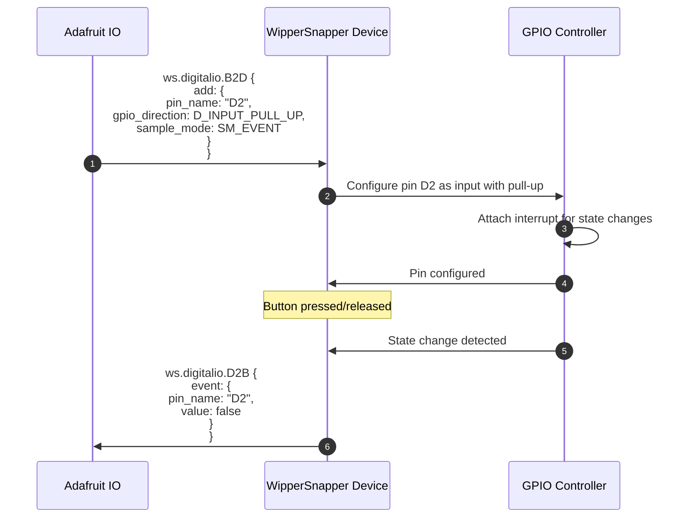

### 5.3 Analog Input (Battery Monitor) - Runtime Addition

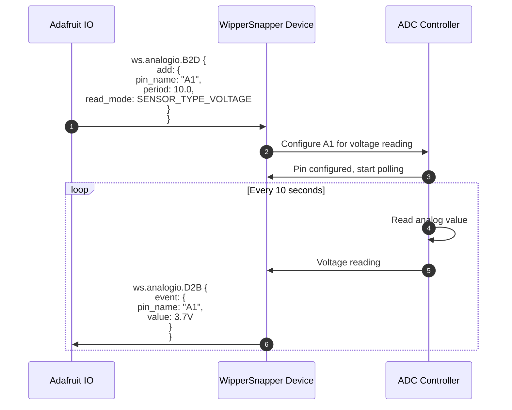

### 5.4 I2C Sensor (BME280 - Multi-Sensor) - Runtime Addition

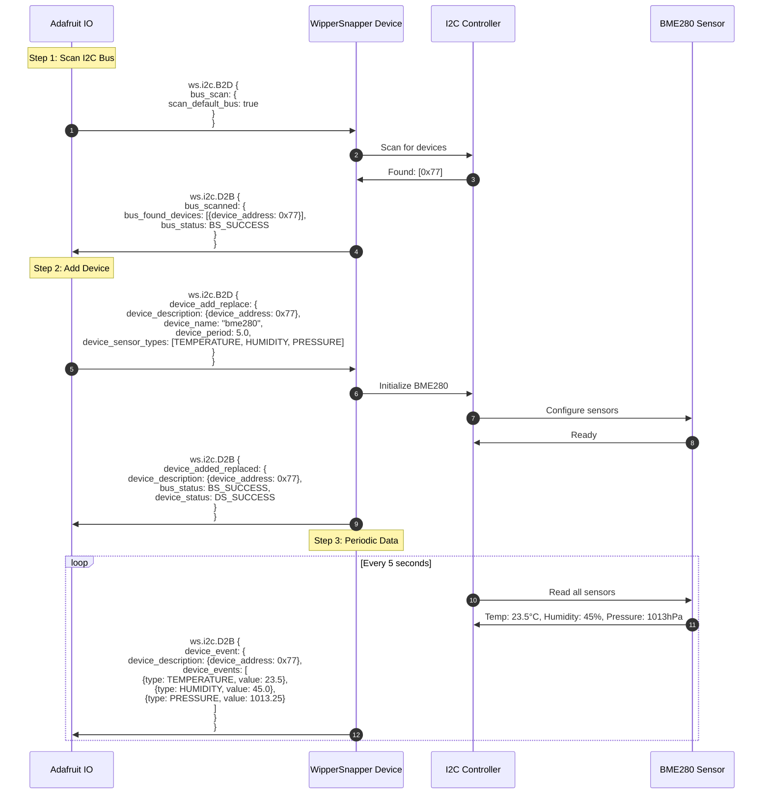

### 5.5 E-Paper Display (UC8179) - Runtime Addition

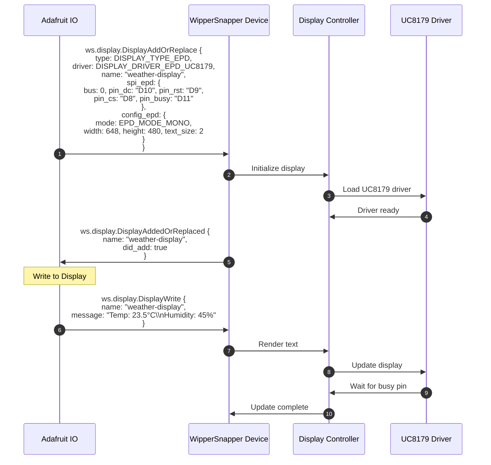

---

## 6. Complete System Architecture

Here's how all v2 components work together:

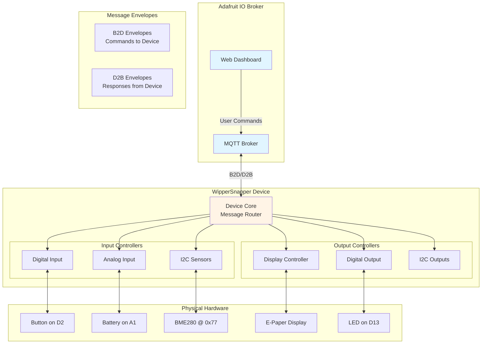

---

## 7. Message Envelope Structure

### Example: Digital IO Messages

**B2D (Commands to Device):**
```protobuf
message B2D {
  oneof payload {
    Add add       = 1;  // Add/configure pin
    Remove remove = 2;  // Remove pin
    Write write   = 3;  // Write to output pin
  }
}
```

**D2B (Responses from Device):**
```protobuf
message D2B {
  oneof payload {
    Event event = 1;  // Pin value changed
  }
}
```

### Message Flow Example

```
Adafruit IO                          Device
    |                                   |
    |  ws.digitalio.B2D                |
    |    add: {pin_name: "D2", ...}    |
    | --------------------------------> |
    |                                   |  Configure hardware
    |                                   |
    |  ws.digitalio.D2B                |
    |    event: {pin_name: "D2", ...}  |
    | <-------------------------------- |
    |                                   |
```

---

## 8. Component Summary Table

| Component | B2D Messages | D2B Messages | Direction |
|-----------|-------------|--------------|-----------|
| **digitalio** | add, remove, write | event | Input & Output |
| **analogio** | add, remove | event | Input only |
| **i2c** | bus_scan, device_add_replace, device_remove, device_output_write | bus_scanned, device_added_replaced, device_removed, device_event | Input & Output |
| **display** | DisplayAddOrReplace, DisplayRemove, DisplayWrite | DisplayAddedOrReplaced, DisplayRemoved | Output only |
| **pwm** | add, remove, write | - | Output only |
| **servo** | add, remove, write | - | Output only |
| **pixels** | add, remove, write | - | Output only |
| **ds18x20** | add, remove | event | Input only |
| **uart** | add, remove | event | Input only |

---

## 9. Data Flow Patterns

### Input Components (Sensors send data)

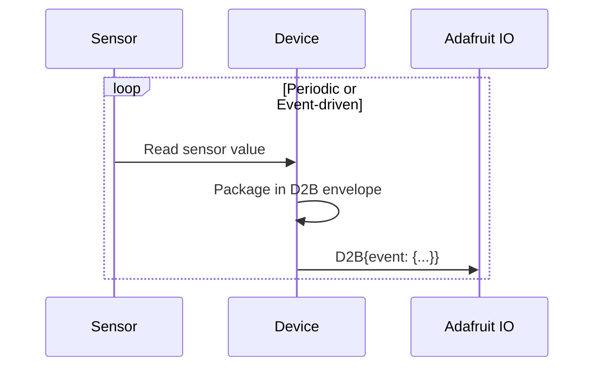

### Output Components (Commands from IO)

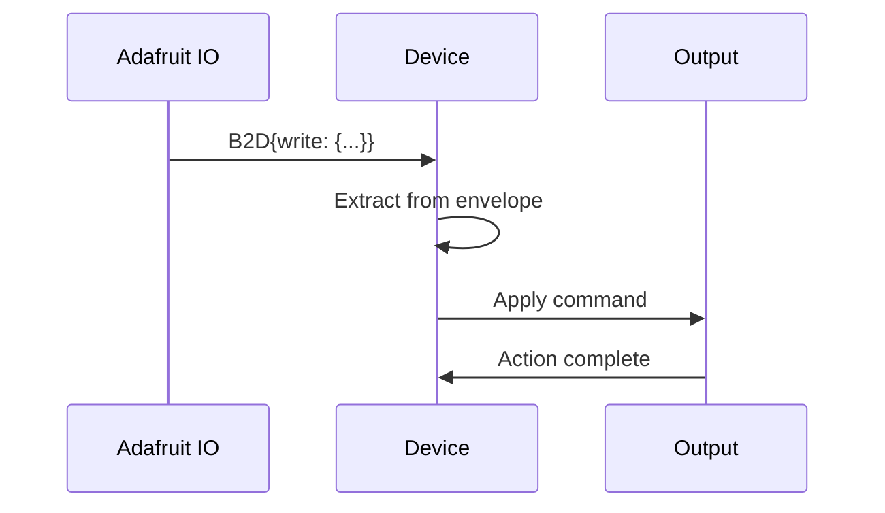

---

## 10. Error Handling

### Status Codes

Components return status codes in their responses:

**I2C Example:**
- `BS_SUCCESS` - Bus operation successful
- `BS_ERROR_PULLUPS` - Missing pull-up resistors
- `DS_SUCCESS` - Device operation successful
- `DS_NOT_FOUND` - Device not found at address

**Error Flow:**
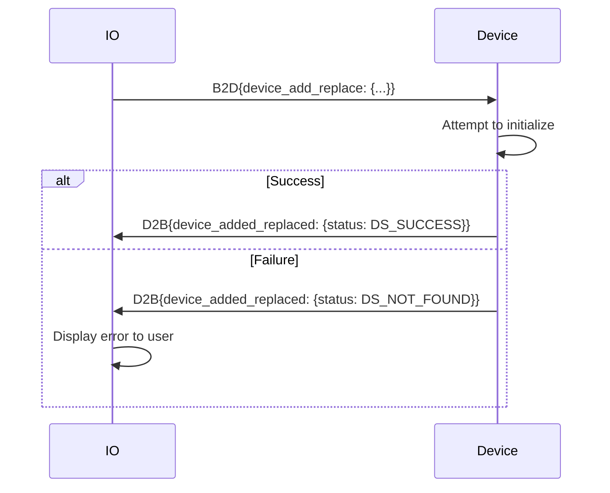

---

## 11. Component Lifecycle States

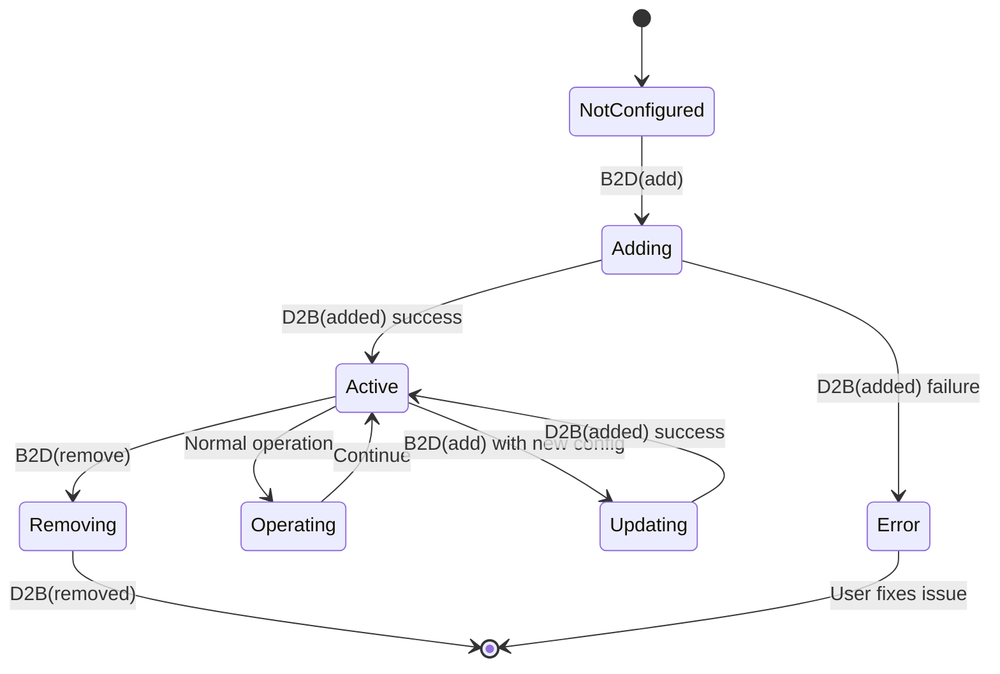

---

## 12. Best Practices for v2

### Message Routing
1. **Envelope pattern** - Always wrap messages in appropriate B2D/D2B envelope
2. **Type safety** - Use oneof payloads for compile-time type checking
3. **Component isolation** - Each component has its own envelope namespace

### Component Management
1. **Add before use** - Always add component before trying to use it
2. **Check responses** - Verify D2B responses for success/failure
3. **Cleanup** - Remove components when no longer needed
4. **Status codes** - Check and handle all status codes appropriately

### Performance
1. **Polling periods** - Choose appropriate periods for input components
2. **Event-driven** - Use event mode (SM_EVENT) for infrequent state changes
3. **Batch operations** - Group related component additions together

---

## 13. Migration from v1 to v2

### Key Differences

| Aspect | v1 | v2 |
|--------|----|----|
| **Message Organization** | Flat message structure | Envelope pattern (B2D/D2B) |
| **Component Namespacing** | Global proto namespace | Component-specific envelopes |
| **Display Support** | Limited | Extended (multiple interface types) |
| **I2C Flexibility** | Basic | Advanced (multiplexers, alt buses, GPS) |
| **Status Reporting** | Single status field | Separate Bus/Device status |

### Migration Example

**v1 I2C Add:**
```protobuf
I2CDeviceInitRequest {
  i2c_device_address: 0x77,
  i2c_device_name: "bme280",
  ...
}
```

**v2 I2C Add:**
```protobuf
ws.i2c.B2D {
  device_add_replace: {
    device_description: {device_address: 0x77},
    device_name: "bme280",
    ...
  }
}
```

---

## 14. Complete Example: Weather Station with Check-In

This example shows a weather station device booting up, receiving its configuration during check-in, and operating:

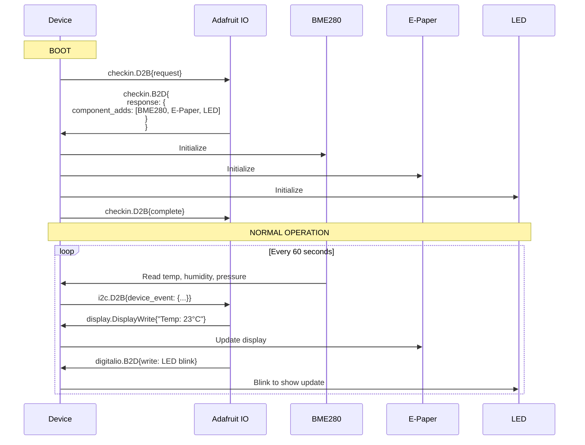

---

## 15. Original Weather Station Example

Here's a complete example showing multiple components working together:

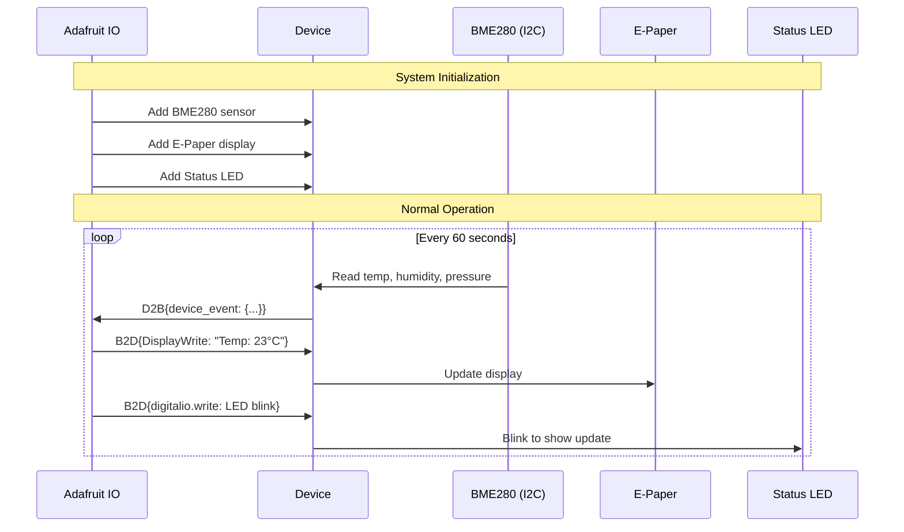

---

## Next Steps

- For component-specific details, see individual `.md` files:
  - [i2c.md](i2c.md) - I2C sensors and devices with v2 envelopes
  - [display.md](display.md) - Display controllers with multiple interface types
  - [digitalio.md](digitalio.md) - Digital GPIO with B2D/D2B
  - [analogio.md](analogio.md) - Analog input with B2D/D2B
  - [pwm.md](pwm.md), [servo.md](servo.md), [pixels.md](pixels.md), etc.

- For hardware definitions:
  - [WipperSnapper_Boards](https://github.com/adafruit/Wippersnapper_Boards)
  - [WipperSnapper_Components](https://github.com/adafruit/Wippersnapper_Components)

---

## Summary

The v2 WipperSnapper API brings:

 - ✅ **Cleaner architecture** with B2D/D2B envelopes
 - ✅ **Better organization** with component-specific namespaces
 - ✅ **Enhanced display support** for various interface types
 - ✅ **Improved I2C flexibility** with multiplexers and alternate buses
 - ✅ **Stronger typing** with protobuf oneof patterns
 - ✅ **Easier extensibility** for future features

The envelope pattern makes the codebase more maintainable while providing a clear, consistent interface for all WipperSnapper components.
