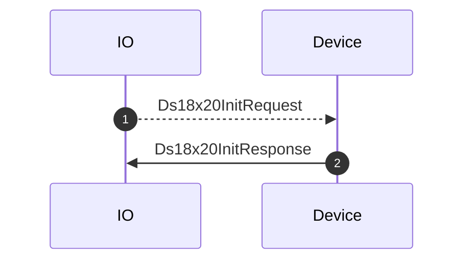
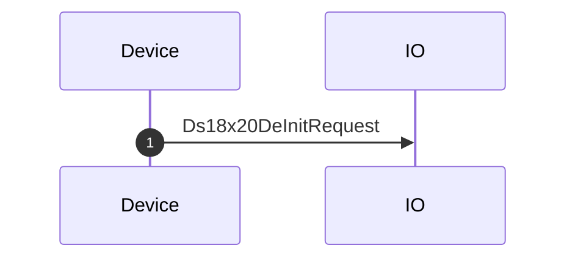
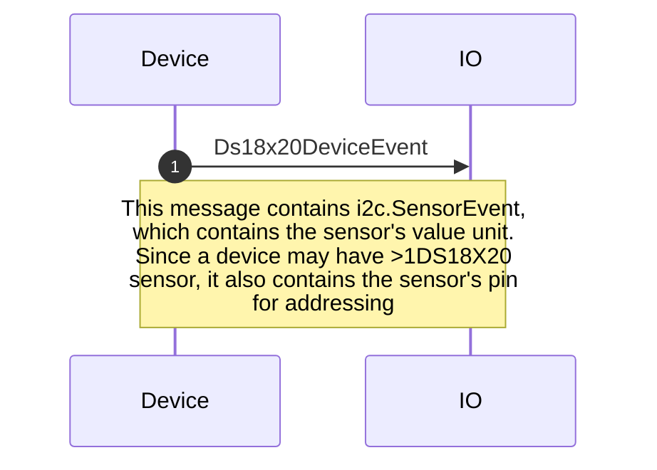

# ds18x20.proto

This file details the API used by hardware running Adafruit WipperSnapper firmware for interfacing with a DS18B20 temperature sensor.

**Note about design and implementation**: WipperSnapper defines a pin as a OneWire bus. Only one DS18x20 sensor is allowed per pin. To use multiple DS18x20 sensors, use multiple pins.

## WipperSnapper Component Definitions

The following JSON component definition type(s) reference `ds18x20.proto`:
* [ds18x20](https://github.com/adafruit/Wippersnapper_Components/tree/main/components/ds18x20)

## Sequence Diagrams

### Create: DS18x20

Request from a broker to:
1) Initialize a OneWire bus on a desired pin
2) Initialize and configure a DS18x20 Maxim temperature sensor on the OneWire bus

### Delete: DS18x20

Request from a broker to:
1) De-initialize a DS18x20 object's driver
2) Release the pin from being used as a OneWire bus

### Sensor Event: DS18x20

Message containing data and metadata from a DS18x20 sensor.

