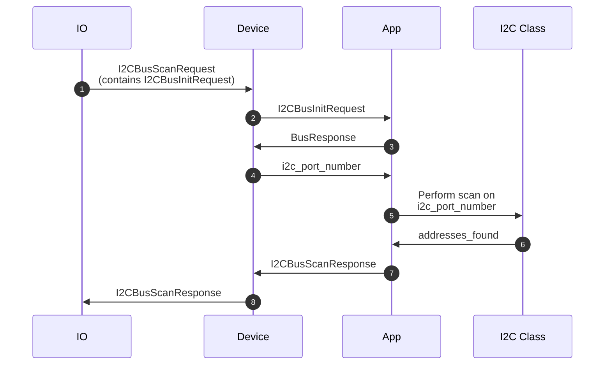
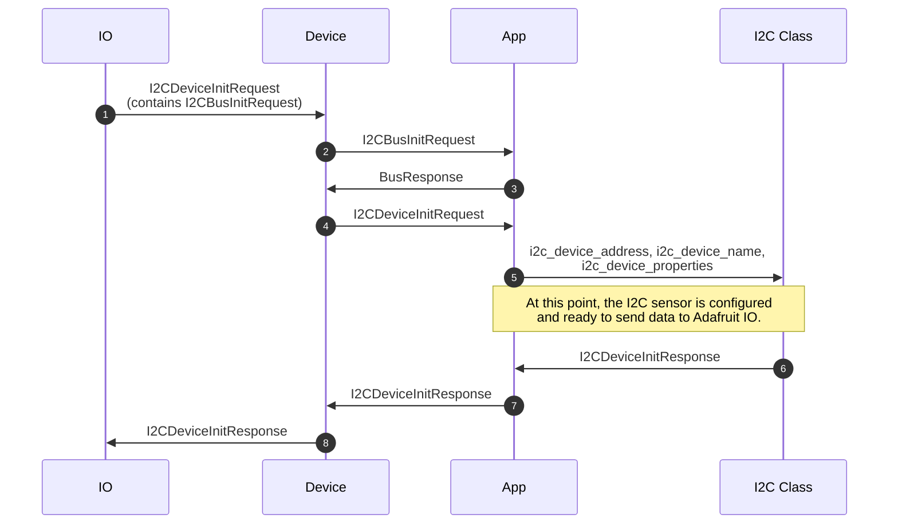
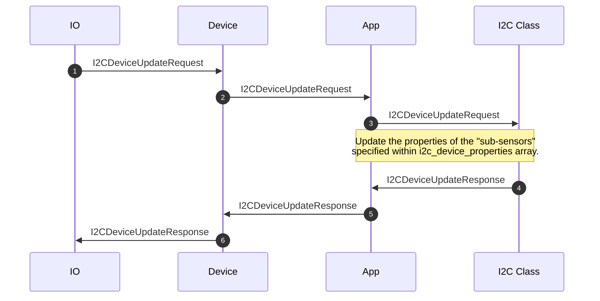
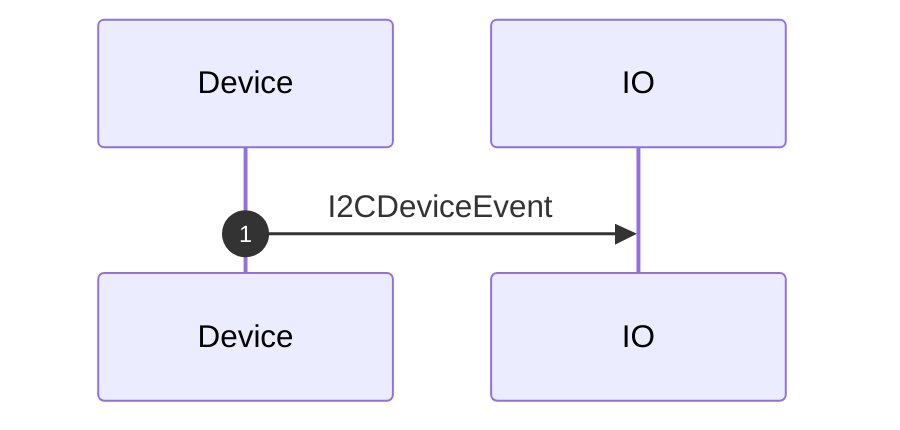
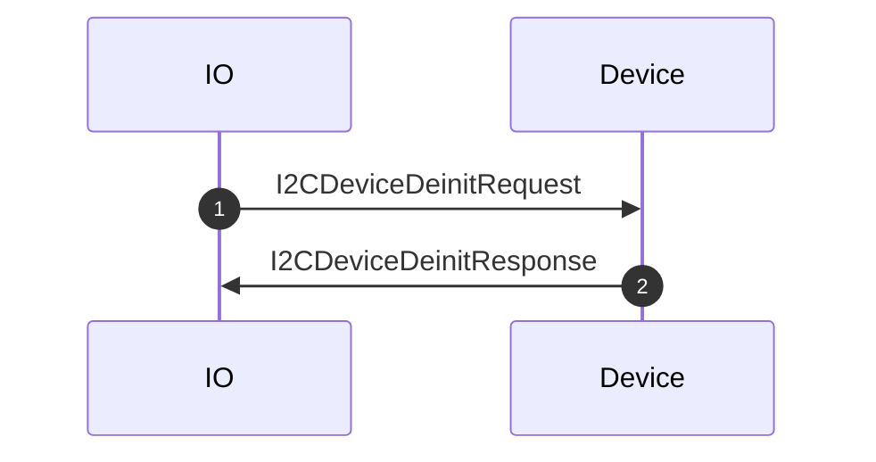

# i2c.proto

This file details the API used by hardware running Adafruit WipperSnapper firmware for interfacing with the I2C bus and I2C sensors.

## WipperSnapper Component Definitions

The following JSON component definition type(s) reference `i2c.proto`:
* [i2c](https://github.com/adafruit/Wippersnapper_Components/tree/main/components/i2c)

## Bus Response Status Codes

All I2C operations return a `BusResponse` enum value to indicate success or failure:

| Status Code | Description |
|------------|-------------|
| `BUS_RESPONSE_SUCCESS` | I2C bus/device successfully initialized |
| `BUS_RESPONSE_ERROR_HANG` | I2C Bus hang detected - user should reset board if persists |
| `BUS_RESPONSE_ERROR_PULLUPS` | I2C bus failed - SDA or SCL needs a pull-up resistor |
| `BUS_RESPONSE_ERROR_WIRING` | I2C bus failed to communicate - check wiring |
| `BUS_RESPONSE_UNSUPPORTED_SENSOR` | WipperSnapper firmware outdated - update required |
| `BUS_RESPONSE_DEVICE_INIT_FAIL` | I2C device failed to initialize |
| `BUS_RESPONSE_DEVICE_DEINIT_FAIL` | I2C device failed to de-initialize |

## I2C Device Types

### Input Devices (Sensors)

Most I2C devices are sensors that read environmental data and send it to Adafruit IO. These devices use the `I2CDeviceSensorProperties` message to configure:
* **sensor_type** - The type of sensor (temperature, humidity, pressure, etc.) using the `SensorType` enum
* **sensor_period** - How often to read the sensor in milliseconds

### Output Devices

Some I2C devices are output devices (displays, LED controllers, etc.). These are configured with `is_output_device = true` and include an `I2COutputAdd` configuration:
* **LED Backpack** - Alphanumeric LED displays with brightness and alignment control
* **Character LCD** - Character LCD displays with row/column configuration
* **SSD1306 OLED** - Small OLED displays with configurable width, height, and text size

## Sequence Diagrams

### I2C Scan

On Adafruit.io, an I2C scan can be initialized one of two ways:
1) User clicks "I2C Scan" button 
2) Users clicks an I2C component from the Component Picker

**Note:** The I2C scan always contains a I2CBusInitRequest message in case the bus was not previously initialized.

```mermaid
sequenceDiagram
autonumber

IO->>Device: I2CBusScanRequest<br>(contains I2CBusInitRequest)
Device->>App: I2CBusInitRequest
App->>Device: BusResponse
Device->>App: i2c_port_number
App->>I2C Class: Perform scan on<br>i2c_port_number 
I2C Class->>App: addresses_found
App->>Device: I2CBusScanResponse
Device->>IO: I2CBusScanResponse
```

### Create a new I2C device

**Note:** I2C devices may contain _multiple_ sensors (i.e: one device can contain a temperature and humidity sensor).  To work with multiple sensors, I2C commands typically contain a `I2CDeviceSensorProperties` sub-message, detailing the properties of the I2C device's sensor.

```mermaid
sequenceDiagram
autonumber

IO->>Device: I2CDeviceInitRequest<br>(contains I2CBusInitRequest)
Device->>App: I2CBusInitRequest
App->>Device: BusResponse
Device->>App: I2CDeviceInitRequest
App->>I2C Class: i2c_device_address, i2c_device_name,<br>i2c_device_properties
Note over App,I2C Class: At this point, the I2C sensor is configured <br>and ready to send data to Adafruit IO.
I2C Class->>App: I2CDeviceInitResponse
App->>Device: I2CDeviceInitResponse
Device->>IO: I2CDeviceInitResponse
```

### Update an existing I2C device

```mermaid
sequenceDiagram
autonumber

IO->>Device: I2CDeviceUpdateRequest
Device->>App: I2CDeviceUpdateRequest
App->>I2C Class: I2CDeviceUpdateRequest
Note over App,I2C Class: Update the properties of the "sub-sensors" <br> specified within i2c_device_properties array.
I2C Class->>App: I2CDeviceUpdateResponse
App->>Device: I2CDeviceUpdateResponse
Device->>IO: I2CDeviceUpdateResponse
```

### Sending data from an I2C component

The process of sending data from an I2C component involves a device sending a `I2CDeviceEvent` message to the broker. Since an i2c component may have more than one sub-component (i.e: a component may contain both a temperature sensor and a humidity sensor), the `sensor_event` is a repeated submessage array which contains the value and corresponding SI unit for all sub-sensors.

While the sequence diagram for this type of message looks simple, the process involves work on the MQTT broker to unpack and parse each `sensor_event` message:

```mermaid
sequenceDiagram
autonumber

Device->>IO: I2CDeviceEvent
```

### Delete an I2C device

The process of deleting an I2C device is straightforward and only requires the device's unique I2C address:

```mermaid
sequenceDiagram
autonumber

IO->>Device: I2CDeviceDeinitRequest
Device->>IO: I2CDeviceDeinitResponse
```

## Supported Sensor Types

The `SensorType` enum defines all supported sensor measurement types and their units:

### Environmental Sensors
* `SENSOR_TYPE_AMBIENT_TEMPERATURE` - Air temperature in °C
* `SENSOR_TYPE_AMBIENT_TEMPERATURE_FAHRENHEIT` - Air temperature in °F
* `SENSOR_TYPE_OBJECT_TEMPERATURE` - Object/surface temperature in °C
* `SENSOR_TYPE_OBJECT_TEMPERATURE_FAHRENHEIT` - Object/surface temperature in °F
* `SENSOR_TYPE_RELATIVE_HUMIDITY` - Relative humidity in %
* `SENSOR_TYPE_PRESSURE` - Atmospheric pressure in hPa
* `SENSOR_TYPE_ALTITUDE` - Altitude in meters

### Light Sensors
* `SENSOR_TYPE_LIGHT` - Light level (non-unit-specific)
* `SENSOR_TYPE_LUX` - Light level in lux
* `SENSOR_TYPE_COLOR` - RGB color values (0-1.0 range, 32-bit RGBA)

### Motion & Orientation Sensors
* `SENSOR_TYPE_ACCELEROMETER` - Acceleration in m/s²
* `SENSOR_TYPE_GYROSCOPE` - Angular rate in rad/s
* `SENSOR_TYPE_MAGNETIC_FIELD` - Magnetic field in µT
* `SENSOR_TYPE_ORIENTATION` - Orientation angle in degrees
* `SENSOR_TYPE_GRAVITY` - Gravity in m/s²
* `SENSOR_TYPE_LINEAR_ACCELERATION` - Acceleration (excluding gravity) in m/s²
* `SENSOR_TYPE_ROTATION_VECTOR` - Rotation angle in radians

### Air Quality Sensors
* `SENSOR_TYPE_PM10_STD` / `SENSOR_TYPE_PM10_ENV` - Particulate Matter 1.0 in ppm
* `SENSOR_TYPE_PM25_STD` / `SENSOR_TYPE_PM25_ENV` - Particulate Matter 2.5 in ppm
* `SENSOR_TYPE_PM100_STD` / `SENSOR_TYPE_PM100_ENV` - Particulate Matter 10.0 in ppm
* `SENSOR_TYPE_CO2` - Measured CO2 in ppm
* `SENSOR_TYPE_ECO2` - Estimated/equivalent CO2 in ppm
* `SENSOR_TYPE_GAS_RESISTANCE` - VOC gas resistance in Ω
* `SENSOR_TYPE_VOC_INDEX` - VOC index (1-500, 100 is normal)
* `SENSOR_TYPE_NOX_INDEX` - NOx index (1-500, 100 is normal)
* `SENSOR_TYPE_TVOC` - Total VOC in ppb

### Electrical Sensors
* `SENSOR_TYPE_VOLTAGE` - Voltage in V
* `SENSOR_TYPE_CURRENT` - Current in mA

### Distance & Position
* `SENSOR_TYPE_PROXIMITY` - Distance (non-unit-specific)

### Generic Types
* `SENSOR_TYPE_RAW` - Raw sensor value (no specific unit)
* `SENSOR_TYPE_UNITLESS_PERCENT` - Percentage value (unitless)

