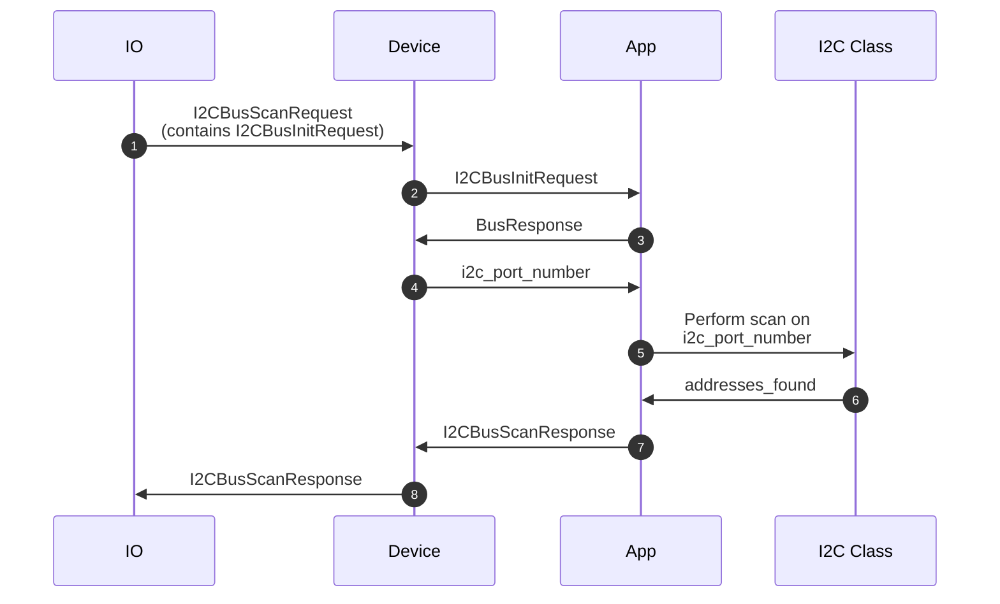
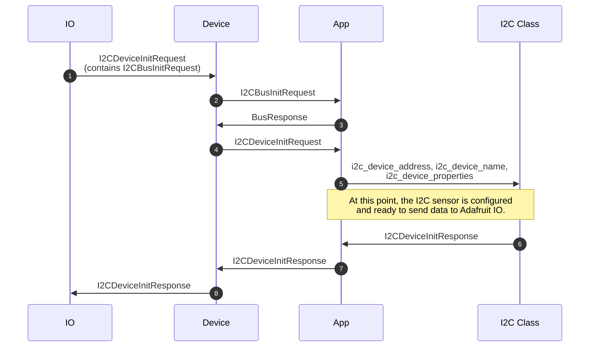
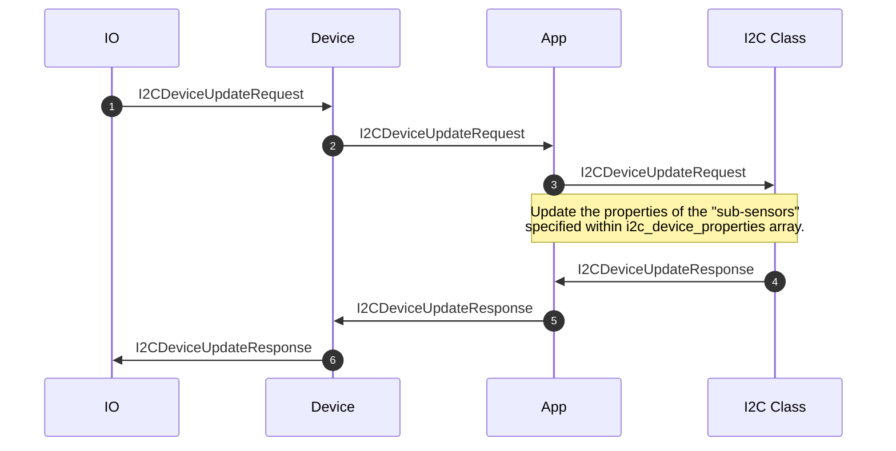
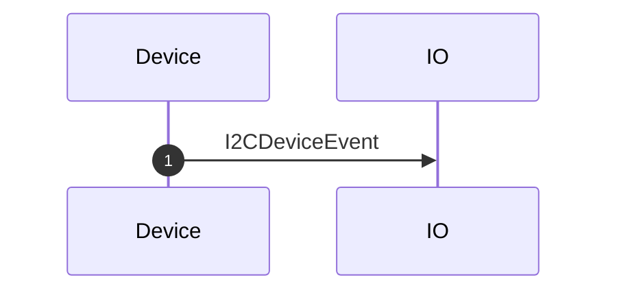
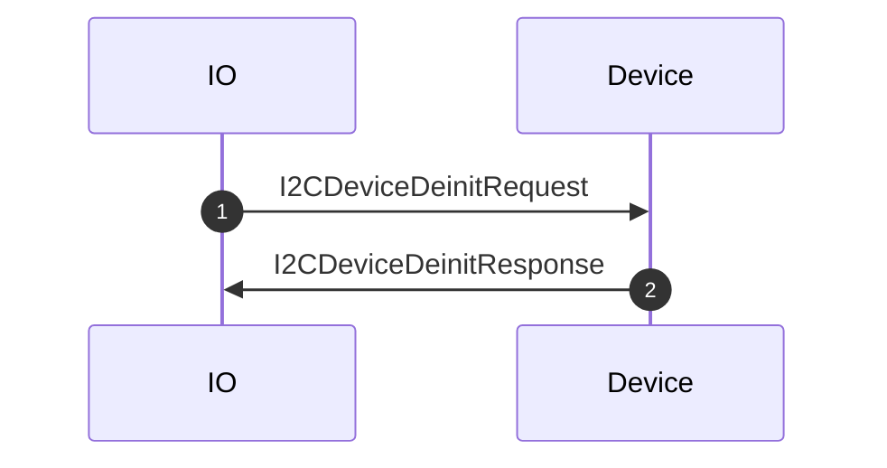

# i2c.proto

This file details the API used by hardware running Adafruit WipperSnapper firmware for interfacing with the I2C bus and I2C sensors.

## WipperSnapper Component Definitions

The following JSON component definition type(s) reference `i2c.proto`:
* [i2c](https://github.com/adafruit/Wippersnapper_Components/tree/main/components/i2c)

## Sequence Diagrams

### I2C Scan

On Adafruit.io, an I2C scan can be initialized one of two ways:
1) User clicks "I2C Scan" button 
2) Users clicks an I2C component from the Component Picker

**Note:** The I2C scan always contains a I2CBusInitRequest message in case the bus was not previously initialized.

### Create a new I2C device

**Note:** I2C devices may contain _multiple_ sensors (i.e: one device can contain a temperature and humidity sensor).  To work with multiple sensors, I2C commands typically contain a `I2CDeviceSensorProperties` sub-message, detailing the properties of the I2C device's sensor.

### Update an existing I2C device

### Sending data from an I2C component

The process of sending data from an I2C component involves a device sending a `I2CDeviceEvent` message to the broker. Since an i2c component may have more than one sub-component (i.e: a component may contain both a temperature sensor and a humidity sensor), the `sensor_event` is a repeated submessage array which contains the value and corresponding SI unit for all sub-sensors.

While the sequence diagram for this type of message looks simple, the process involves work on the MQTT broker to unpack and parse each `sensor_event` message:

### Delete an I2C device

The process of deleting an I2C device is straightforward and only requires the device's unique I2C address:

