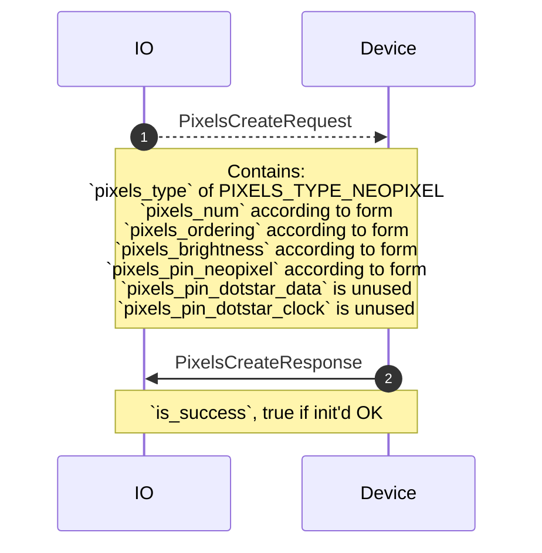
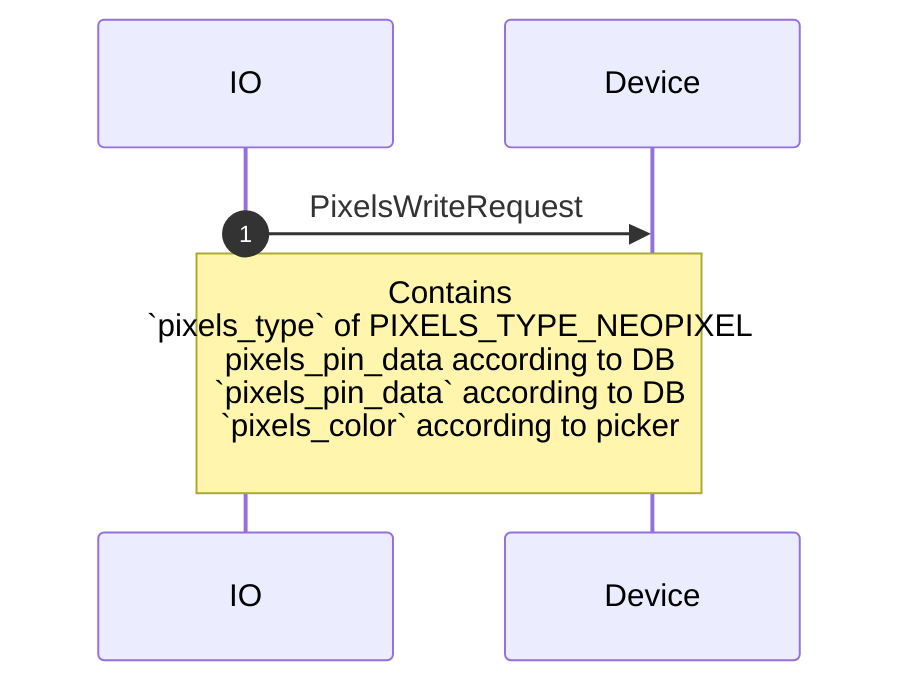
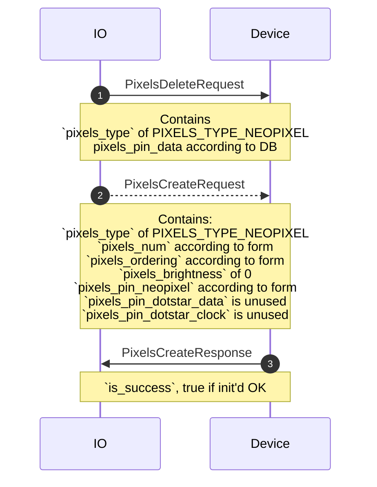
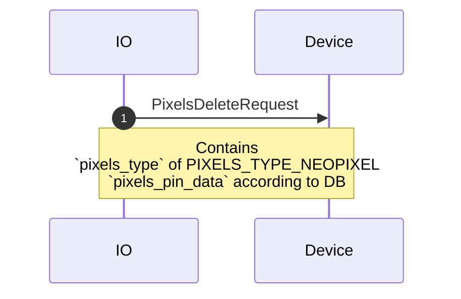
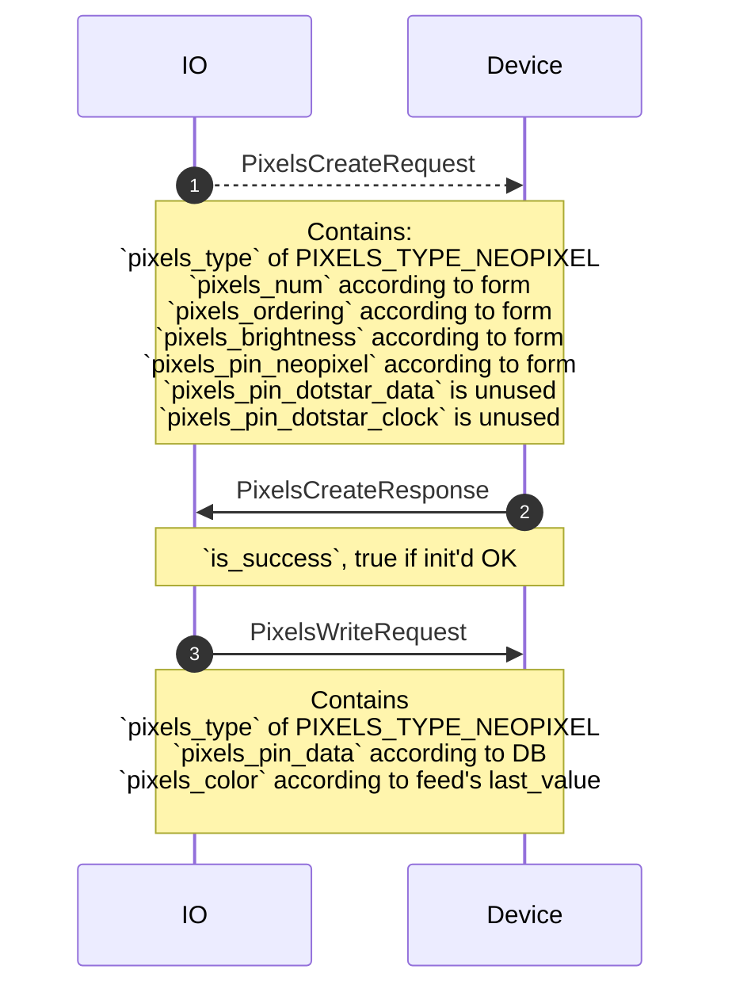
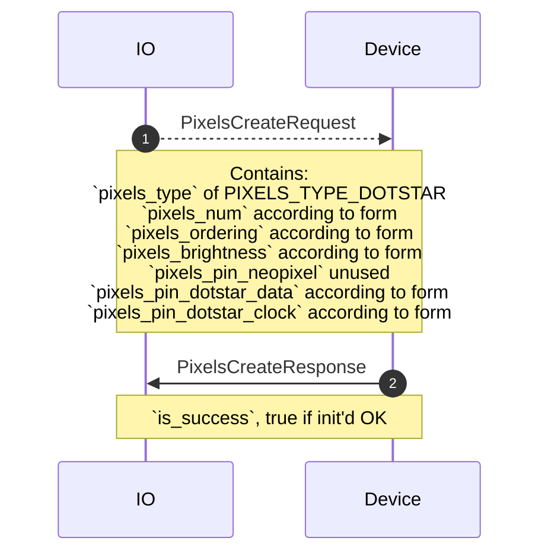
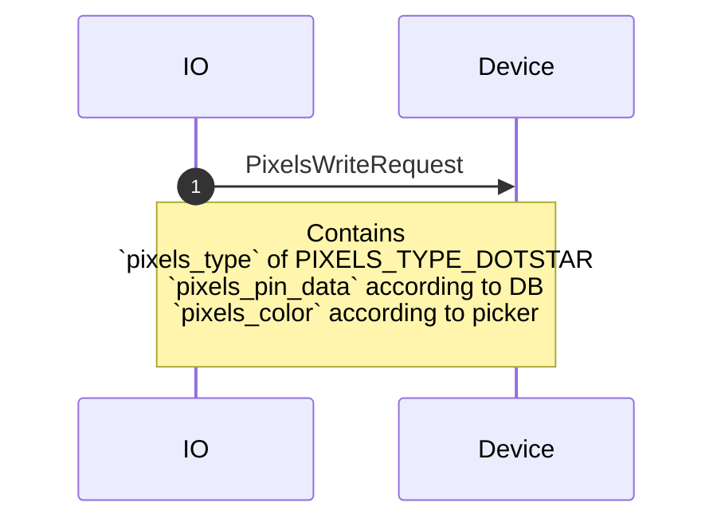
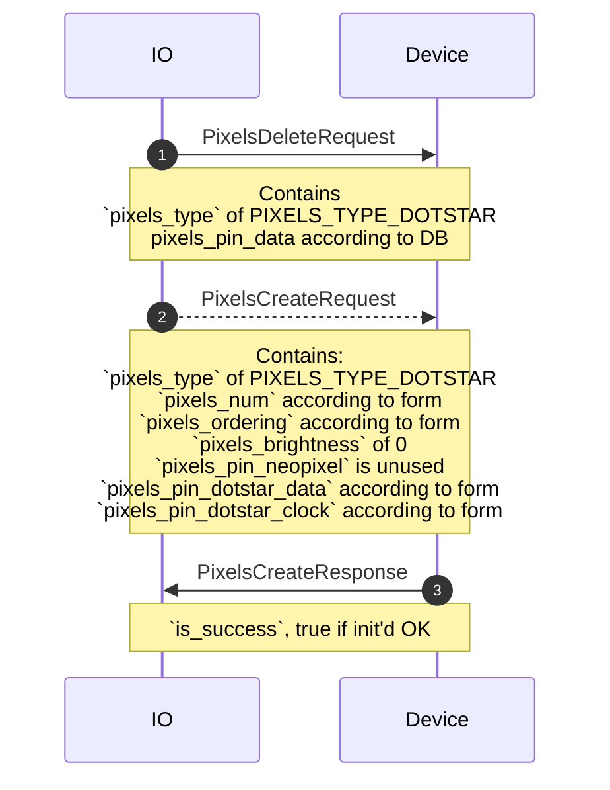
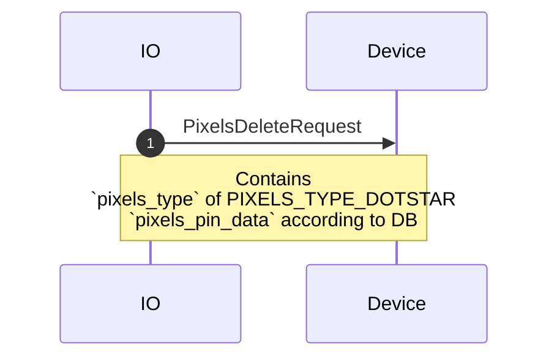
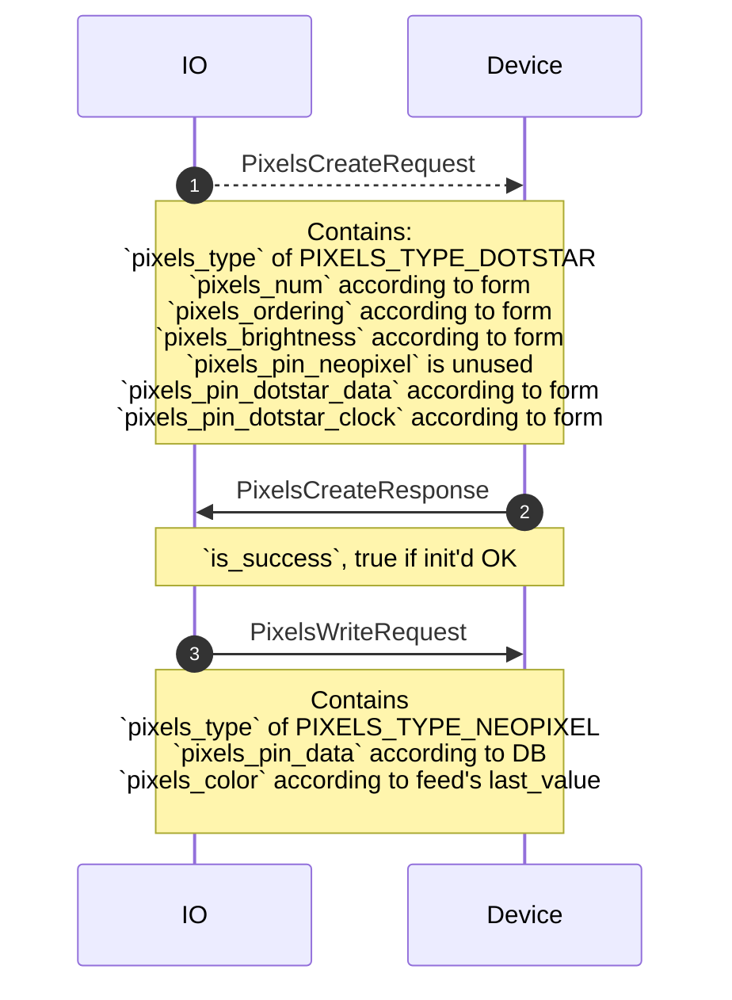

# pixels.proto

This file details the WipperSnapper messaging API for interfacing with a strand of addressable RGB(W) pixels (Adafruit NeoPixel/WS2812b, DotStar/APA102).

## WipperSnapper Components

The following component definitions reference `pixels.proto`:
* [Adafruit_DotStar](https://github.com/adafruit/Wippersnapper_Components/pull/44)
* [Adafruit_NeoPixels](https://github.com/adafruit/Wippersnapper_Components/pull/44)

## Sequence Diagrams

### Create: NeoPixel

### Write: NeoPixel

### Update: NeoPixel

### Delete: NeoPixel

### Sync: NeoPixel

### Create: DotStar

### Write: DotStar

### Update: DotStar

### Delete: DotStar

### Sync: DotStar

