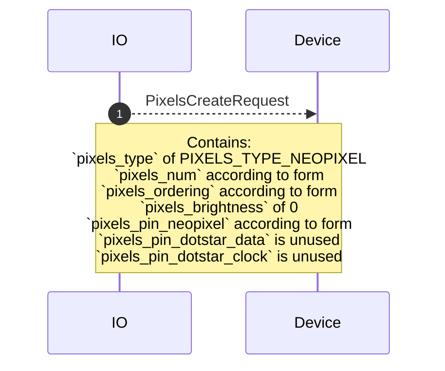
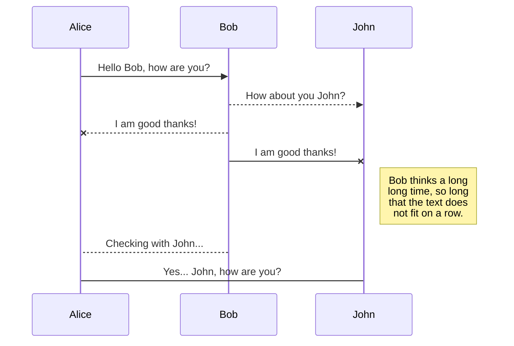
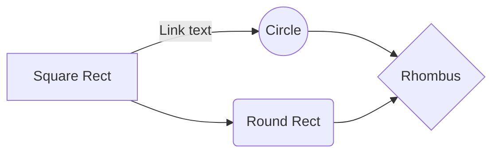

# pixels.proto

This file details the WipperSnapper messaging API for interfacing with a strand of addressable RGB(W) pixels (Adafruit NeoPixel/WS2812b, DotStar/APA102). 

## Component Form Diagram

TODO

## Component Widget Diagram

TODO

## Sequence Diagrams 

### Create: NeoPixel

### Update: NeoPixel

### Delete: NeoPixel

### Sync: NeoPixel

### Create: DotStar

### Update: DotStar

### Delete: DotStar

### Sync: DotStar

## UML diagrams

You can render UML diagrams using [Mermaid](https://mermaidjs.github.io/). For example, this will produce a sequence diagram:

And this will produce a flow chart:

