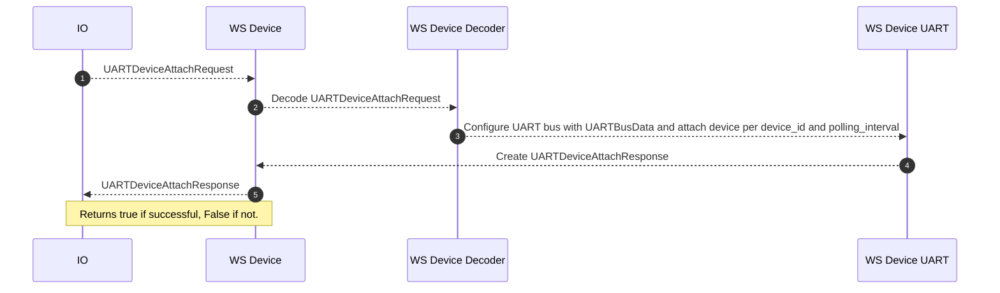

# uart.proto

This file details the WipperSnapper messaging API for interfacing with a UART bus.

## WipperSnapper Components

The following WipperSnapper components utilize `pwm.proto`:

* PMS* Air Quality Sensors
* Adafruit Universal GPS module using the MTK33x9 chipset

## Sequence Diagrams

### Attaching a UART Component to a device running WipperSnapper 

