# WipperSnapper Happy Path: Complete Device Flow

This document demonstrates the complete "happy path" flow for a WipperSnapper device, from initial check-in through adding one of each component type. This serves as a comprehensive overview of how all the WipperSnapper protocol buffers work together.

## Overview

WipperSnapper enables IoT devices to connect to Adafruit IO and control various hardware components through MQTT messaging. The flow consists of:

1. **Device Registration** - Device checks in and registers with Adafruit IO
2. **Hardware Configuration** - IO configures the device's hardware capabilities
3. **Component Lifecycle** - Adding, using, updating, and removing components
4. **Data Flow** - Sensors send data to IO, outputs receive commands from IO

---

## 1. Device Registration & Check-In

The device must first register with Adafruit IO and establish its identity and capabilities.

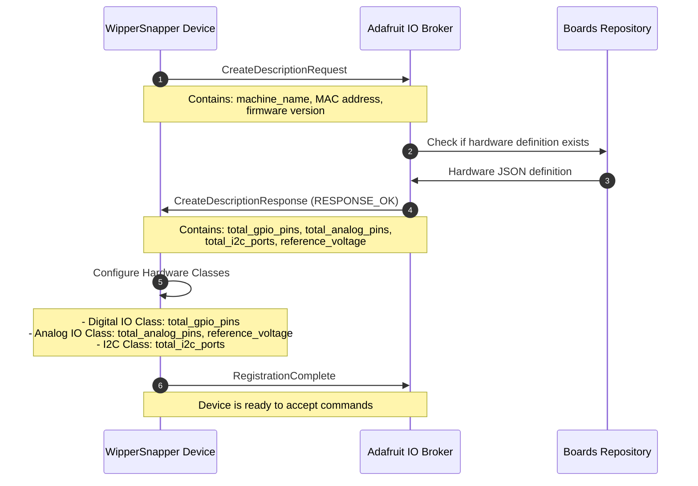

**Key Messages:**
- `CreateDescriptionRequest` - Device identifies itself (machine_name, MAC, version)
- `CreateDescriptionResponse` - IO returns hardware capabilities
- `RegistrationComplete` - Device confirms it's ready

---

## 2. Adding Components: One of Each Type

Once registered, the device can have various components attached. Let's walk through adding one of each component type.

### 2.1 Digital GPIO Pin (Input)

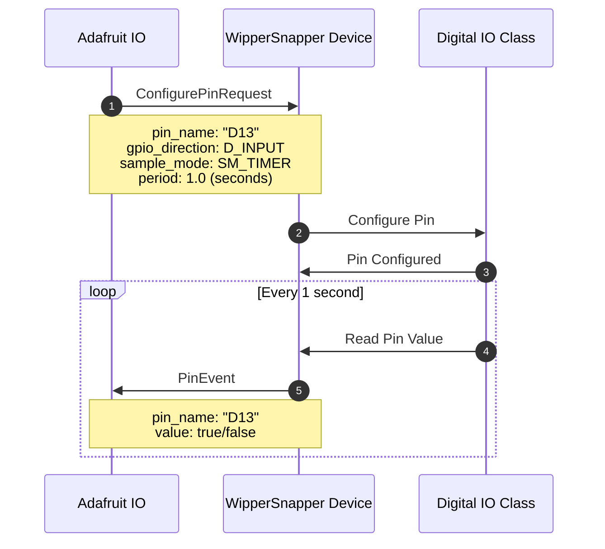

**Messages Used:** `ConfigurePinRequest`, `PinEvent`

---

### 2.2 I2C Sensor (BME280 - Temperature & Humidity)

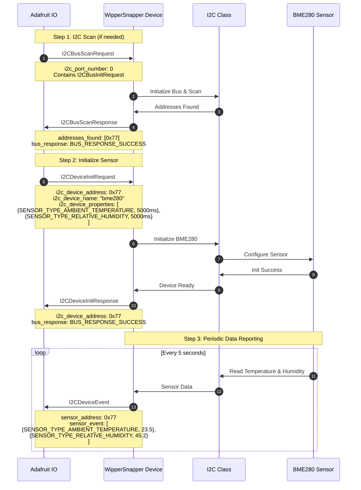

**Messages Used:** `I2CBusScanRequest`, `I2CBusScanResponse`, `I2CDeviceInitRequest`, `I2CDeviceInitResponse`, `I2CDeviceEvent`

---

### 2.3 E-Paper Display (UC8179 - 5.83" E-Ink)

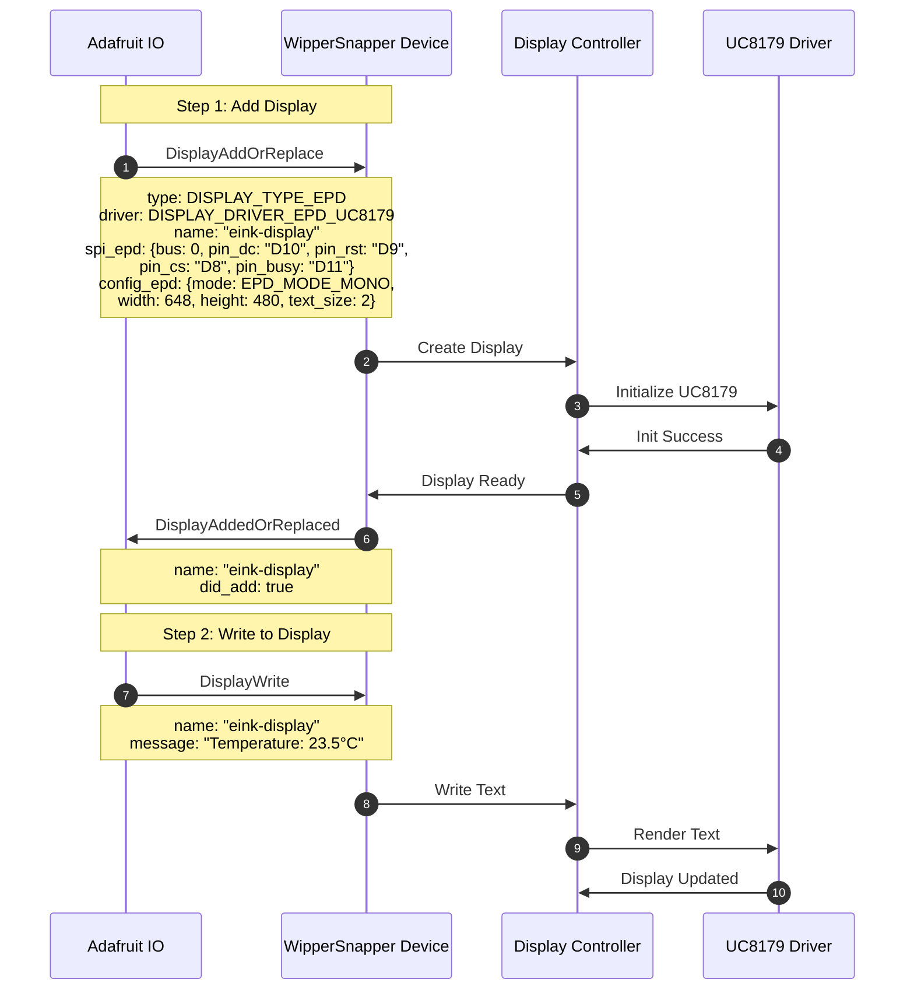

**Messages Used:** `DisplayAddOrReplace`, `DisplayAddedOrReplaced`, `DisplayWrite`

---

### 2.4 PWM Output (Dimmable LED)

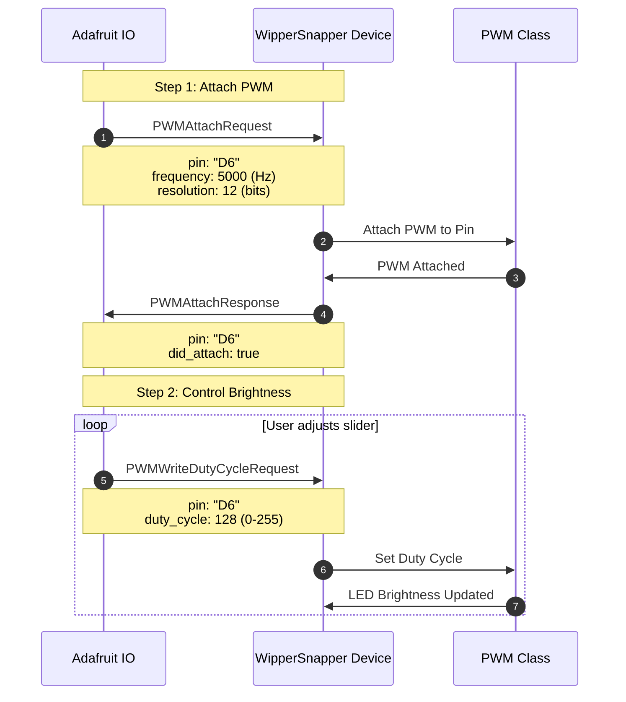

**Messages Used:** `PWMAttachRequest`, `PWMAttachResponse`, `PWMWriteDutyCycleRequest`

---

### 2.5 Servo Motor

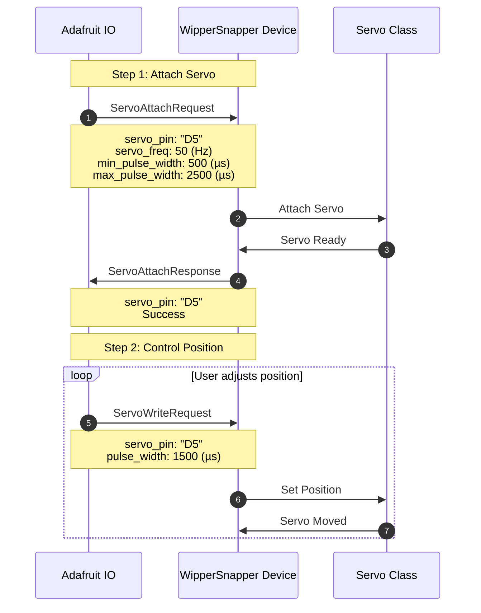

**Messages Used:** `ServoAttachRequest`, `ServoAttachResponse`, `ServoWriteRequest`

---

### 2.6 NeoPixel LED Strip

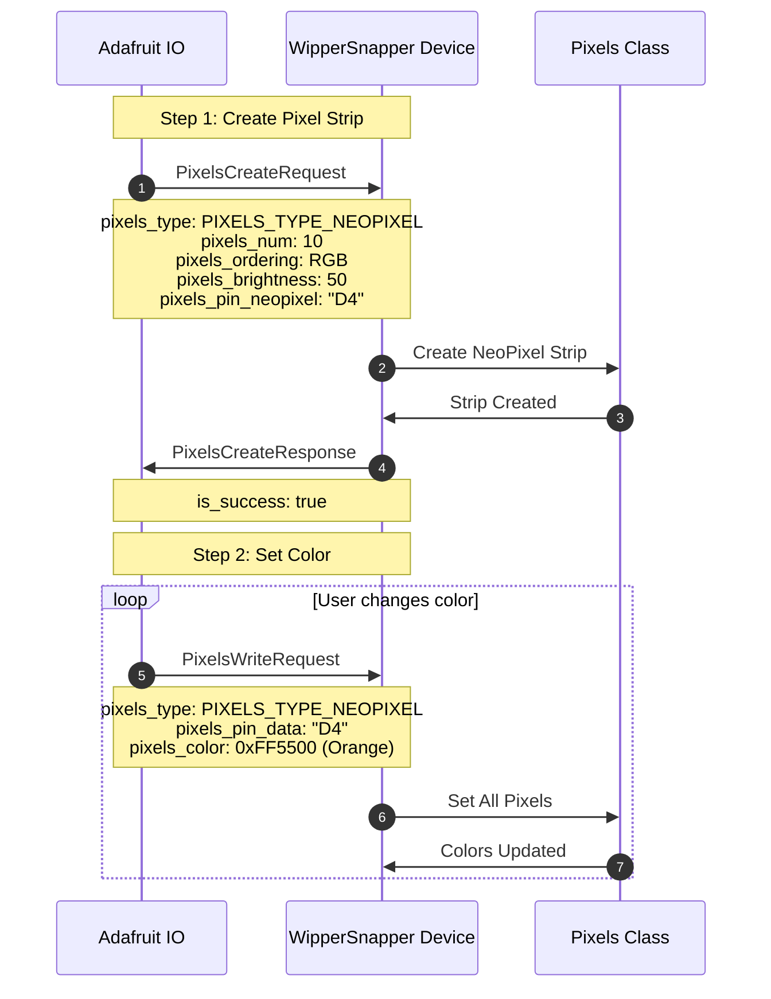

**Messages Used:** `PixelsCreateRequest`, `PixelsCreateResponse`, `PixelsWriteRequest`

---

### 2.7 DS18B20 Temperature Sensor (OneWire)

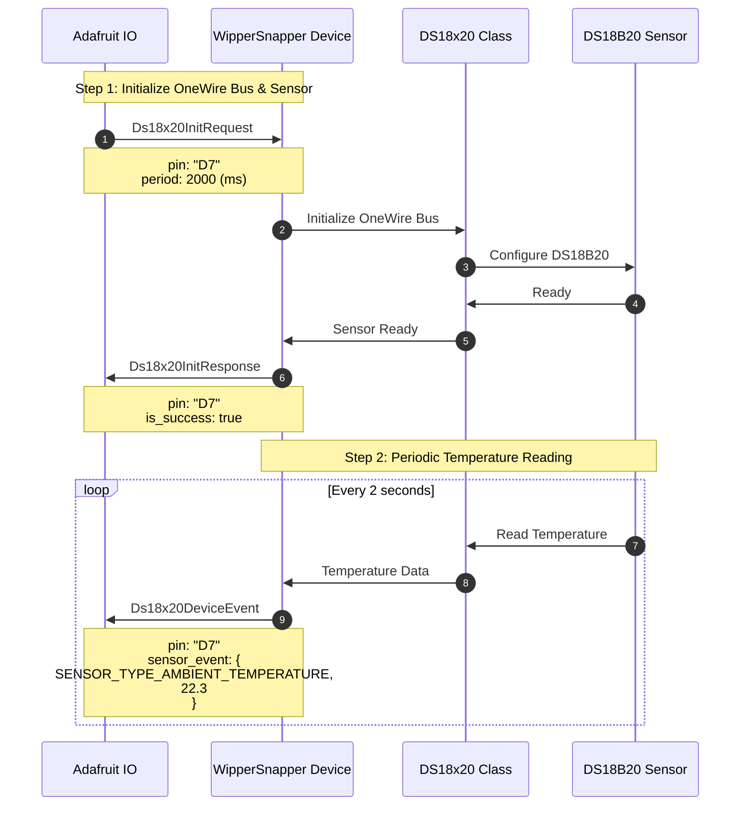

**Messages Used:** `Ds18x20InitRequest`, `Ds18x20InitResponse`, `Ds18x20DeviceEvent`

---

### 2.8 UART Device (GPS Module)

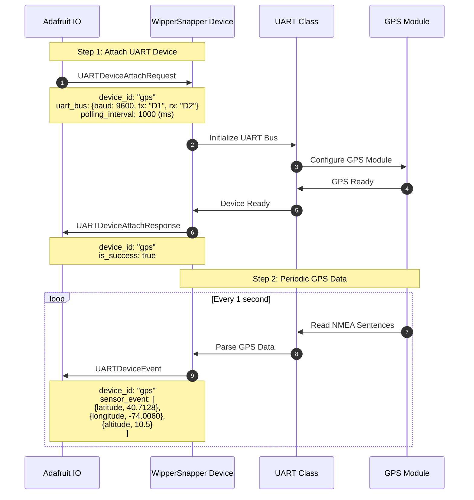

**Messages Used:** `UARTDeviceAttachRequest`, `UARTDeviceAttachResponse`, `UARTDeviceEvent`

---

## 3. Complete System Overview

Here's how all these components work together on a single device:

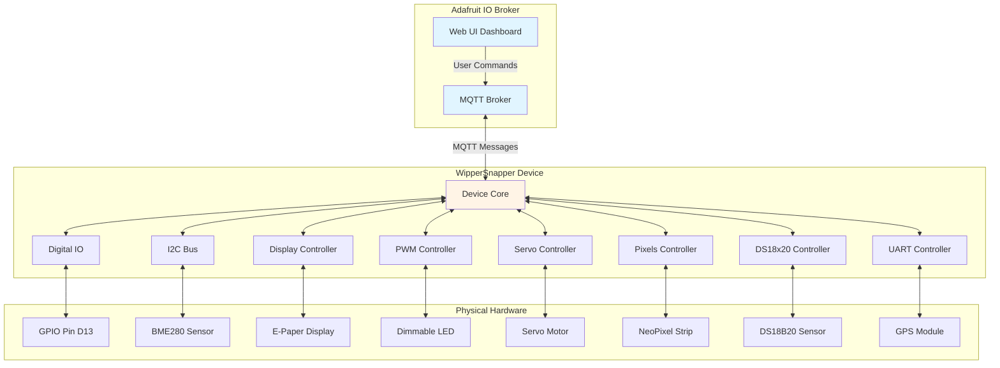

---

## 4. Data Flow Summary

### Input Components (Send Data to IO)
| Component | Message Type | Frequency | Data Type |
|-----------|-------------|-----------|-----------|
| Digital GPIO (Input) | `PinEvent` | Periodic (timer) or Event-driven | Boolean (HIGH/LOW) |
| I2C Sensors | `I2CDeviceEvent` | Periodic (configurable) | Multiple sensor values |
| DS18B20 | `Ds18x20DeviceEvent` | Periodic (configurable) | Temperature |
| UART GPS | `UARTDeviceEvent` | Periodic (configurable) | Location data |

### Output Components (Receive Commands from IO)
| Component | Message Type | Trigger | Action |
|-----------|-------------|---------|--------|
| Digital GPIO (Output) | `ConfigurePinRequest` | User toggle | Set pin HIGH/LOW |
| Display | `DisplayWrite` | User input | Render text/image |
| PWM LED | `PWMWriteDutyCycleRequest` | User slider | Adjust brightness |
| Servo | `ServoWriteRequest` | User control | Move to position |
| NeoPixels | `PixelsWriteRequest` | User color picker | Set LED colors |

---

## 5. Component Lifecycle

All components follow a similar lifecycle pattern:

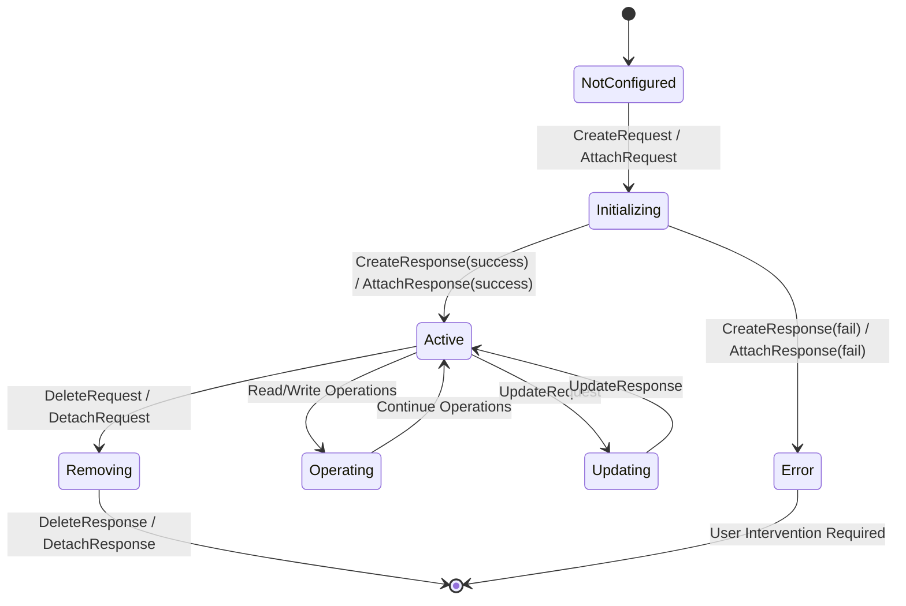

**Lifecycle Operations:**
- **Create/Attach** - Initialize the component with configuration
- **Operate** - Read data (inputs) or write commands (outputs)
- **Update** - Modify configuration (often requires detach/reattach)
- **Delete/Detach** - Remove the component and free resources

---

## 6. Error Handling

### Common Error Responses

**I2C Bus Errors:**
- `BUS_RESPONSE_ERROR_PULLUPS` - Missing pull-up resistors on SDA/SCL
- `BUS_RESPONSE_ERROR_WIRING` - Connection issue, check wiring
- `BUS_RESPONSE_UNSUPPORTED_SENSOR` - Firmware needs update
- `BUS_RESPONSE_DEVICE_INIT_FAIL` - Sensor not responding at address

**General Pattern:**
1. Device returns error response with status code
2. IO displays error to user
3. User corrects hardware/configuration issue
4. User retries operation

---

## 7. MQTT Topic Structure

All WipperSnapper communication uses structured MQTT topics:

**Broker → Device (Commands):**
```
/:username/wprsnpr/:clientId/signals/device/:component
```

**Device → Broker (Responses/Data):**
```
/:username/wprsnpr/:clientId/signals/broker/:component
```

**Component Types:**
- `status` - Device registration and check-in
- `pin` - Digital GPIO operations
- `i2c` - I2C device operations
- `display` - Display operations
- `pwm` - PWM operations
- `servo` - Servo operations
- `pixels` - NeoPixel/DotStar operations
- `ds18x20` - DS18x20 temperature sensor operations
- `uart` - UART device operations

---

## 8. Best Practices

### Device Setup
1. Always complete device registration before adding components
2. Perform I2C scan before adding I2C devices
3. Initialize buses (I2C, UART, OneWire) before devices
4. Verify hardware connections match proto configuration

### Component Configuration
1. Use appropriate polling periods (don't over-poll sensors)
2. Set reasonable PWM frequencies for target hardware
3. Configure display text_size based on display resolution
4. Use proper pixel ordering for NeoPixel types

### Error Recovery
1. Check bus response codes after all I2C operations
2. Implement retry logic with backoff for transient errors
3. Log detailed error information for debugging
4. Validate hardware configuration before firmware updates

---

## Next Steps

- For detailed API documentation, see individual component `.proto` files
- For component-specific workflows, see individual `.md` files:
  - [i2c.md](i2c/v1/i2c.md) - I2C sensors and devices
  - [display.md](display/v1/display.md) - Display controllers
  - [pwm.md](pwm/v1/pwm.md) - PWM outputs
  - [servo.md](servo/v1/servo.md) - Servo motors
  - [pixels.md](pixels/v1/pixels.md) - NeoPixels and DotStars
  - [ds18x20.md](ds18x20/v1/ds18x20.md) - DS18B20 temperature sensors
  - [uart.md](uart/v1/uart.md) - UART devices (GPS, air quality sensors)
- For hardware definitions, see [WipperSnapper_Boards](https://github.com/adafruit/Wippersnapper_Boards)
- For component definitions, see [WipperSnapper_Components](https://github.com/adafruit/Wippersnapper_Components)
